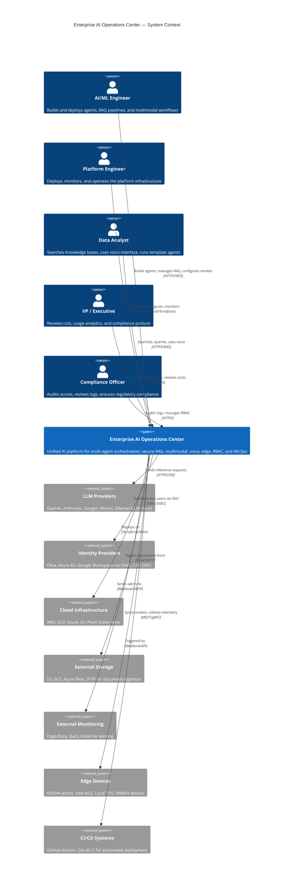
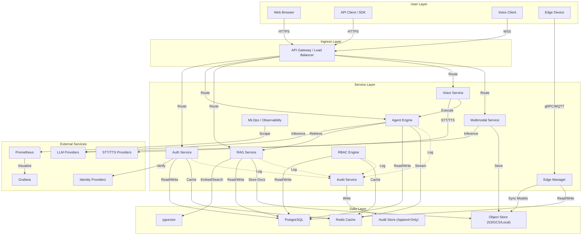
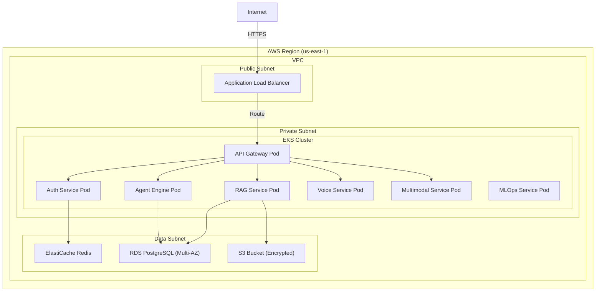
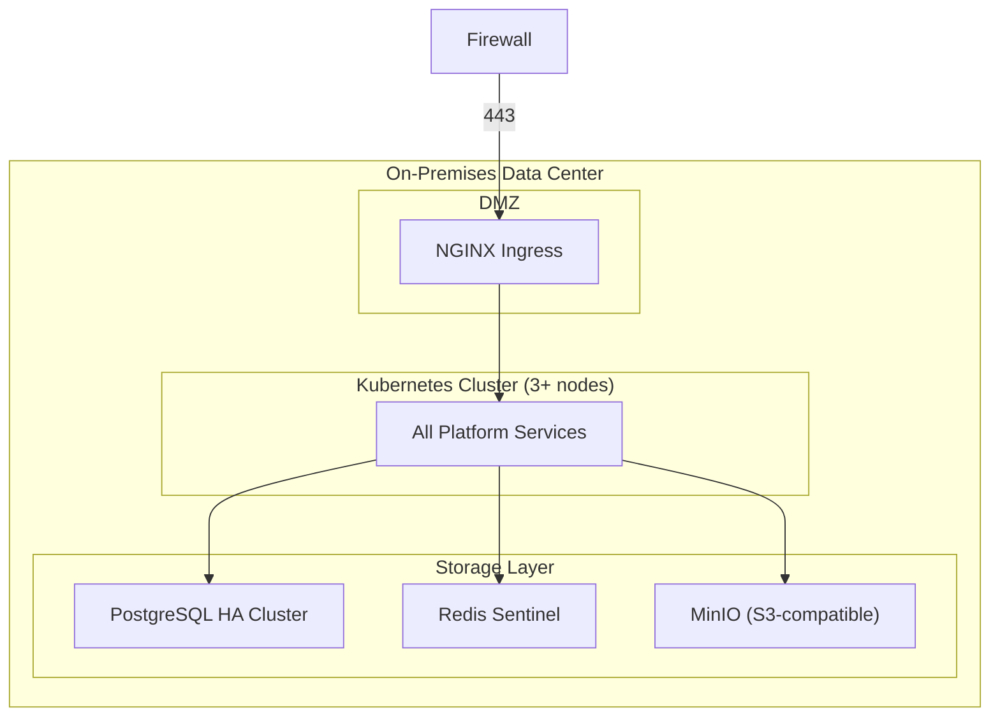
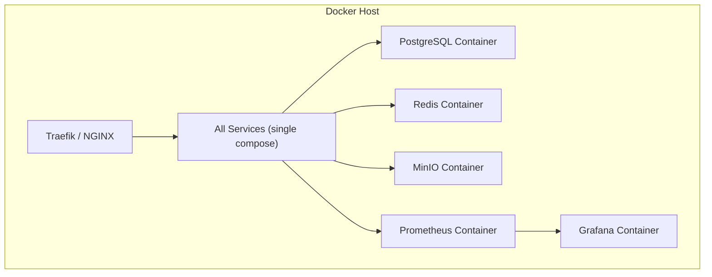

# System Context Design

**Product:** Enterprise AI Operations Center  
**Version:** 1.0  
**Date:** 2026-06-13  
**Classification:** Internal — Confidential  
**Status:** Draft — Awaiting Approval

---

## 1. System Context Overview (C4 — Level 1)

The System Context diagram defines the highest-level view of the Enterprise AI Operations Center, showing how it interacts with users, external systems, and infrastructure services.

### 1.1 Context Diagram



---

## 2. System Boundary Definition

### 2.1 Internal vs. External Boundary

```
┌─────────────────────────── TRUST BOUNDARY ───────────────────────────────┐
│                                                                          │
│  ┌──────────────────────── PLATFORM BOUNDARY ────────────────────────┐   │
│  │                                                                    │   │
│  │  ┌─────────┐ ┌─────────┐ ┌─────────┐ ┌─────────┐ ┌─────────┐   │   │
│  │  │  API    │ │  Auth   │ │  Agent  │ │  RAG    │ │  Voice  │   │   │
│  │  │ Gateway │ │ Service │ │ Engine  │ │ Service │ │ Service │   │   │
│  │  └────┬────┘ └────┬────┘ └────┬────┘ └────┬────┘ └────┬────┘   │   │
│  │       │           │           │           │           │          │   │
│  │  ┌────┴────┐ ┌────┴────┐ ┌────┴────┐ ┌────┴────┐ ┌────┴────┐   │   │
│  │  │Multimod │ │  Edge   │ │  MLOps  │ │  RBAC   │ │  Audit  │   │   │
│  │  │ Service │ │ Manager │ │ Service │ │ Engine  │ │ Service │   │   │
│  │  └─────────┘ └─────────┘ └─────────┘ └─────────┘ └─────────┘   │   │
│  │                                                                    │   │
│  │  ┌─────────────────── DATA LAYER ──────────────────────────────┐  │   │
│  │  │  PostgreSQL │ pgvector │ Redis │ Object Store │ Audit Store │  │   │
│  │  └────────────────────────────────────────────────────────────────┘  │   │
│  └────────────────────────────────────────────────────────────────────┘   │
│                                                                          │
└──────────────────────────────────────────────────────────────────────────┘
                    │              │              │
          ┌─────────┴──┐    ┌─────┴─────┐   ┌────┴─────┐
          │ LLM APIs   │    │ IdP (SSO) │   │  Edge    │
          │ (External) │    │ (External)│   │ Devices  │
          └────────────┘    └───────────┘   └──────────┘
```

### 2.2 Boundary Classification

| Boundary | Type | Controls |
|---|---|---|
| **Internet → API Gateway** | Untrusted → DMZ | TLS 1.3, rate limiting, WAF, DDoS protection |
| **API Gateway → Services** | DMZ → Trusted | JWT validation, RBAC enforcement, request signing |
| **Service → Service** | Trusted → Trusted | mTLS (service mesh), signed tokens, network policies |
| **Services → Data Layer** | Trusted → Data | Connection pooling, encrypted connections, least-privilege DB roles |
| **Platform → LLM Providers** | Trusted → External | API key rotation, request/response logging, cost controls |
| **Platform → Edge Devices** | Trusted → Semi-Trusted | Certificate-based auth, model signature verification, telemetry validation |
| **Platform → IdP** | Trusted → External | SAML/OIDC standard protocols, certificate pinning |

---

## 3. Data Flow Overview

### 3.1 Primary Data Flows



### 3.2 Data Flow Classification

| Flow | Data Type | Sensitivity | Encryption | Logging |
|---|---|---|---|---|
| User → Gateway | Auth credentials, queries | High | TLS 1.3 | Request metadata only |
| Gateway → Auth | JWT, session data | High | mTLS | Full audit |
| Agent → LLM | Prompts, context | High | TLS 1.3 | Full (with PII masking) |
| RAG → Vector DB | Embeddings, metadata | Medium | TLS | Query metadata |
| RAG → Object Store | Raw documents | High | TLS + at-rest AES-256 | Access audit |
| Edge → Platform | Telemetry, model requests | Medium | TLS / mTLS | Full |
| Voice → STT | Audio streams | High | TLS 1.3 | Metadata (opt-in full) |
| Any → Audit | Audit events | Critical | TLS + at-rest AES-256 | N/A (is the log) |

---

## 4. Deployment Contexts

### 4.1 Cloud Deployment (AWS Example)



### 4.2 On-Prem Deployment



### 4.3 Docker Compose (Development / Small Team)



---

## 5. Integration Protocols

| Integration | Protocol | Format | Auth | Timeout | Retry |
|---|---|---|---|---|---|
| LLM Providers | HTTPS + SSE | JSON | API Key (Bearer) | 120s | 3x exponential |
| Identity Providers | HTTPS | SAML XML / OIDC JSON | Certificate / Client Secret | 10s | 2x |
| Object Storage | HTTPS (S3 API) | Binary / Multipart | IAM / Access Key | 30s | 3x |
| Edge Devices | gRPC + MQTT | Protobuf / JSON | mTLS Certificate | 30s (gRPC) | 5x (MQTT QoS 1) |
| Monitoring | HTTP (Prometheus scrape) | OpenMetrics | None (internal network) | 5s | N/A (pull-based) |
| Alerting | HTTPS (Webhook) | JSON | HMAC signature | 10s | 3x |
| STT/TTS | WSS (WebSocket) | Binary audio + JSON | API Key | 30s | 2x |
| CI/CD | HTTPS (Webhook) | JSON | HMAC signature | 10s | 3x |

---

## 6. Cross-Cutting Concerns

### 6.1 Observability Pipeline

```
All Services ──▶ OpenTelemetry Collector ──▶ ┌──────────┐
                                              │Prometheus│ → Grafana Dashboards
Agent Traces ──▶ OTel Collector ────────────▶ │          │
                                              └──────────┘
                                              ┌──────────┐
Structured Logs ─▶ Fluentd / Vector ────────▶ │  Loki /  │ → Grafana Log Explorer
                                              │  ELK     │
                                              └──────────┘
                                              ┌──────────┐
Audit Events ───▶ Audit Service ────────────▶ │Append-   │ → Compliance Reports
                                              │Only Store│
                                              └──────────┘
```

### 6.2 Security Pipeline

```
Request ──▶ TLS Termination ──▶ Rate Limiter ──▶ Auth (JWT) ──▶ RBAC Check ──▶ Service
                                     │                              │
                                     ▼                              ▼
                               Block if over              Deny if unauthorized
                                  limit                  (log to audit service)
```

---

*Document Owner: Solutions Architect*  
*Next Review: Upon stakeholder approval of Phase 2*
