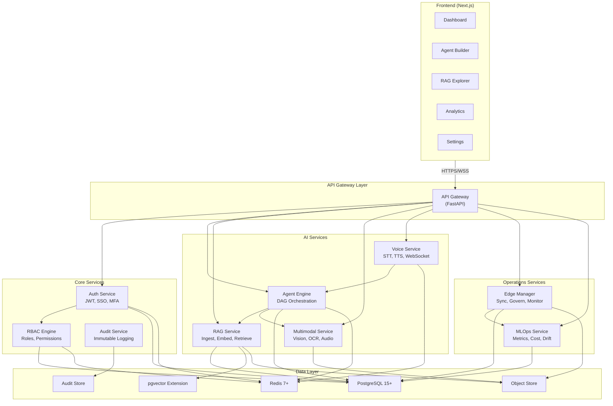
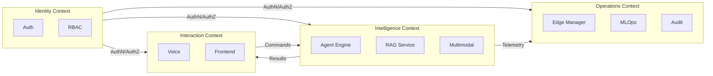
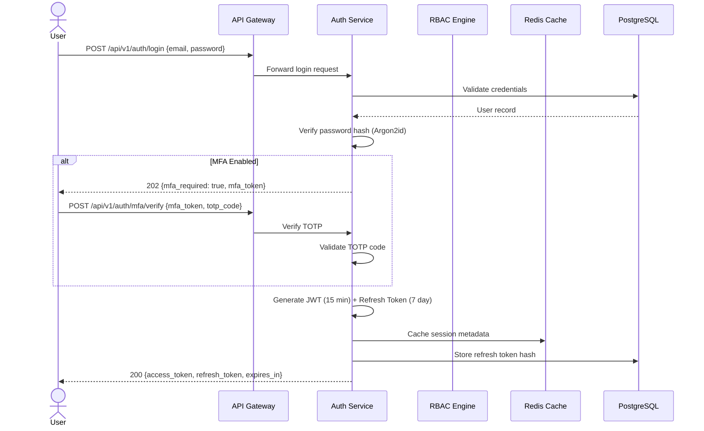
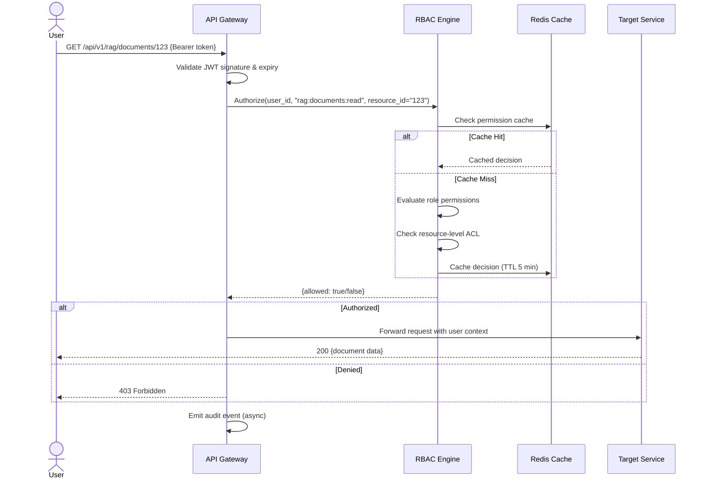

# High-Level Design (HLD)

**Product:** Enterprise AI Operations Center  
**Version:** 1.0  
**Date:** 2026-06-13  
**Classification:** Internal — Confidential  
**Status:** Draft — Awaiting Approval

---

## 1. Architecture Overview

The Enterprise AI Operations Center follows **Clean Architecture** with clear separation between domain logic, application services, infrastructure, and interfaces. The system is composed of **10 bounded microservices** communicating over well-defined APIs, with a shared data layer underneath.

### 1.1 Architecture Style

| Dimension | Choice | Rationale |
|---|---|---|
| **Service Topology** | Microservices (modular monolith-ready) | Independent scaling per module; can deploy as monolith for small teams |
| **Communication** | Synchronous (REST/gRPC) + Async (Redis Streams) | REST for simplicity; async for decoupled event processing |
| **Data Strategy** | Database-per-service (logical) with shared PostgreSQL cluster | Reduces operational overhead while maintaining schema isolation |
| **Frontend** | Next.js SPA with SSR | SEO for docs, fast interactivity for dashboards |
| **API Style** | REST (OpenAPI 3.1) + WebSocket (real-time) | REST for CRUD; WebSocket for streaming agent execution and voice |

### 1.2 Layered Architecture (Per Service)

```
┌────────────────────────────────────────────────────────────────┐
│                      INTERFACE LAYER                           │
│  REST Controllers │ WebSocket Handlers │ gRPC Services         │
├────────────────────────────────────────────────────────────────┤
│                    APPLICATION LAYER                            │
│  Use Cases │ Command Handlers │ Query Handlers │ DTOs          │
├────────────────────────────────────────────────────────────────┤
│                      DOMAIN LAYER                              │
│  Entities │ Value Objects │ Domain Services │ Domain Events     │
├────────────────────────────────────────────────────────────────┤
│                   INFRASTRUCTURE LAYER                         │
│  Repositories │ External APIs │ Message Broker │ Cache         │
└────────────────────────────────────────────────────────────────┘
```

**Dependency Rule:** Dependencies only point inward. The Domain Layer has zero external dependencies.

---

## 2. Service Architecture

### 2.1 Service Map



### 2.2 Service Responsibilities

| Service | Responsibility | Scaling Strategy | Data Store |
|---|---|---|---|
| **API Gateway** | Request routing, rate limiting, TLS termination, request validation | Horizontal (stateless) | None (pass-through) |
| **Auth Service** | User registration, login, JWT issuance, SSO, MFA, API keys | Horizontal (stateless, cached) | PostgreSQL + Redis |
| **RBAC Engine** | Role management, permission evaluation, policy engine | Horizontal (cached) | PostgreSQL + Redis |
| **Audit Service** | Immutable event logging, compliance reports, log query | Horizontal (append-only writes) | Append-only store |
| **Agent Engine** | DAG orchestration, tool calling, LLM integration, execution traces | Horizontal (worker pool) | PostgreSQL + Redis |
| **RAG Service** | Document ingestion, chunking, embedding, retrieval, evaluation | Horizontal (worker pool) | PostgreSQL + pgvector + Object Store |
| **Multimodal Service** | Image analysis, OCR, video processing, audio transcription | Horizontal (GPU-aware) | Object Store |
| **Voice Service** | STT, TTS, WebSocket session management, voice commands | Horizontal (sticky sessions) | Redis (session state) |
| **Edge Manager** | Device registry, model sync, remote management, telemetry | Horizontal | PostgreSQL + Object Store |
| **MLOps Service** | Metrics aggregation, cost tracking, drift detection, evaluation | Horizontal | PostgreSQL |

---

## 3. Service Boundaries & Ownership

### 3.1 Bounded Contexts (DDD)



### 3.2 Service Communication Matrix

| From → To | Protocol | Pattern | Purpose |
|---|---|---|---|
| Gateway → Auth | HTTP (sync) | Request/Response | JWT validation on every request |
| Gateway → Any Service | HTTP (sync) | Request/Response | Route authenticated requests |
| Agent → RAG | HTTP (sync) | Request/Response | Retrieve context during execution |
| Agent → LLM Provider | HTTP + SSE (sync) | Streaming | LLM inference with streaming response |
| Agent → Agent | Redis Streams (async) | Pub/Sub | Inter-agent messaging in workflows |
| Voice → Agent | HTTP (sync) | Request/Response | Execute voice commands via agent |
| Voice → STT/TTS | WebSocket (sync) | Bidirectional stream | Real-time audio processing |
| Any → Audit | Redis Streams (async) | Fire-and-forget | Audit event emission (non-blocking) |
| Any → MLOps | Prometheus scrape (pull) | Pull | Metrics collection |
| Edge → Platform | gRPC (sync) + MQTT (async) | Mixed | Model sync (gRPC), telemetry (MQTT) |
| RAG → Object Store | S3 API (sync) | Request/Response | Document storage and retrieval |

---

## 4. Technology Stack

### 4.1 Backend Stack

| Layer | Technology | Version | Purpose |
|---|---|---|---|
| **Language** | Python | 3.11+ | All backend services |
| **Web Framework** | FastAPI | 0.115+ | REST API, WebSocket, OpenAPI generation |
| **ORM** | SQLAlchemy | 2.0+ | Database access with async support |
| **Migrations** | Alembic | 1.13+ | Schema version control |
| **Validation** | Pydantic | 2.0+ | Request/response validation, settings |
| **Task Queue** | Celery + Redis | 5.3+ | Async job processing (ingestion, evaluation) |
| **Caching** | Redis | 7+ | Session cache, RBAC cache, pub/sub |
| **Testing** | pytest + pytest-asyncio | 8.0+ | Unit and integration testing |
| **Linting** | Ruff | 0.5+ | Fast Python linter and formatter |
| **Type Checking** | mypy | 1.10+ | Static type analysis |

### 4.2 AI/ML Stack

| Component | Technology | Purpose |
|---|---|---|
| **LLM Abstraction** | LangChain Core | Provider-agnostic LLM calling |
| **Embeddings** | sentence-transformers / OpenAI | Text and multimodal embeddings |
| **Vector Search** | pgvector (default) / Qdrant | Similarity search |
| **OCR** | Tesseract + pytesseract | Document OCR |
| **Vision** | OpenAI GPT-4o / Google Gemini / LLaVA | Image analysis |
| **STT** | Whisper (local) / Deepgram | Speech-to-text |
| **TTS** | Coqui TTS / ElevenLabs | Text-to-speech |
| **RAG Evaluation** | RAGAS | Retrieval quality metrics |
| **Experiment Tracking** | MLflow | Agent configuration versioning |
| **Edge Runtime** | ONNX Runtime | Lightweight inference |

### 4.3 Frontend Stack

| Layer | Technology | Version | Purpose |
|---|---|---|---|
| **Framework** | Next.js | 14+ | SSR, routing, API routes |
| **Language** | TypeScript | 5.0+ | Type-safe frontend development |
| **UI Library** | React | 18+ | Component rendering |
| **State Management** | Zustand | 4+ | Lightweight state management |
| **Data Fetching** | TanStack Query | 5+ | Server state management with caching |
| **Styling** | Tailwind CSS | 3+ | Utility-first CSS (per user preference) |
| **Charts** | Recharts | 2+ | Dashboard visualizations |
| **DAG Editor** | React Flow | 11+ | Visual agent workflow builder |
| **Testing** | Vitest + Playwright | Latest | Unit and E2E testing |

### 4.4 Infrastructure Stack

| Layer | Technology | Version | Purpose |
|---|---|---|---|
| **Container Runtime** | Docker | 24+ | Containerization |
| **Orchestration** | Kubernetes | 1.28+ | Container orchestration |
| **Package Manager** | Helm | 3+ | Kubernetes package management |
| **IaC** | Terraform | 1.7+ | Multi-cloud infrastructure |
| **CI/CD** | GitHub Actions | N/A | Automated build, test, deploy |
| **Reverse Proxy** | NGINX / Traefik | Latest | Ingress, TLS termination |
| **Service Mesh** | Istio (optional) | 1.20+ | mTLS, traffic management |

### 4.5 Observability Stack

| Layer | Technology | Version | Purpose |
|---|---|---|---|
| **Metrics** | Prometheus | 2.50+ | Metrics collection |
| **Dashboards** | Grafana | 10+ | Visualization |
| **Tracing** | OpenTelemetry + Jaeger | Latest | Distributed tracing |
| **Logging** | Loki / ELK | Latest | Log aggregation |
| **Alerting** | Alertmanager | Latest | Alert routing |

---

## 5. API Gateway Design

### 5.1 Gateway Responsibilities

```
                           ┌─────────────────────────────┐
Internet ──── TLS 1.3 ────▶│       API GATEWAY           │
                           │                             │
                           │  1. TLS Termination         │
                           │  2. Request Validation      │
                           │  3. Rate Limiting           │
                           │  4. Authentication (JWT)    │
                           │  5. RBAC Pre-check          │
                           │  6. Request Routing         │
                           │  7. Response Transformation │
                           │  8. CORS Handling           │
                           │  9. Request Logging         │
                           │ 10. Metrics Emission        │
                           └─────────────────────────────┘
                              │    │    │    │    │
                              ▼    ▼    ▼    ▼    ▼
                           auth agent rag voice mm ...
```

### 5.2 URL Routing Schema

| Path Pattern | Service | Auth Required | Rate Limit |
|---|---|---|---|
| `/api/v1/auth/**` | Auth Service | No (login/register) | 20 req/min |
| `/api/v1/users/**` | Auth Service | Yes | 100 req/min |
| `/api/v1/rbac/**` | RBAC Engine | Yes (Admin) | 100 req/min |
| `/api/v1/agents/**` | Agent Engine | Yes | 1000 req/min |
| `/api/v1/workflows/**` | Agent Engine | Yes | 500 req/min |
| `/api/v1/rag/**` | RAG Service | Yes | 500 req/min |
| `/api/v1/documents/**` | RAG Service | Yes | 200 req/min |
| `/api/v1/multimodal/**` | Multimodal Service | Yes | 200 req/min |
| `/api/v1/voice/**` | Voice Service | Yes | 100 req/min |
| `/api/v1/edge/**` | Edge Manager | Yes | 500 req/min |
| `/api/v1/mlops/**` | MLOps Service | Yes | 500 req/min |
| `/api/v1/audit/**` | Audit Service | Yes (Admin) | 200 req/min |
| `/ws/v1/agents/**` | Agent Engine | Yes | N/A (WebSocket) |
| `/ws/v1/voice/**` | Voice Service | Yes | N/A (WebSocket) |
| `/health` | Gateway | No | N/A |
| `/ready` | Gateway | No | N/A |
| `/metrics` | Gateway | Internal | N/A |

---

## 6. Authentication & Authorization Flow

### 6.1 Authentication Flow



### 6.2 Authorization Flow (Per-Request)



---

## 7. Data Architecture (High Level)

### 7.1 Database Strategy

| Database | Engine | Purpose | Isolation |
|---|---|---|---|
| `eaioc_auth` | PostgreSQL | Users, sessions, API keys, MFA | Schema per service |
| `eaioc_rbac` | PostgreSQL | Roles, permissions, policies | Schema per service |
| `eaioc_agents` | PostgreSQL | Agent definitions, workflows, executions | Schema per service |
| `eaioc_rag` | PostgreSQL + pgvector | Documents, chunks, embeddings, knowledge bases | Schema per service |
| `eaioc_edge` | PostgreSQL | Device registry, model sync state | Schema per service |
| `eaioc_mlops` | PostgreSQL | Metrics, cost records, evaluations | Schema per service |
| `eaioc_audit` | PostgreSQL (append-only) | Immutable audit events | Dedicated instance |
| `cache` | Redis | Sessions, RBAC cache, pub/sub, streams | Logical database per service |
| `objects` | S3/MinIO | Documents, models, media files | Bucket per tenant |

### 7.2 Multi-Tenancy Strategy

```
┌─────────────────────────────────────────────────────────┐
│                    PostgreSQL Cluster                     │
│                                                          │
│  ┌──────────────┐  ┌──────────────┐  ┌──────────────┐  │
│  │  eaioc_auth  │  │ eaioc_agents │  │  eaioc_rag   │  │
│  │              │  │              │  │              │  │
│  │ tenant_id FK │  │ tenant_id FK │  │ tenant_id FK │  │
│  │ on ALL rows  │  │ on ALL rows  │  │ on ALL rows  │  │
│  │              │  │              │  │              │  │
│  │ RLS Policies │  │ RLS Policies │  │ RLS Policies │  │
│  └──────────────┘  └──────────────┘  └──────────────┘  │
│                                                          │
│  Strategy: Shared database, shared schema, tenant_id     │
│  column with PostgreSQL Row-Level Security (RLS)         │
└──────────────────────────────────────────────────────────┘
```

**Tradeoff:** Shared database with RLS is simpler to operate than database-per-tenant but has a theoretical isolation ceiling. For v1.0, this is sufficient for up to 1,000 tenants. Database-per-tenant can be offered as an enterprise option in v2.0.

---

## 8. Caching Strategy

| Cache Layer | Technology | TTL | Invalidation | Purpose |
|---|---|---|---|---|
| **JWT Session** | Redis | 15 min | On logout/revocation | Active session tracking |
| **RBAC Permissions** | Redis | 5 min | On role/permission change | Fast authorization decisions |
| **User Profile** | Redis | 10 min | On profile update | Reduce auth DB queries |
| **RAG Query Cache** | Redis | 30 min | On knowledge base update | Cache frequent queries |
| **LLM Response Cache** | Redis | 1 hour | Manual invalidation | Cache deterministic LLM calls |
| **Config Cache** | Redis | 5 min | On config change | Service configuration |
| **API Response** | HTTP Cache-Control | Varies | ETag-based | Browser-side caching |

---

## 9. Error Handling Strategy

### 9.1 Error Response Format (RFC 7807)

```json
{
  "type": "https://eaioc.dev/errors/rbac/forbidden",
  "title": "Access Denied",
  "status": 403,
  "detail": "User 'user_123' does not have 'rag:documents:read' permission on resource 'doc_456'",
  "instance": "/api/v1/rag/documents/456",
  "request_id": "req_abc123def456",
  "timestamp": "2026-06-13T00:30:00Z"
}
```

### 9.2 Error Hierarchy

| HTTP Status | Error Type | Retry | Alert |
|---|---|---|---|
| 400 | Validation Error | No | No |
| 401 | Authentication Required | No (re-auth) | After 5 in 1 min |
| 403 | Authorization Denied | No | After 10 in 1 min |
| 404 | Resource Not Found | No | No |
| 409 | Conflict | No | No |
| 422 | Unprocessable Entity | No | No |
| 429 | Rate Limited | Yes (backoff) | After burst |
| 500 | Internal Server Error | Yes (1x) | Immediate |
| 502 | Upstream Error (LLM) | Yes (3x) | After 3 failures |
| 503 | Service Unavailable | Yes (backoff) | Immediate |
| 504 | Gateway Timeout | Yes (1x) | After 3 |

---

## 10. Resilience Patterns

### 10.1 Circuit Breaker (LLM Providers)

```
     ┌──────────┐          ┌──────────┐          ┌──────────┐
     │  CLOSED  │──fail───▶│   OPEN   │──timer──▶│HALF-OPEN │
     │          │          │          │          │          │
     │ Normal   │          │ Reject   │          │ Test one │
     │ operation│◀─reset──│ all      │◀─fail───│ request  │
     │          │          │ requests │          │          │
     └──────────┘          └──────────┘          └──────────┘
     
     Thresholds:
     - Open after: 5 failures in 60 seconds
     - Half-open after: 30 seconds
     - Close after: 3 consecutive successes
```

### 10.2 Fallback Chain (LLM Providers)

```
Request ──▶ Primary (OpenAI GPT-4o)
                │
                ├── Success ──▶ Return response
                │
                └── Failure ──▶ Secondary (Anthropic Claude)
                                    │
                                    ├── Success ──▶ Return response
                                    │
                                    └── Failure ──▶ Tertiary (Local Ollama)
                                                        │
                                                        ├── Success ──▶ Return response
                                                        │
                                                        └── Failure ──▶ 503 Service Unavailable
```

### 10.3 Bulkhead Pattern

| Service | Pool Size | Queue Size | Timeout | Rationale |
|---|---|---|---|---|
| LLM Calls | 50 concurrent | 200 queued | 120s | Prevent LLM slowdown from cascading |
| RAG Ingestion | 10 concurrent | 1000 queued | 300s | Heavy CPU/IO work; limit resource use |
| Multimodal Processing | 5 concurrent | 50 queued | 600s | GPU-intensive; prevent resource starvation |
| Voice Sessions | 100 concurrent | 50 queued | 30s | Low-latency requirement; reject rather than queue |

---

## 11. Design Decisions & Tradeoffs

| # | Decision | Options | Choice | Tradeoff |
|---|---|---|---|---|
| D-01 | Monolith vs. Microservices | Monolith, Microservices, Modular Monolith | **Microservices (modular monolith-ready)** | Higher deployment complexity vs. independent scaling and deployment |
| D-02 | Sync vs. Async Communication | REST, gRPC, Message Queue | **REST + Redis Streams** | Simpler debugging vs. eventual consistency for events |
| D-03 | Multi-Tenancy | DB-per-tenant, Schema-per-tenant, Shared+RLS | **Shared DB + RLS** | Simpler operations vs. lower isolation ceiling |
| D-04 | API Gateway | Custom (FastAPI), Kong, NGINX | **Custom FastAPI** | Full control + Python ecosystem vs. maintenance burden |
| D-05 | Session Storage | JWT-only, JWT+Redis, Server-side sessions | **JWT + Redis** | Revocable sessions vs. additional Redis dependency |
| D-06 | Event Sourcing | Full event sourcing, CRUD + events, CRUD-only | **CRUD + async events** | Simpler implementation vs. no full event replay |
| D-07 | Frontend Architecture | SPA, SSR, Hybrid | **Hybrid (Next.js SSR + CSR)** | Best of both vs. more complex build pipeline |
| D-08 | Embedding Storage | Dedicated vector DB, pgvector, both | **pgvector (default, swappable)** | Reduced infra vs. performance ceiling at extreme scale |

---

*Document Owner: Solutions Architect*  
*Next Review: Upon stakeholder approval of Phase 2*
