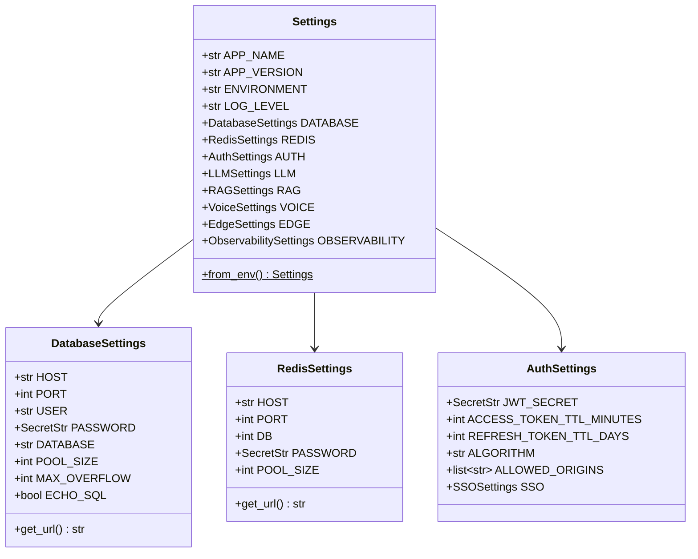
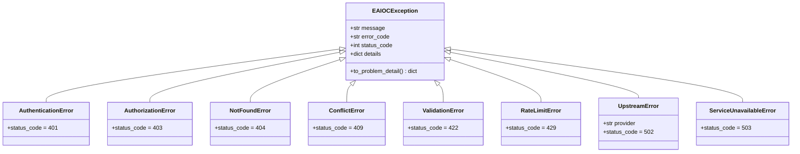
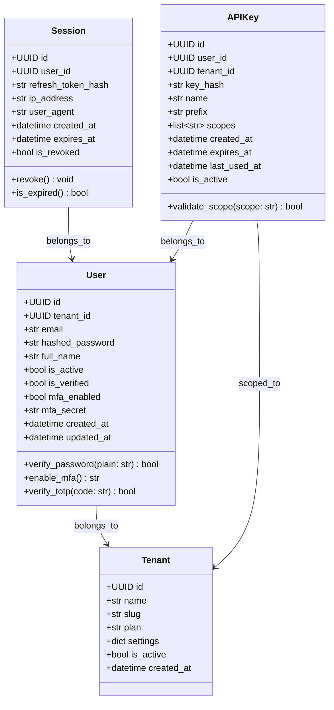
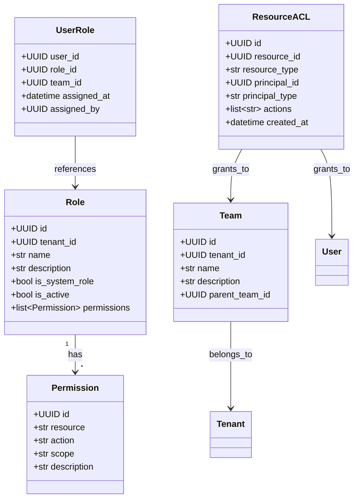
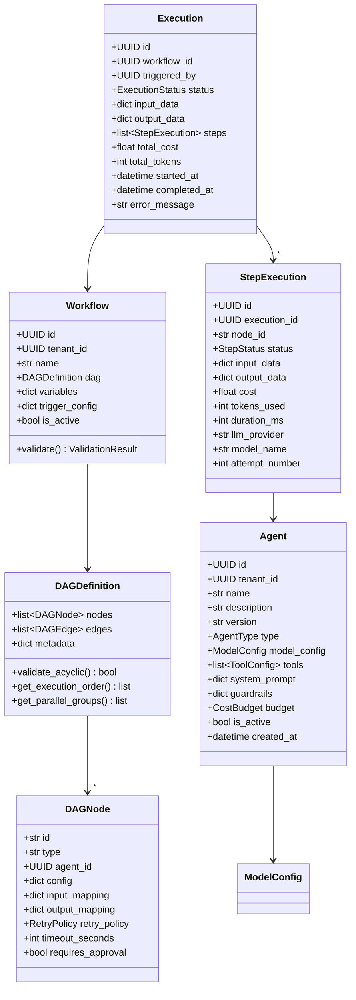
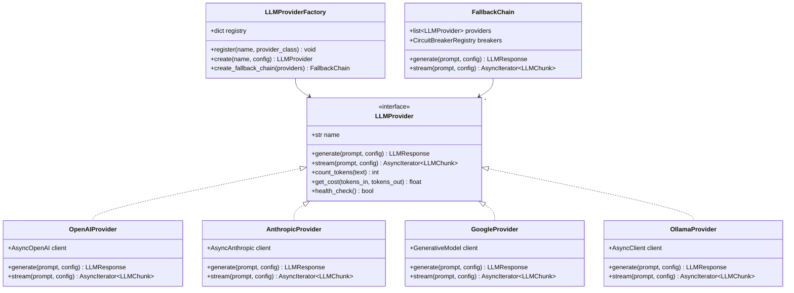
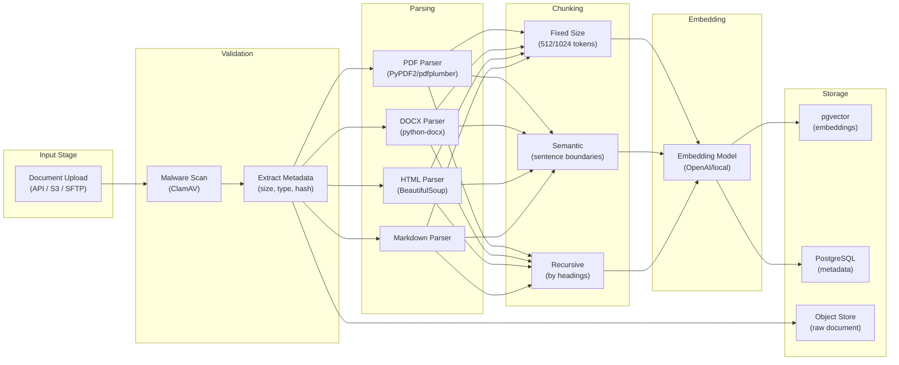
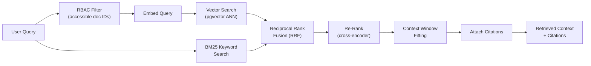
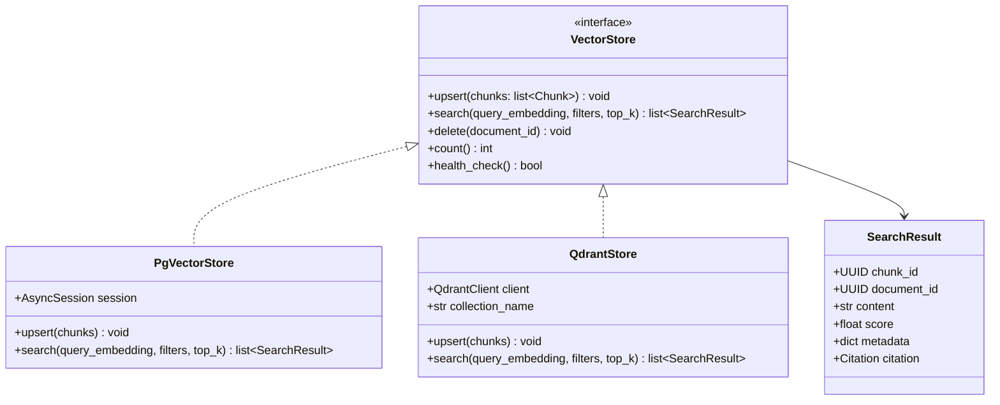
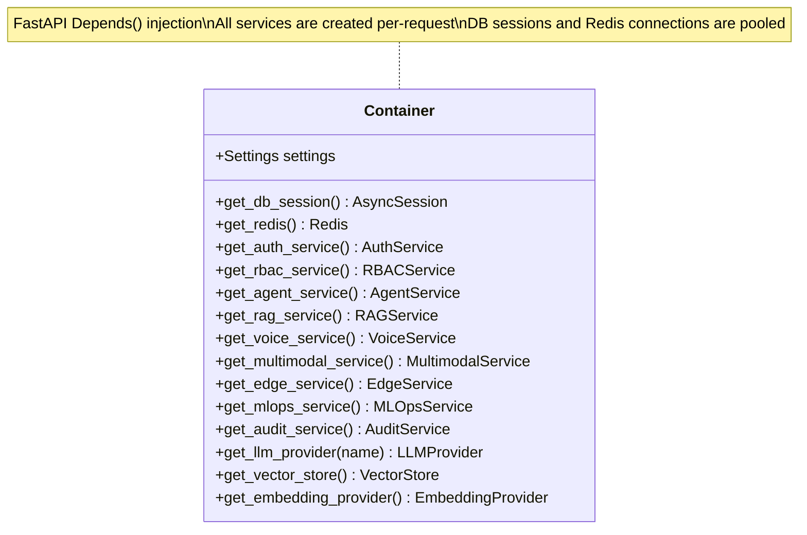

# Low-Level Design (LLD)

**Product:** Enterprise AI Operations Center  
**Version:** 1.0  
**Date:** 2026-06-13  
**Classification:** Internal — Confidential  
**Status:** Draft — Awaiting Approval

---

## 1. Project Structure

```
enterprise-ai-ops-platform/
├── backend/
│   ├── app/
│   │   ├── core/                    # Shared kernel
│   │   │   ├── config.py            # Pydantic Settings (12-factor)
│   │   │   ├── database.py          # SQLAlchemy async engine & session
│   │   │   ├── security.py          # JWT, hashing, encryption utilities
│   │   │   ├── middleware.py        # Auth, CORS, rate-limit, logging middleware
│   │   │   ├── dependencies.py      # FastAPI dependency injection
│   │   │   ├── exceptions.py        # Custom exception hierarchy
│   │   │   ├── events.py            # Application lifecycle events
│   │   │   └── telemetry.py         # OpenTelemetry setup
│   │   │
│   │   ├── auth/                    # Auth Bounded Context
│   │   │   ├── domain/
│   │   │   │   ├── entities.py      # User, Session, APIKey entities
│   │   │   │   ├── value_objects.py  # Email, Password, TokenPair
│   │   │   │   ├── events.py        # UserRegistered, UserLoggedIn, etc.
│   │   │   │   └── exceptions.py    # AuthenticationError, etc.
│   │   │   ├── application/
│   │   │   │   ├── services.py      # AuthService, MFAService
│   │   │   │   ├── commands.py      # RegisterUser, LoginUser, etc.
│   │   │   │   └── queries.py       # GetUser, ListSessions, etc.
│   │   │   ├── infrastructure/
│   │   │   │   ├── repository.py    # UserRepository (SQLAlchemy)
│   │   │   │   ├── models.py        # ORM models
│   │   │   │   ├── sso.py           # SAML/OIDC provider integration
│   │   │   │   └── cache.py         # Redis session cache
│   │   │   └── interface/
│   │   │       ├── router.py        # FastAPI router
│   │   │       ├── schemas.py       # Pydantic request/response schemas
│   │   │       └── dependencies.py  # Auth-specific DI
│   │   │
│   │   ├── rbac/                    # RBAC Bounded Context
│   │   │   ├── domain/
│   │   │   │   ├── entities.py      # Role, Permission, Policy
│   │   │   │   ├── value_objects.py  # PermissionScope, ResourceACL
│   │   │   │   └── services.py      # PermissionEvaluator
│   │   │   ├── application/
│   │   │   │   ├── services.py      # RBACService
│   │   │   │   ├── commands.py      # CreateRole, AssignPermission
│   │   │   │   └── queries.py       # CheckPermission, ListRoles
│   │   │   ├── infrastructure/
│   │   │   │   ├── repository.py    # RoleRepository, PermissionRepository
│   │   │   │   ├── models.py        # ORM models
│   │   │   │   └── cache.py         # Redis permission cache
│   │   │   └── interface/
│   │   │       ├── router.py        # FastAPI router
│   │   │       └── schemas.py       # Pydantic schemas
│   │   │
│   │   ├── agents/                  # Agent Engine Bounded Context
│   │   │   ├── domain/
│   │   │   │   ├── entities.py      # Agent, Workflow, Execution, Step
│   │   │   │   ├── value_objects.py  # DAGDefinition, ToolCall, ModelConfig
│   │   │   │   ├── services.py      # DAGValidator, CycleDetector
│   │   │   │   └── events.py        # AgentStarted, StepCompleted, etc.
│   │   │   ├── application/
│   │   │   │   ├── services.py      # AgentService, WorkflowOrchestrator
│   │   │   │   ├── commands.py      # CreateAgent, RunWorkflow, ApproveStep
│   │   │   │   └── queries.py       # GetExecution, ListAgents
│   │   │   ├── infrastructure/
│   │   │   │   ├── repository.py    # AgentRepository, ExecutionRepository
│   │   │   │   ├── models.py        # ORM models
│   │   │   │   ├── llm_providers/   # LLM provider integrations
│   │   │   │   │   ├── base.py      # Abstract LLMProvider interface
│   │   │   │   │   ├── openai.py    # OpenAI provider
│   │   │   │   │   ├── anthropic.py # Anthropic provider
│   │   │   │   │   ├── google.py    # Google Gemini provider
│   │   │   │   │   └── ollama.py    # Local Ollama provider
│   │   │   │   ├── tools/           # Tool implementations
│   │   │   │   │   ├── base.py      # Abstract Tool interface
│   │   │   │   │   ├── registry.py  # ToolRegistry
│   │   │   │   │   └── builtin/     # Built-in tools
│   │   │   │   └── stream.py        # Redis Streams for execution events
│   │   │   └── interface/
│   │   │       ├── router.py        # REST endpoints
│   │   │       ├── websocket.py     # WebSocket for live execution
│   │   │       └── schemas.py       # Pydantic schemas
│   │   │
│   │   ├── rag/                     # RAG Bounded Context
│   │   │   ├── domain/
│   │   │   │   ├── entities.py      # KnowledgeBase, Document, Chunk
│   │   │   │   ├── value_objects.py  # Embedding, ChunkingStrategy, Citation
│   │   │   │   ├── services.py      # ChunkingService, RetrievalRanker
│   │   │   │   └── events.py        # DocumentIngested, ChunkEmbedded
│   │   │   ├── application/
│   │   │   │   ├── services.py      # RAGService, IngestionPipeline
│   │   │   │   ├── commands.py      # IngestDocument, CreateKnowledgeBase
│   │   │   │   └── queries.py       # Search, GetDocument
│   │   │   ├── infrastructure/
│   │   │   │   ├── repository.py    # DocumentRepository, ChunkRepository
│   │   │   │   ├── models.py        # ORM models
│   │   │   │   ├── vector_store/    # Vector store backends
│   │   │   │   │   ├── base.py      # Abstract VectorStore interface
│   │   │   │   │   ├── pgvector.py  # pgvector implementation
│   │   │   │   │   └── qdrant.py    # Qdrant implementation
│   │   │   │   ├── embeddings/      # Embedding providers
│   │   │   │   │   ├── base.py      # Abstract EmbeddingProvider
│   │   │   │   │   ├── openai.py    # OpenAI embeddings
│   │   │   │   │   └── local.py     # sentence-transformers
│   │   │   │   ├── parsers/         # Document parsers
│   │   │   │   │   ├── base.py      # Abstract DocumentParser
│   │   │   │   │   ├── pdf.py       # PDF parser
│   │   │   │   │   ├── docx.py      # DOCX parser
│   │   │   │   │   ├── html.py      # HTML parser
│   │   │   │   │   └── markdown.py  # Markdown parser
│   │   │   │   ├── chunking/        # Chunking strategies
│   │   │   │   │   ├── base.py      # Abstract ChunkingStrategy
│   │   │   │   │   ├── fixed.py     # Fixed-size chunking
│   │   │   │   │   ├── semantic.py  # Semantic chunking
│   │   │   │   │   └── recursive.py # Recursive character chunking
│   │   │   │   └── object_store.py  # S3/MinIO document storage
│   │   │   └── interface/
│   │   │       ├── router.py
│   │   │       └── schemas.py
│   │   │
│   │   ├── multimodal/              # Multimodal Bounded Context
│   │   │   ├── domain/
│   │   │   │   ├── entities.py      # MediaAsset, AnalysisResult
│   │   │   │   └── value_objects.py  # MediaType, OCRResult
│   │   │   ├── application/
│   │   │   │   ├── services.py      # MultimodalService, OCRService
│   │   │   │   └── commands.py      # AnalyzeImage, TranscribeAudio
│   │   │   ├── infrastructure/
│   │   │   │   ├── repository.py
│   │   │   │   ├── models.py
│   │   │   │   ├── vision.py        # Vision LLM integration
│   │   │   │   ├── ocr.py           # Tesseract OCR integration
│   │   │   │   └── audio.py         # Audio transcription
│   │   │   └── interface/
│   │   │       ├── router.py
│   │   │       └── schemas.py
│   │   │
│   │   ├── voice/                   # Voice Bounded Context
│   │   │   ├── domain/
│   │   │   │   ├── entities.py      # VoiceSession, Utterance
│   │   │   │   └── value_objects.py  # AudioFormat, TranscriptSegment
│   │   │   ├── application/
│   │   │   │   └── services.py      # VoiceService, SessionManager
│   │   │   ├── infrastructure/
│   │   │   │   ├── stt/             # STT providers
│   │   │   │   │   ├── base.py      # Abstract STTProvider
│   │   │   │   │   ├── whisper.py   # Whisper (local)
│   │   │   │   │   └── deepgram.py  # Deepgram (cloud)
│   │   │   │   ├── tts/             # TTS providers
│   │   │   │   │   ├── base.py      # Abstract TTSProvider
│   │   │   │   │   ├── coqui.py     # Coqui TTS (local)
│   │   │   │   │   └── elevenlabs.py # ElevenLabs (cloud)
│   │   │   │   └── session_store.py  # Redis session management
│   │   │   └── interface/
│   │   │       ├── router.py
│   │   │       ├── websocket.py     # WebSocket voice handler
│   │   │       └── schemas.py
│   │   │
│   │   ├── edge/                    # Edge Bounded Context
│   │   │   ├── domain/
│   │   │   │   ├── entities.py      # EdgeDevice, DeployedModel
│   │   │   │   └── value_objects.py  # DeviceCapabilities, SyncStatus
│   │   │   ├── application/
│   │   │   │   └── services.py      # EdgeService, ModelSyncService
│   │   │   ├── infrastructure/
│   │   │   │   ├── repository.py
│   │   │   │   ├── models.py
│   │   │   │   ├── mqtt.py          # MQTT client for telemetry
│   │   │   │   └── grpc_service.py  # gRPC for model sync
│   │   │   └── interface/
│   │   │       ├── router.py
│   │   │       └── schemas.py
│   │   │
│   │   ├── mlops/                   # MLOps Bounded Context
│   │   │   ├── domain/
│   │   │   │   ├── entities.py      # MetricRecord, CostRecord, Evaluation
│   │   │   │   └── value_objects.py  # MetricType, DriftScore
│   │   │   ├── application/
│   │   │   │   └── services.py      # MetricsService, CostTracker, DriftDetector
│   │   │   ├── infrastructure/
│   │   │   │   ├── repository.py
│   │   │   │   ├── models.py
│   │   │   │   ├── prometheus.py    # Prometheus metrics exporter
│   │   │   │   ├── mlflow_client.py # MLflow integration
│   │   │   │   └── ragas_eval.py    # RAGAS evaluation runner
│   │   │   └── interface/
│   │   │       ├── router.py
│   │   │       └── schemas.py
│   │   │
│   │   ├── audit/                   # Audit Bounded Context
│   │   │   ├── domain/
│   │   │   │   ├── entities.py      # AuditEvent
│   │   │   │   └── value_objects.py  # AuditAction, AuditOutcome
│   │   │   ├── application/
│   │   │   │   └── services.py      # AuditService
│   │   │   ├── infrastructure/
│   │   │   │   ├── repository.py    # Append-only repository
│   │   │   │   ├── models.py
│   │   │   │   └── hash_chain.py    # Tamper-evident hash chain
│   │   │   └── interface/
│   │   │       ├── router.py
│   │   │       └── schemas.py
│   │   │
│   │   └── main.py                  # FastAPI application factory
│   │
│   ├── migrations/                  # Alembic migrations
│   │   ├── alembic.ini
│   │   ├── env.py
│   │   └── versions/
│   │
│   ├── tests/                       # Test suite
│   │   ├── conftest.py              # Shared fixtures
│   │   ├── unit/                    # Unit tests (per module)
│   │   ├── integration/             # Integration tests
│   │   └── e2e/                     # End-to-end API tests
│   │
│   ├── pyproject.toml               # Python project config
│   ├── Dockerfile                   # Production Dockerfile
│   └── Dockerfile.dev               # Development Dockerfile
│
├── frontend/                        # Next.js Application
│   ├── src/
│   │   ├── app/                     # Next.js App Router
│   │   ├── components/              # Shared UI components
│   │   ├── features/                # Feature-based modules
│   │   ├── lib/                     # Utilities, API client
│   │   ├── stores/                  # Zustand stores
│   │   └── types/                   # TypeScript types
│   ├── package.json
│   └── Dockerfile
│
├── edge/                            # Edge runtime
│   ├── runtime/                     # ONNX inference runtime
│   ├── sync/                        # Model synchronization
│   └── Dockerfile
│
├── deployment/
│   ├── docker/
│   │   ├── docker-compose.yml       # Local development
│   │   └── docker-compose.prod.yml  # Production compose
│   ├── kubernetes/
│   │   ├── helm/                    # Helm chart
│   │   └── manifests/               # Raw K8s manifests
│   └── terraform/
│       ├── aws/
│       ├── gcp/
│       ├── azure/
│       └── modules/
│
├── .github/
│   └── workflows/                   # CI/CD pipelines
│
└── docs/                            # Documentation
```

---

## 2. Core Module Design

### 2.1 Configuration (config.py)



### 2.2 Exception Hierarchy



---

## 3. Auth Module — Detailed Design

### 3.1 Domain Entities



### 3.2 Auth Service Interface

```python
class AuthService(Protocol):
    async def register(self, cmd: RegisterUser) -> User: ...
    async def login(self, cmd: LoginUser) -> TokenPair: ...
    async def verify_email(self, token: str) -> User: ...
    async def refresh_token(self, refresh_token: str) -> TokenPair: ...
    async def logout(self, session_id: UUID) -> None: ...
    async def logout_all(self, user_id: UUID) -> None: ...
    async def enable_mfa(self, user_id: UUID) -> MFASetup: ...
    async def verify_mfa(self, user_id: UUID, code: str) -> TokenPair: ...
    async def create_api_key(self, cmd: CreateAPIKey) -> APIKeyCreated: ...
    async def revoke_api_key(self, key_id: UUID) -> None: ...
    async def initiate_sso(self, provider: str) -> SSORedirect: ...
    async def complete_sso(self, callback: SSOCallback) -> TokenPair: ...
```

---

## 4. RBAC Module — Detailed Design

### 4.1 Permission Model



### 4.2 Default Roles & Permissions

| Role | agents:* | rag:* | voice:* | multimodal:* | edge:* | rbac:* | audit:read | users:* | billing:* |
|---|---|---|---|---|---|---|---|---|---|
| **Super Admin** | ✅ all | ✅ all | ✅ all | ✅ all | ✅ all | ✅ all | ✅ | ✅ all | ✅ all |
| **Org Admin** | ✅ all | ✅ all | ✅ all | ✅ all | ✅ all | ✅ manage | ✅ | ✅ manage | ✅ read |
| **Team Lead** | ✅ all | ✅ all | ✅ all | ✅ all | ✅ read | ❌ | ✅ | ✅ team | ❌ |
| **Developer** | ✅ crud+exec | ✅ crud+search | ✅ use | ✅ use | ✅ read | ❌ | ❌ | ❌ | ❌ |
| **Analyst** | ✅ read+exec | ✅ read+search | ✅ use | ✅ use | ❌ | ❌ | ❌ | ❌ | ❌ |
| **Viewer** | ✅ read | ✅ read | ❌ | ✅ read | ❌ | ❌ | ❌ | ❌ | ❌ |

### 4.3 Permission Evaluation Algorithm

```
function evaluate(user_id, resource, action, resource_id):
    
    1. CHECK deny-list cache → if explicit deny, return DENY
    
    2. CHECK permission cache (Redis) → if hit, return cached decision
    
    3. LOAD user roles for current tenant context
    
    4. FOR each role:
         IF role has permission(resource, action, scope=*):
             CACHE and return ALLOW
    
    5. IF resource_id provided:
         CHECK resource-level ACL for (user_id, resource_id, action)
         CHECK team-level ACL for (user_teams, resource_id, action)
         IF any ACL grants access:
             CACHE and return ALLOW
    
    6. CHECK inherited permissions from parent team hierarchy
    
    7. DEFAULT: return DENY
    
    8. EMIT audit event with decision
```

**Performance target:** P99 < 5ms (achieved via Redis cache with 5-minute TTL)

---

## 5. Agent Engine — Detailed Design

### 5.1 Domain Entities



### 5.2 Workflow Orchestration Engine

```
┌──────────────────────────────────────────────────────────────────┐
│                    WORKFLOW ORCHESTRATOR                          │
│                                                                  │
│  1. RECEIVE workflow execution request                           │
│  2. VALIDATE DAG (acyclic, all agents exist, permissions OK)     │
│  3. COMPUTE topological sort → execution order                   │
│  4. FOR each execution level (parallel group):                   │
│     a. DISPATCH all nodes in this level to worker pool           │
│     b. FOR each node:                                            │
│        i.   CHECK if requires_approval → PAUSE if yes            │
│        ii.  RESOLVE input mappings from previous step outputs    │
│        iii. EXECUTE agent with resolved inputs                   │
│        iv.  IF agent calls tools → EXECUTE tools                 │
│        v.   IF agent calls RAG → RETRIEVE with user's RBAC      │
│        vi.  CHECK guardrails on output                           │
│        vii. CHECK cost budget → KILL if exceeded                 │
│        viii.STORE step result                                    │
│        ix.  EMIT step completion event (Redis Stream)            │
│     c. WAIT for all nodes in level to complete                   │
│     d. IF any node failed → apply retry policy or fail workflow  │
│  5. AGGREGATE final output from terminal nodes                   │
│  6. EMIT workflow completion event                               │
│  7. RECORD execution trace in database                           │
└──────────────────────────────────────────────────────────────────┘
```

### 5.3 LLM Provider Interface



---

## 6. RAG Service — Detailed Design

### 6.1 Ingestion Pipeline



### 6.2 Retrieval Pipeline



### 6.3 Vector Store Interface



---

## 7. Voice Service — Detailed Design

### 7.1 Voice Pipeline

```
                    WebSocket Connection
                         │
        ┌────────────────┼────────────────┐
        │                │                │
   ┌────▼────┐    ┌──────▼──────┐   ┌────▼────┐
   │   VAD   │    │  Audio      │   │ Session │
   │(Voice   │───▶│  Buffer     │   │ Manager │
   │Activity)│    │  (chunking) │   │ (Redis) │
   └─────────┘    └──────┬──────┘   └─────────┘
                         │
                  ┌──────▼──────┐
                  │    STT      │
                  │  (Whisper)  │
                  └──────┬──────┘
                         │ text
                  ┌──────▼──────┐
                  │   Agent     │
                  │  Execution  │
                  └──────┬──────┘
                         │ response text
                  ┌──────▼──────┐
                  │    TTS      │
                  │  (Coqui)   │
                  └──────┬──────┘
                         │ audio
                  ┌──────▼──────┐
                  │  WebSocket  │
                  │  Response   │
                  └─────────────┘
```

### 7.2 WebSocket Message Protocol

```json
// Client → Server: Audio data
{
  "type": "audio",
  "session_id": "sess_123",
  "data": "<base64 encoded audio chunk>",
  "format": "pcm_16000_mono",
  "sequence": 42
}

// Server → Client: Transcription
{
  "type": "transcript",
  "session_id": "sess_123",
  "text": "Summarize today's reports",
  "is_final": true,
  "confidence": 0.95
}

// Server → Client: Agent response (streaming)
{
  "type": "response",
  "session_id": "sess_123",
  "text": "Here is a summary of today's reports...",
  "audio": "<base64 encoded audio chunk>",
  "is_final": false
}
```

---

## 8. Edge Runtime — Detailed Design

### 8.1 Edge Architecture

```
┌──────────────────────────────────────────────┐
│              EDGE DEVICE                      │
│                                              │
│  ┌──────────────┐  ┌──────────────────────┐  │
│  │ ONNX Runtime │  │ Model Registry       │  │
│  │ (Inference)  │  │ (local cache)        │  │
│  └──────┬───────┘  └──────────┬───────────┘  │
│         │                     │              │
│  ┌──────▼───────────────────▼──────────┐    │
│  │         Edge Agent                    │    │
│  │  - Request handling                   │    │
│  │  - Local inference                    │    │
│  │  - Telemetry buffering                │    │
│  │  - Model version management           │    │
│  └──────┬──────────────────┬─────────────┘    │
│         │                  │                  │
│  ┌──────▼──────┐  ┌───────▼─────────┐        │
│  │ gRPC Client │  │ MQTT Client     │        │
│  │ (model sync)│  │ (telemetry pub) │        │
│  └──────┬──────┘  └───────┬─────────┘        │
└─────────┼─────────────────┼──────────────────┘
          │                 │
     ┌────▼─────────────────▼────┐
     │   CENTRAL PLATFORM         │
     │                            │
     │  Edge Manager Service      │
     │  ├── gRPC Server           │
     │  │   (model distribution)  │
     │  └── MQTT Broker           │
     │      (telemetry ingest)    │
     └────────────────────────────┘
```

### 8.2 Model Sync Protocol

```
Edge Device                           Central Platform
     │                                       │
     │──── gRPC: GetModelManifest() ────────▶│
     │                                       │
     │◀─── ModelManifest {                   │
     │      models: [                        │
     │        {id, version, checksum, url}   │
     │      ]                                │
     │     } ────────────────────────────────│
     │                                       │
     │ (compare with local versions)         │
     │                                       │
     │──── gRPC: DownloadModel(id, ver) ───▶│
     │                                       │
     │◀─── Stream<ModelChunk> ──────────────│
     │                                       │
     │ (verify checksum, load into runtime)  │
     │                                       │
     │──── MQTT: telemetry/device_id ──────▶│
     │     {inference_count, latency,        │
     │      error_rate, model_versions}      │
     │                                       │
```

---

## 9. Middleware Pipeline

### 9.1 Request Processing Order

```
Request ──▶ [1] CORSMiddleware
           ──▶ [2] RequestIDMiddleware (generate correlation_id)
           ──▶ [3] RateLimitMiddleware (check Redis counter)
           ──▶ [4] AuthenticationMiddleware (validate JWT / API key)
           ──▶ [5] TenantContextMiddleware (set tenant_id from token)
           ──▶ [6] RBACMiddleware (check permissions)
           ──▶ [7] AuditMiddleware (log request start)
           ──▶ [8] MetricsMiddleware (start timer)
           ──▶ [9] Route Handler (business logic)
           ──▶ [8] MetricsMiddleware (record duration)
           ──▶ [7] AuditMiddleware (log response)
           ──▶ Response
```

### 9.2 Dependency Injection Container



---

## 10. Testing Strategy

### 10.1 Test Pyramid

```
          ┌──────────────┐
          │   E2E Tests  │  ← 10%: Full API flow tests (Playwright + httpx)
          │   (10 tests) │
         ┌┴──────────────┴┐
         │ Integration     │  ← 25%: Service + DB + Redis (testcontainers)
         │ Tests (50 tests)│
        ┌┴────────────────┴┐
        │  Unit Tests       │  ← 65%: Domain logic, pure functions
        │  (200+ tests)     │
        └──────────────────┘
```

### 10.2 Test Coverage Targets

| Module | Unit | Integration | E2E | Total Target |
|---|---|---|---|---|
| Auth | 90% | 85% | 80% | **88%** |
| RBAC | 95% | 85% | 75% | **90%** |
| Agent Engine | 85% | 80% | 70% | **83%** |
| RAG Service | 85% | 80% | 75% | **83%** |
| Voice | 80% | 75% | 60% | **78%** |
| Multimodal | 80% | 75% | 60% | **78%** |
| Edge | 80% | 70% | 60% | **75%** |
| MLOps | 85% | 80% | 70% | **83%** |
| Audit | 90% | 85% | 75% | **88%** |
| **Overall** | | | | **> 85%** |

---

*Document Owner: Technical Lead*  
*Next Review: Upon stakeholder approval of Phase 2*
