# Component Diagrams

**Product:** Enterprise AI Operations Center  
**Version:** 1.0  
**Date:** 2026-06-13  
**Classification:** Internal — Confidential  
**Status:** Draft — Awaiting Approval

---

## 1. Overview

This document provides C4 Level 3 (Component) diagrams for each service in the platform, showing internal structure, dependencies, and interactions.

---

## 2. Auth Service — Components

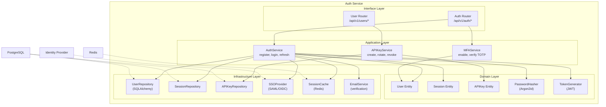

---

## 3. RBAC Engine — Components

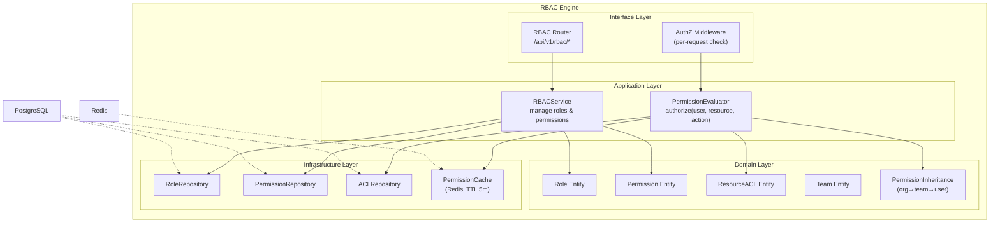

---

## 4. Agent Engine — Components

```mermaid
flowchart TB
    subgraph AgentEngine["Agent Engine"]
        direction TB
        subgraph Interface3["Interface Layer"]
            AGR["Agent Router<br/>/api/v1/agents/*"]
            WFR["Workflow Router<br/>/api/v1/workflows/*"]
            WS["WebSocket Handler<br/>/ws/v1/agents/*"]
        end
        
        subgraph Application3["Application Layer"]
            AGS["AgentService<br/>CRUD, execute"]
            WO["WorkflowOrchestrator<br/>DAG execution engine"]
            TM["ToolManager<br/>tool registry & invocation"]
        end
        
        subgraph Domain3["Domain Layer"]
            AGE["Agent Entity"]
            WFE["Workflow Entity"]
            DAG["DAGDefinition<br/>nodes, edges, validation"]
            EXE["Execution Entity"]
            STEP["StepExecution Entity"]
            GR["Guardrails<br/>output validation"]
            CB["CostBudget<br/>per-execution limits"]
        end
        
        subgraph Infrastructure3["Infrastructure Layer"]
            AGR2["AgentRepository"]
            WFR2["WorkflowRepository"]
            EXR["ExecutionRepository"]
            LLM["LLM Provider Registry<br/>(OpenAI, Anthropic, etc.)"]
            FC["FallbackChain<br/>(with circuit breakers)"]
            TR["ToolRegistry<br/>(built-in + custom)"]
            ES["Event Stream<br/>(Redis Streams)"]
        end
    end

    AGR --> AGS
    WFR --> WO
    WS --> WO
    AGS --> AGE
    WO --> WFE
    WO --> DAG
    WO --> EXE
    WO --> STEP
    WO --> GR
    WO --> CB
    WO --> TM
    AGS --> AGR2
    WO --> WFR2
    WO --> EXR
    WO --> FC
    TM --> TR
    WO --> ES

    FC --> LLM
    PG3["PostgreSQL"] -.-> AGR2
    PG3 -.-> WFR2
    PG3 -.-> EXR
    REDIS3["Redis"] -.-> ES
    EXTLLM["LLM APIs"] -.-> LLM
```

---

## 5. RAG Service — Components

```mermaid
flowchart TB
    subgraph RAGService["RAG Service"]
        direction TB
        subgraph Interface4["Interface Layer"]
            DR["Document Router<br/>/api/v1/documents/*"]
            SR2["Search Router<br/>/api/v1/rag/search"]
            KBR["KB Router<br/>/api/v1/rag/knowledge-bases/*"]
        end
        
        subgraph Application4["Application Layer"]
            IS["IngestionService<br/>parse, chunk, embed, store"]
            RS2["RetrievalService<br/>search, rank, cite"]
            KBS["KBManagementService<br/>create, version, rollback"]
            ES2["EvaluationService<br/>RAGAS metrics"]
        end
        
        subgraph Domain4["Domain Layer"]
            KBE["KnowledgeBase Entity"]
            DE["Document Entity"]
            CE["Chunk Entity"]
            CIT["Citation Value Object"]
            CS2["ChunkingStrategy<br/>(fixed, semantic, recursive)"]
        end
        
        subgraph Infrastructure4["Infrastructure Layer"]
            DR2["DocumentRepository"]
            CR["ChunkRepository"]
            VS["VectorStore<br/>(pgvector / Qdrant)"]
            EP["EmbeddingProvider<br/>(OpenAI / local)"]
            DP["DocumentParsers<br/>(PDF, DOCX, HTML, MD)"]
            OS["ObjectStore<br/>(S3 / MinIO)"]
            BM["BM25Index<br/>(keyword search)"]
            RRF["RRF Ranker<br/>(fusion)"]
            AV["AntiVirus<br/>(ClamAV)"]
        end
    end

    DR --> IS
    SR2 --> RS2
    KBR --> KBS
    IS --> DE
    IS --> CE
    IS --> CS2
    RS2 --> CIT
    RS2 --> VS
    RS2 --> BM
    RS2 --> RRF
    IS --> DP
    IS --> EP
    IS --> VS
    IS --> OS
    IS --> AV
    ES2 --> RS2
    IS --> DR2
    IS --> CR

    PG4["PostgreSQL"] -.-> DR2
    PG4 -.-> CR
    PGVEC["pgvector"] -.-> VS
    S3["Object Store"] -.-> OS
    EMBAPI["Embedding API"] -.-> EP
```

---

## 6. Voice Service — Components

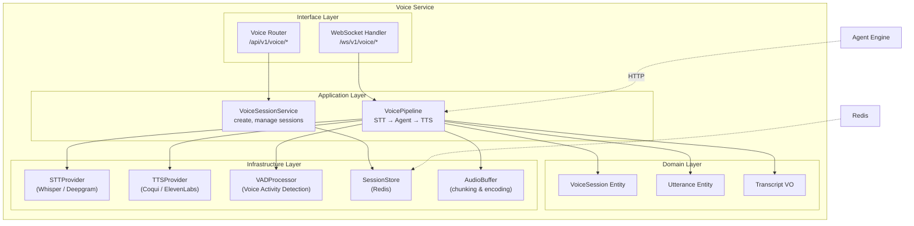

---

## 7. Multimodal Service — Components

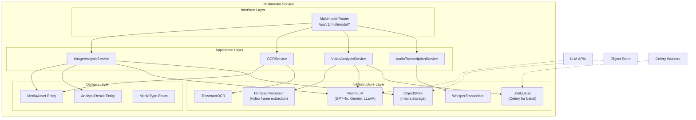

---

## 8. Edge Manager — Components

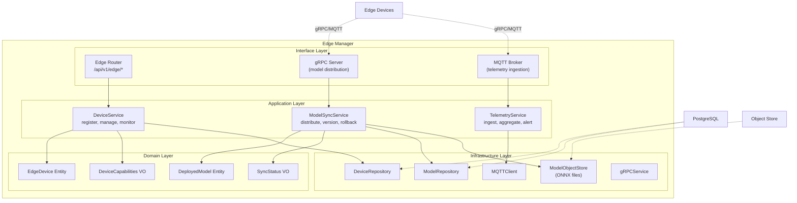

---

## 9. MLOps Service — Components

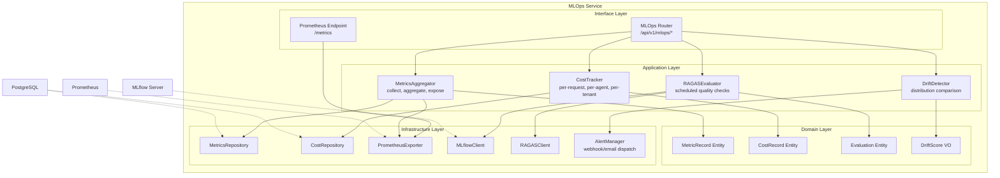

---

## 10. Audit Service — Components

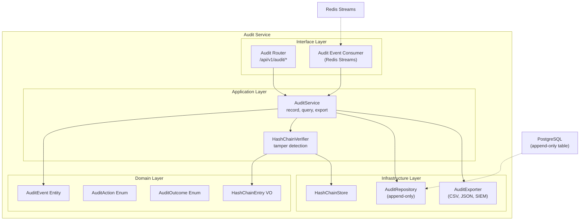

---

## 11. Frontend — Component Architecture

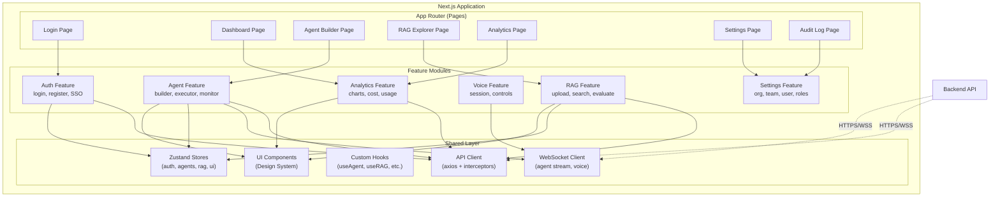

---

## 12. Cross-Cutting: Observability Pipeline

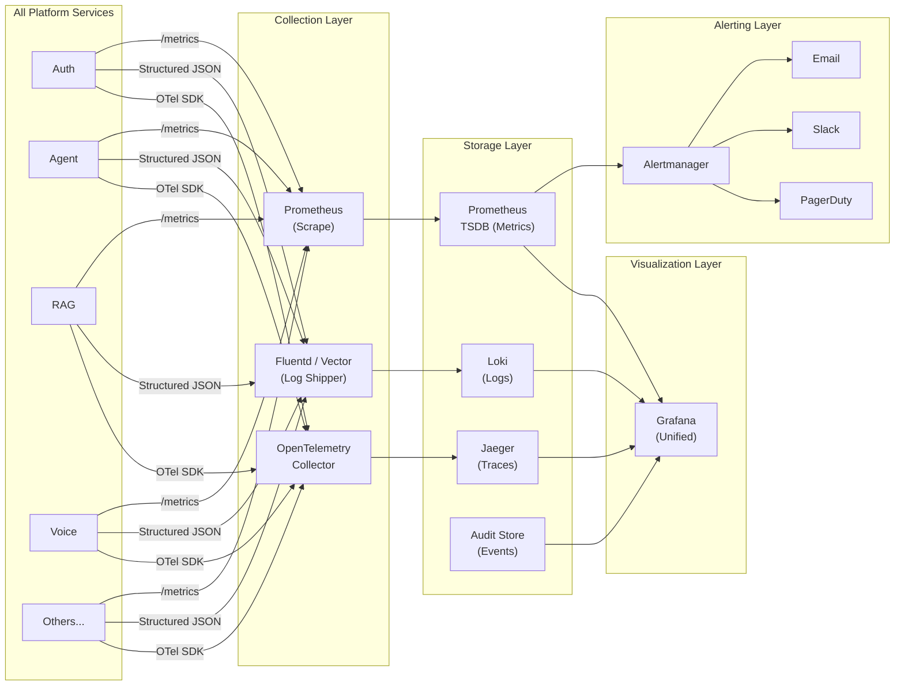

---

*Document Owner: Solutions Architect*  
*Next Review: Upon stakeholder approval of Phase 2*
