# Sequence Diagrams

**Product:** Enterprise AI Operations Center  
**Version:** 1.0  
**Date:** 2026-06-13  
**Classification:** Internal — Confidential  
**Status:** Draft — Awaiting Approval

---

## 1. Overview

This document provides sequence diagrams for all critical flows in the platform. Each diagram captures the happy path plus key error/edge cases.

---

## 2. User Registration Flow

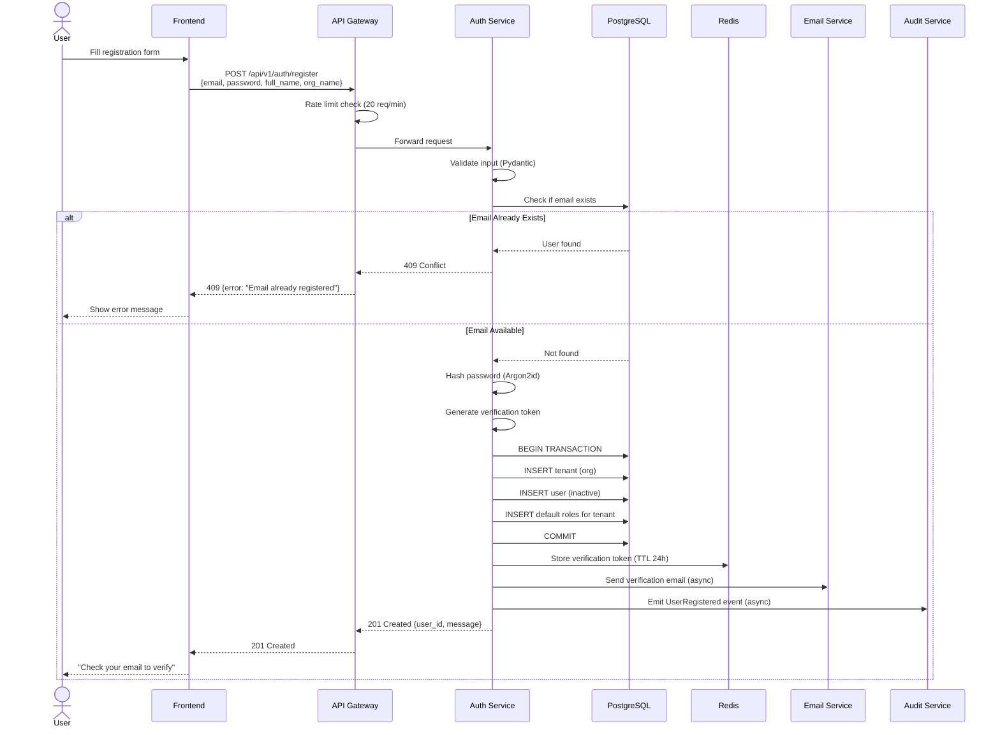

---

## 3. SSO Login Flow (SAML 2.0)

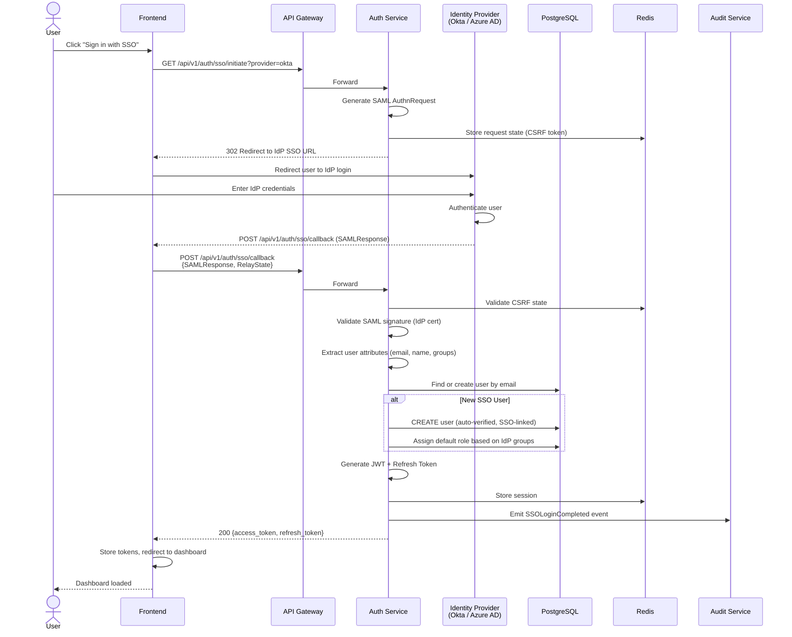

---

## 4. Agent Workflow Execution Flow

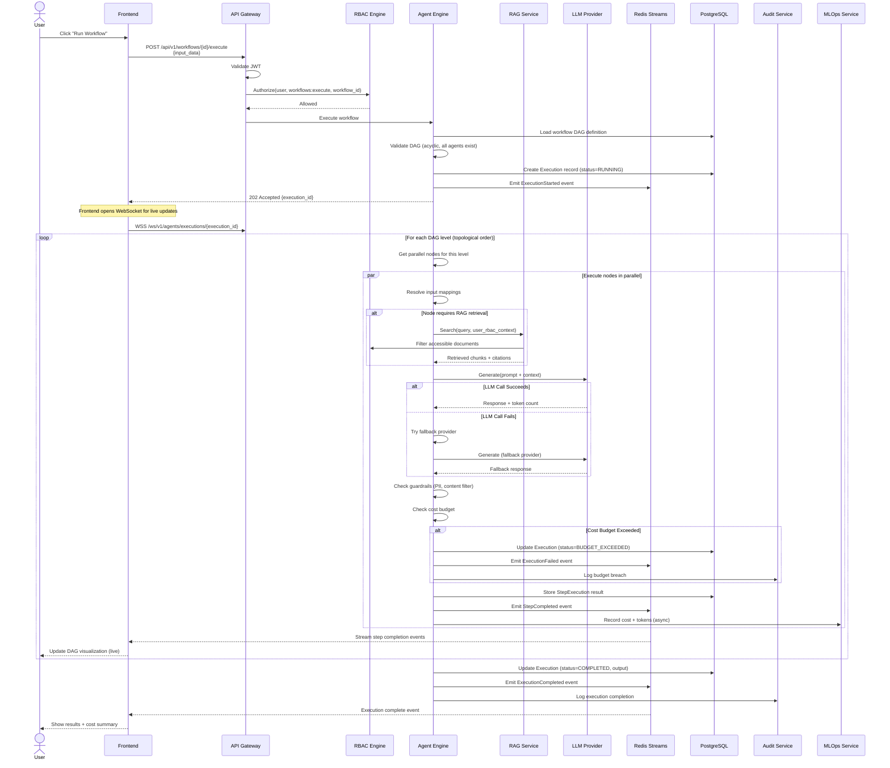

---

## 5. Human-in-the-Loop Approval Flow

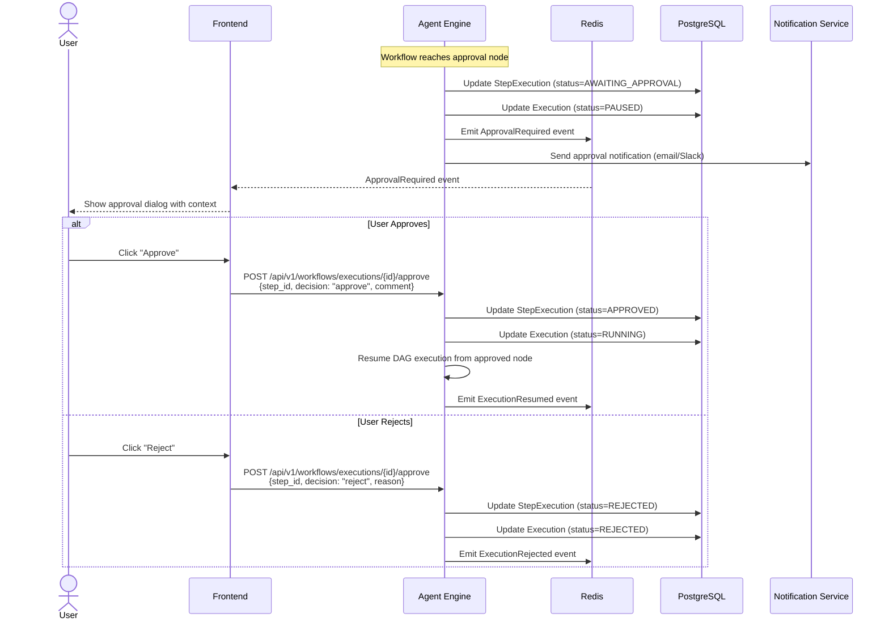

---

## 6. RAG Document Ingestion Flow

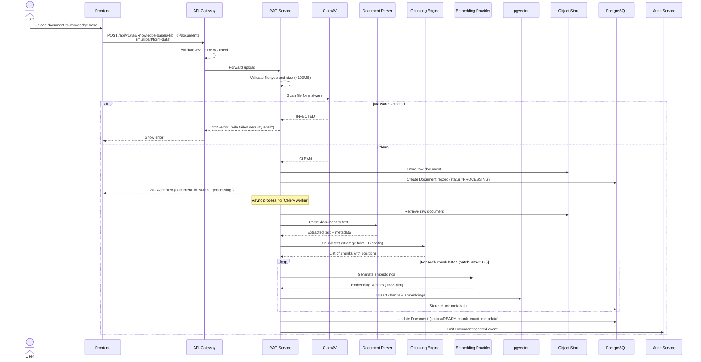

---

## 7. RAG Retrieval with RBAC Flow

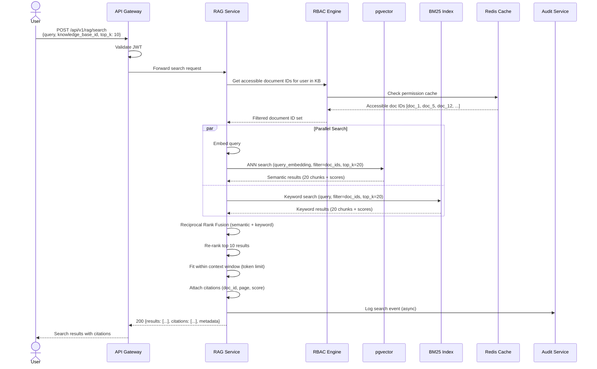

---

## 8. Voice Conversation Flow

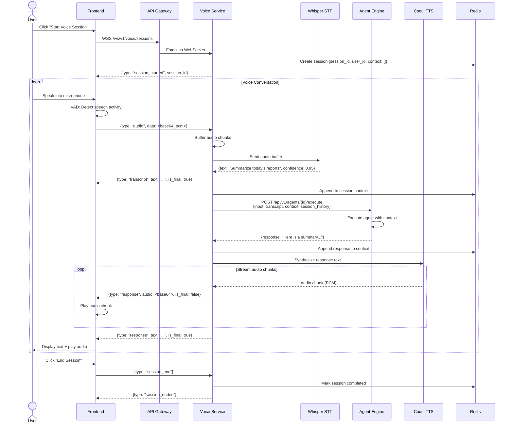

---

## 9. Edge Model Sync Flow

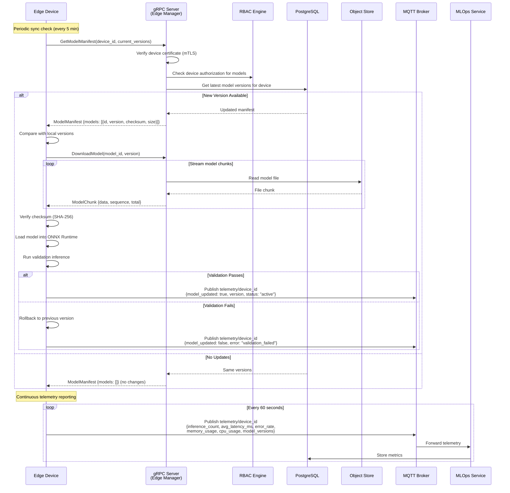

---

## 10. Token Refresh Flow

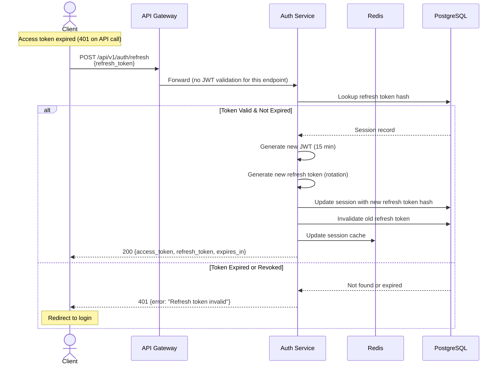

---

## 11. Cost Budget Enforcement Flow

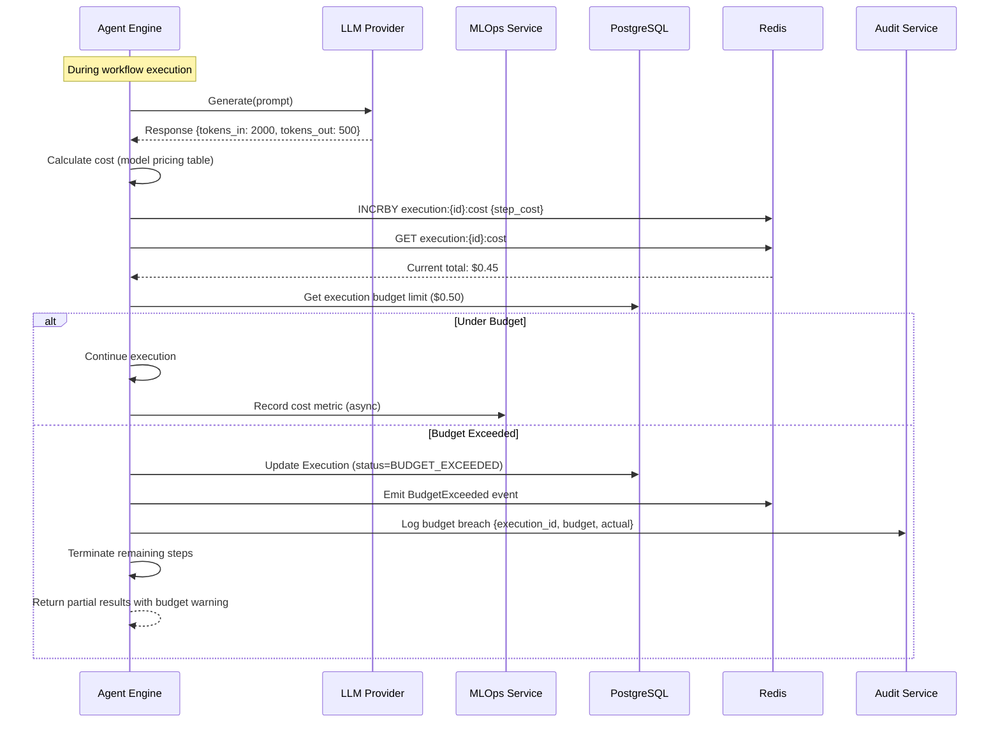

---

## 12. Audit Hash Chain Integrity Flow

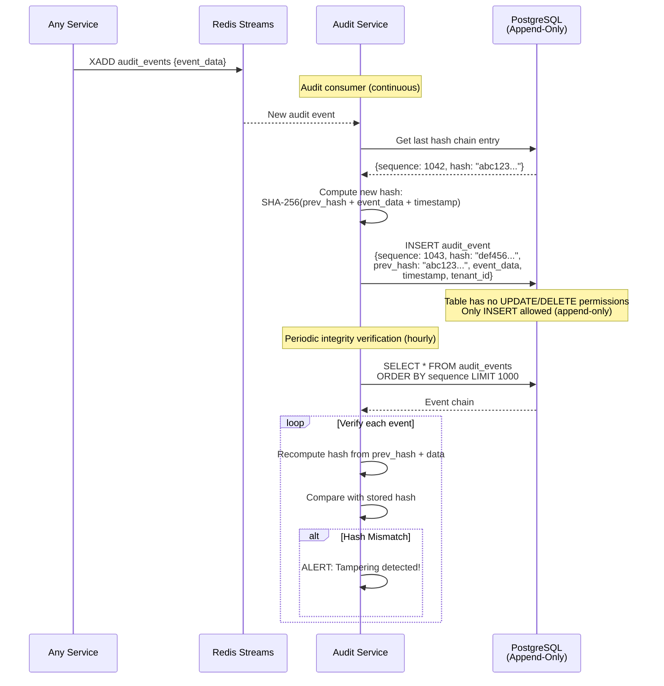

---

## 13. Multi-Agent Communication Flow

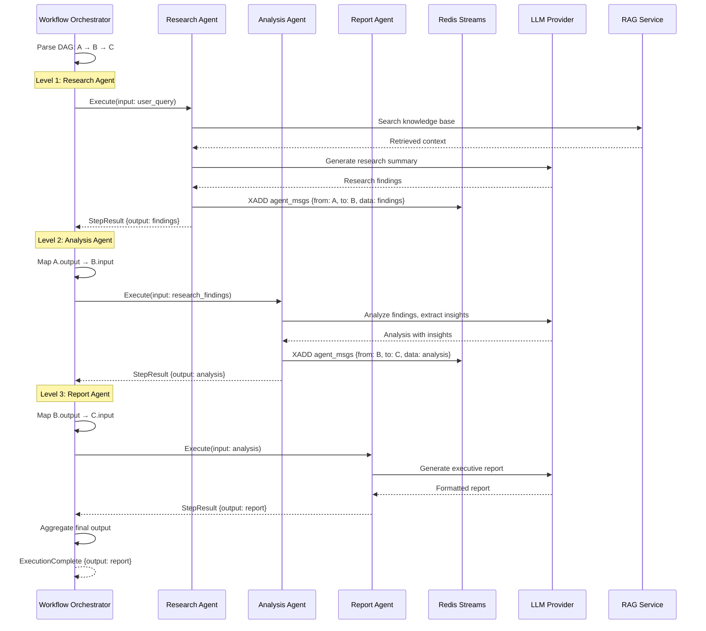

---

*Document Owner: Solutions Architect*  
*Next Review: Upon stakeholder approval of Phase 2*
