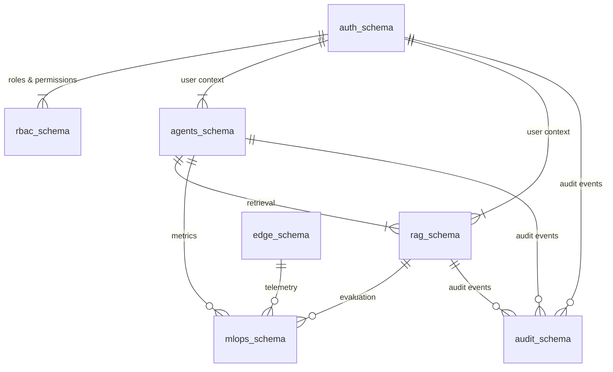
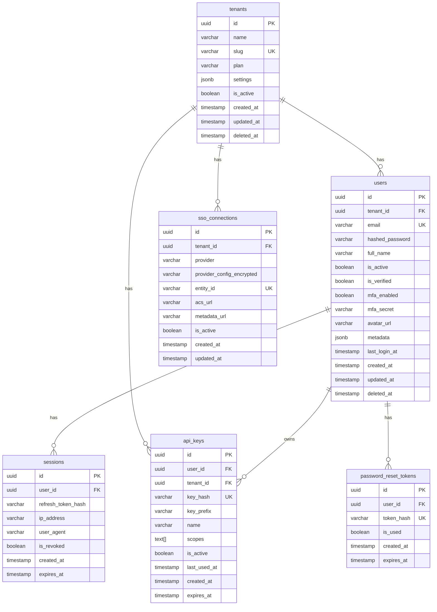
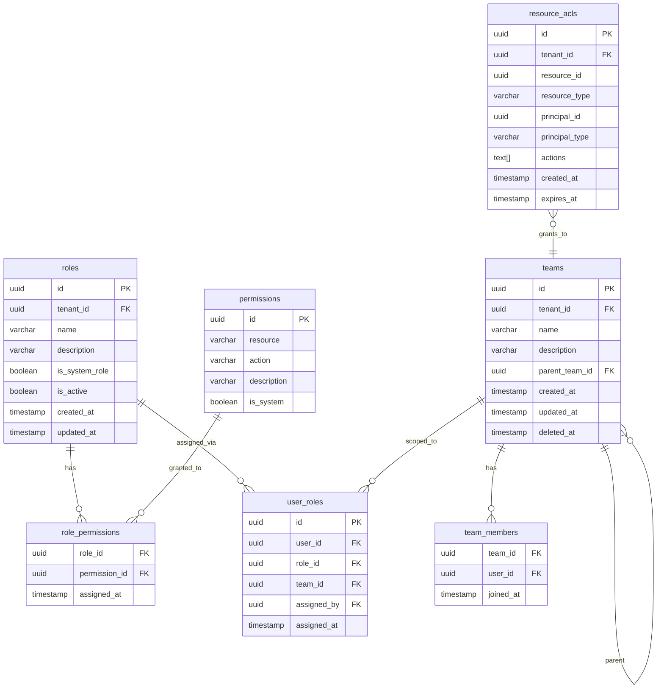
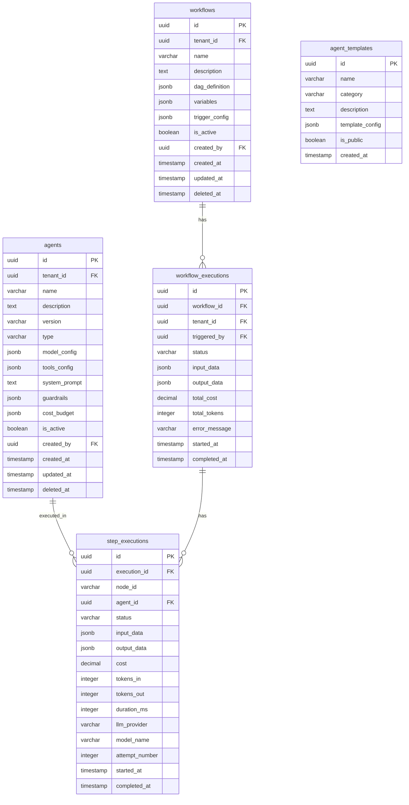
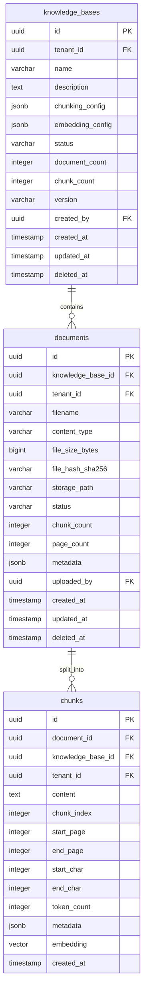

# Database Design

**Product:** Enterprise AI Operations Center  
**Version:** 1.0  
**Date:** 2026-06-13  
**Classification:** Internal — Confidential  
**Status:** Draft — Awaiting Approval

---

## 1. Database Strategy Overview

### 1.1 Design Principles

| Principle | Implementation |
|---|---|
| **Multi-Tenancy** | Shared database, shared schema with `tenant_id` column + PostgreSQL Row-Level Security (RLS) |
| **Schema Isolation** | Each bounded context owns its own schema within a shared PostgreSQL cluster |
| **Immutable Audit** | Audit tables use append-only pattern with no UPDATE/DELETE grants |
| **Soft Deletes** | All entity tables use `deleted_at` timestamp instead of physical deletes |
| **UUID Primary Keys** | All tables use UUIDv7 (time-sorted) for globally unique, sortable identifiers |
| **Temporal Tracking** | All tables have `created_at` and `updated_at` timestamps |
| **Normalization** | 3NF minimum; denormalization only for proven performance needs |
| **Foreign Keys** | Enforced within schemas; cross-schema references use application-level integrity |

### 1.2 PostgreSQL Configuration

| Parameter | Value | Rationale |
|---|---|---|
| Version | 15+ | pgvector support, improved JSONB, RLS performance |
| Extensions | pgvector, pgcrypto, pg_trgm, btree_gin | Vector search, encryption, fuzzy text, composite indexes |
| Connection Pool | PgBouncer (transaction mode) | Reduce connection overhead |
| Max Connections | 200 (per instance) | Balanced for K8s pod scaling |
| Shared Buffers | 25% of RAM | PostgreSQL recommended |
| Work Mem | 256MB | Complex queries with sorting |
| WAL Level | replica | Enable streaming replication |
| Replication | 1 primary + 2 read replicas | HA + read scaling |

---

## 2. Schema Overview



```
PostgreSQL Cluster
├── Schema: auth          (Users, Sessions, API Keys, Tenants)
├── Schema: rbac          (Roles, Permissions, Policies, ACLs)
├── Schema: agents        (Agents, Workflows, Executions, Steps)
├── Schema: rag           (Knowledge Bases, Documents, Chunks, Embeddings)
├── Schema: multimodal    (Media Assets, Analysis Results)
├── Schema: voice         (Voice Sessions, Utterances)
├── Schema: edge          (Devices, Deployed Models, Sync State)
├── Schema: mlops         (Metrics, Cost Records, Evaluations, Experiments)
└── Schema: audit         (Audit Events — append-only)
```

---

## 3. Auth Schema

### 3.1 ER Diagram



### 3.2 Table DDL

```sql
-- Schema: auth
CREATE SCHEMA IF NOT EXISTS auth;

-- Enable required extensions
CREATE EXTENSION IF NOT EXISTS "pgcrypto";
CREATE EXTENSION IF NOT EXISTS "pg_trgm";

-- Tenants
CREATE TABLE auth.tenants (
    id              UUID PRIMARY KEY DEFAULT gen_random_uuid(),
    name            VARCHAR(255) NOT NULL,
    slug            VARCHAR(100) NOT NULL UNIQUE,
    plan            VARCHAR(50) NOT NULL DEFAULT 'free',
    settings        JSONB NOT NULL DEFAULT '{}',
    is_active       BOOLEAN NOT NULL DEFAULT true,
    created_at      TIMESTAMPTZ NOT NULL DEFAULT NOW(),
    updated_at      TIMESTAMPTZ NOT NULL DEFAULT NOW(),
    deleted_at      TIMESTAMPTZ
);

CREATE INDEX idx_tenants_slug ON auth.tenants(slug) WHERE deleted_at IS NULL;
CREATE INDEX idx_tenants_plan ON auth.tenants(plan) WHERE deleted_at IS NULL;

-- Users
CREATE TABLE auth.users (
    id              UUID PRIMARY KEY DEFAULT gen_random_uuid(),
    tenant_id       UUID NOT NULL REFERENCES auth.tenants(id),
    email           VARCHAR(320) NOT NULL,
    hashed_password VARCHAR(255),  -- NULL for SSO-only users
    full_name       VARCHAR(255) NOT NULL,
    is_active       BOOLEAN NOT NULL DEFAULT false,
    is_verified     BOOLEAN NOT NULL DEFAULT false,
    mfa_enabled     BOOLEAN NOT NULL DEFAULT false,
    mfa_secret      VARCHAR(255),  -- Encrypted TOTP secret
    avatar_url      VARCHAR(2048),
    metadata        JSONB NOT NULL DEFAULT '{}',
    last_login_at   TIMESTAMPTZ,
    created_at      TIMESTAMPTZ NOT NULL DEFAULT NOW(),
    updated_at      TIMESTAMPTZ NOT NULL DEFAULT NOW(),
    deleted_at      TIMESTAMPTZ,

    CONSTRAINT uq_users_email_tenant UNIQUE (tenant_id, email)
);

CREATE INDEX idx_users_tenant ON auth.users(tenant_id) WHERE deleted_at IS NULL;
CREATE INDEX idx_users_email ON auth.users(email) WHERE deleted_at IS NULL;
CREATE INDEX idx_users_active ON auth.users(tenant_id, is_active) WHERE deleted_at IS NULL;

-- Sessions
CREATE TABLE auth.sessions (
    id                  UUID PRIMARY KEY DEFAULT gen_random_uuid(),
    user_id             UUID NOT NULL REFERENCES auth.users(id),
    refresh_token_hash  VARCHAR(255) NOT NULL,
    ip_address          INET,
    user_agent          TEXT,
    is_revoked          BOOLEAN NOT NULL DEFAULT false,
    created_at          TIMESTAMPTZ NOT NULL DEFAULT NOW(),
    expires_at          TIMESTAMPTZ NOT NULL
);

CREATE INDEX idx_sessions_user ON auth.sessions(user_id) WHERE is_revoked = false;
CREATE INDEX idx_sessions_expires ON auth.sessions(expires_at) WHERE is_revoked = false;

-- API Keys
CREATE TABLE auth.api_keys (
    id              UUID PRIMARY KEY DEFAULT gen_random_uuid(),
    user_id         UUID NOT NULL REFERENCES auth.users(id),
    tenant_id       UUID NOT NULL REFERENCES auth.tenants(id),
    key_hash        VARCHAR(255) NOT NULL UNIQUE,
    key_prefix      VARCHAR(12) NOT NULL,  -- e.g., "eaioc_sk_..."
    name            VARCHAR(255) NOT NULL,
    scopes          TEXT[] NOT NULL DEFAULT '{}',
    is_active       BOOLEAN NOT NULL DEFAULT true,
    last_used_at    TIMESTAMPTZ,
    created_at      TIMESTAMPTZ NOT NULL DEFAULT NOW(),
    expires_at      TIMESTAMPTZ
);

CREATE INDEX idx_api_keys_hash ON auth.api_keys(key_hash) WHERE is_active = true;
CREATE INDEX idx_api_keys_user ON auth.api_keys(user_id) WHERE is_active = true;
CREATE INDEX idx_api_keys_tenant ON auth.api_keys(tenant_id) WHERE is_active = true;

-- SSO Connections
CREATE TABLE auth.sso_connections (
    id                          UUID PRIMARY KEY DEFAULT gen_random_uuid(),
    tenant_id                   UUID NOT NULL REFERENCES auth.tenants(id),
    provider                    VARCHAR(50) NOT NULL,  -- 'saml', 'oidc'
    provider_config_encrypted   TEXT NOT NULL,  -- AES-256 encrypted JSON
    entity_id                   VARCHAR(512) UNIQUE,
    acs_url                     VARCHAR(2048),
    metadata_url                VARCHAR(2048),
    is_active                   BOOLEAN NOT NULL DEFAULT true,
    created_at                  TIMESTAMPTZ NOT NULL DEFAULT NOW(),
    updated_at                  TIMESTAMPTZ NOT NULL DEFAULT NOW()
);

CREATE INDEX idx_sso_tenant ON auth.sso_connections(tenant_id) WHERE is_active = true;

-- Password Reset Tokens
CREATE TABLE auth.password_reset_tokens (
    id              UUID PRIMARY KEY DEFAULT gen_random_uuid(),
    user_id         UUID NOT NULL REFERENCES auth.users(id),
    token_hash      VARCHAR(255) NOT NULL UNIQUE,
    is_used         BOOLEAN NOT NULL DEFAULT false,
    created_at      TIMESTAMPTZ NOT NULL DEFAULT NOW(),
    expires_at      TIMESTAMPTZ NOT NULL
);

CREATE INDEX idx_prt_token ON auth.password_reset_tokens(token_hash) WHERE is_used = false;

-- Row-Level Security
ALTER TABLE auth.users ENABLE ROW LEVEL SECURITY;
ALTER TABLE auth.api_keys ENABLE ROW LEVEL SECURITY;
ALTER TABLE auth.sessions ENABLE ROW LEVEL SECURITY;
ALTER TABLE auth.sso_connections ENABLE ROW LEVEL SECURITY;

CREATE POLICY tenant_isolation_users ON auth.users
    USING (tenant_id = current_setting('app.current_tenant_id')::uuid);

CREATE POLICY tenant_isolation_api_keys ON auth.api_keys
    USING (tenant_id = current_setting('app.current_tenant_id')::uuid);
```

---

## 4. RBAC Schema

### 4.1 ER Diagram



### 4.2 Table DDL

```sql
CREATE SCHEMA IF NOT EXISTS rbac;

-- Permissions (system-wide, not tenant-specific)
CREATE TABLE rbac.permissions (
    id              UUID PRIMARY KEY DEFAULT gen_random_uuid(),
    resource        VARCHAR(100) NOT NULL,    -- e.g., 'agents', 'rag', 'voice'
    action          VARCHAR(100) NOT NULL,    -- e.g., 'create', 'read', 'update', 'delete', 'execute'
    description     TEXT,
    is_system       BOOLEAN NOT NULL DEFAULT true,

    CONSTRAINT uq_permission UNIQUE (resource, action)
);

-- Roles
CREATE TABLE rbac.roles (
    id              UUID PRIMARY KEY DEFAULT gen_random_uuid(),
    tenant_id       UUID NOT NULL REFERENCES auth.tenants(id),
    name            VARCHAR(100) NOT NULL,
    description     TEXT,
    is_system_role  BOOLEAN NOT NULL DEFAULT false,
    is_active       BOOLEAN NOT NULL DEFAULT true,
    created_at      TIMESTAMPTZ NOT NULL DEFAULT NOW(),
    updated_at      TIMESTAMPTZ NOT NULL DEFAULT NOW(),

    CONSTRAINT uq_role_name_tenant UNIQUE (tenant_id, name)
);

CREATE INDEX idx_roles_tenant ON rbac.roles(tenant_id) WHERE is_active = true;

-- Role-Permission mapping
CREATE TABLE rbac.role_permissions (
    role_id         UUID NOT NULL REFERENCES rbac.roles(id) ON DELETE CASCADE,
    permission_id   UUID NOT NULL REFERENCES rbac.permissions(id) ON DELETE CASCADE,
    assigned_at     TIMESTAMPTZ NOT NULL DEFAULT NOW(),

    PRIMARY KEY (role_id, permission_id)
);

-- Teams (hierarchical)
CREATE TABLE rbac.teams (
    id              UUID PRIMARY KEY DEFAULT gen_random_uuid(),
    tenant_id       UUID NOT NULL REFERENCES auth.tenants(id),
    name            VARCHAR(255) NOT NULL,
    description     TEXT,
    parent_team_id  UUID REFERENCES rbac.teams(id),
    created_at      TIMESTAMPTZ NOT NULL DEFAULT NOW(),
    updated_at      TIMESTAMPTZ NOT NULL DEFAULT NOW(),
    deleted_at      TIMESTAMPTZ,

    CONSTRAINT uq_team_name_tenant UNIQUE (tenant_id, name)
);

CREATE INDEX idx_teams_tenant ON rbac.teams(tenant_id) WHERE deleted_at IS NULL;
CREATE INDEX idx_teams_parent ON rbac.teams(parent_team_id) WHERE deleted_at IS NULL;

-- Team Members
CREATE TABLE rbac.team_members (
    team_id         UUID NOT NULL REFERENCES rbac.teams(id) ON DELETE CASCADE,
    user_id         UUID NOT NULL REFERENCES auth.users(id) ON DELETE CASCADE,
    joined_at       TIMESTAMPTZ NOT NULL DEFAULT NOW(),

    PRIMARY KEY (team_id, user_id)
);

-- User Roles (scoped to team)
CREATE TABLE rbac.user_roles (
    id              UUID PRIMARY KEY DEFAULT gen_random_uuid(),
    user_id         UUID NOT NULL REFERENCES auth.users(id) ON DELETE CASCADE,
    role_id         UUID NOT NULL REFERENCES rbac.roles(id) ON DELETE CASCADE,
    team_id         UUID REFERENCES rbac.teams(id),  -- NULL = org-level assignment
    assigned_by     UUID REFERENCES auth.users(id),
    assigned_at     TIMESTAMPTZ NOT NULL DEFAULT NOW(),

    CONSTRAINT uq_user_role_team UNIQUE (user_id, role_id, team_id)
);

CREATE INDEX idx_user_roles_user ON rbac.user_roles(user_id);
CREATE INDEX idx_user_roles_role ON rbac.user_roles(role_id);

-- Resource-level ACLs
CREATE TABLE rbac.resource_acls (
    id              UUID PRIMARY KEY DEFAULT gen_random_uuid(),
    tenant_id       UUID NOT NULL REFERENCES auth.tenants(id),
    resource_id     UUID NOT NULL,
    resource_type   VARCHAR(100) NOT NULL,    -- 'document', 'agent', 'knowledge_base'
    principal_id    UUID NOT NULL,
    principal_type  VARCHAR(20) NOT NULL,     -- 'user', 'team', 'role'
    actions         TEXT[] NOT NULL,           -- ['read', 'write', 'delete']
    created_at      TIMESTAMPTZ NOT NULL DEFAULT NOW(),
    expires_at      TIMESTAMPTZ,

    CONSTRAINT uq_acl UNIQUE (resource_id, resource_type, principal_id, principal_type)
);

CREATE INDEX idx_acl_resource ON rbac.resource_acls(resource_id, resource_type);
CREATE INDEX idx_acl_principal ON rbac.resource_acls(principal_id, principal_type);
CREATE INDEX idx_acl_tenant ON rbac.resource_acls(tenant_id);

-- RLS
ALTER TABLE rbac.roles ENABLE ROW LEVEL SECURITY;
ALTER TABLE rbac.teams ENABLE ROW LEVEL SECURITY;
ALTER TABLE rbac.resource_acls ENABLE ROW LEVEL SECURITY;

CREATE POLICY tenant_isolation_roles ON rbac.roles
    USING (tenant_id = current_setting('app.current_tenant_id')::uuid);

CREATE POLICY tenant_isolation_teams ON rbac.teams
    USING (tenant_id = current_setting('app.current_tenant_id')::uuid);

CREATE POLICY tenant_isolation_acls ON rbac.resource_acls
    USING (tenant_id = current_setting('app.current_tenant_id')::uuid);

-- Seed system permissions
INSERT INTO rbac.permissions (resource, action, description) VALUES
    ('agents', 'create', 'Create new agents'),
    ('agents', 'read', 'View agent configurations'),
    ('agents', 'update', 'Modify agent configurations'),
    ('agents', 'delete', 'Delete agents'),
    ('agents', 'execute', 'Execute agent workflows'),
    ('rag', 'create', 'Create knowledge bases and upload documents'),
    ('rag', 'read', 'View documents and search'),
    ('rag', 'update', 'Modify knowledge base settings'),
    ('rag', 'delete', 'Delete documents and knowledge bases'),
    ('rag', 'search', 'Search knowledge bases'),
    ('voice', 'use', 'Use voice interface'),
    ('voice', 'manage', 'Configure voice settings'),
    ('multimodal', 'use', 'Use multimodal analysis'),
    ('multimodal', 'manage', 'Configure multimodal settings'),
    ('edge', 'read', 'View edge devices'),
    ('edge', 'manage', 'Manage edge devices and models'),
    ('rbac', 'manage', 'Manage roles and permissions'),
    ('users', 'read', 'View users'),
    ('users', 'manage', 'Manage users'),
    ('users', 'team_manage', 'Manage team members'),
    ('audit', 'read', 'View audit logs'),
    ('billing', 'read', 'View billing information'),
    ('billing', 'manage', 'Manage billing settings');
```

---

## 5. Agents Schema

### 5.1 ER Diagram



### 5.2 Table DDL

```sql
CREATE SCHEMA IF NOT EXISTS agents;

-- Agents
CREATE TABLE agents.agents (
    id              UUID PRIMARY KEY DEFAULT gen_random_uuid(),
    tenant_id       UUID NOT NULL REFERENCES auth.tenants(id),
    name            VARCHAR(255) NOT NULL,
    description     TEXT,
    version         VARCHAR(20) NOT NULL DEFAULT '1.0.0',
    type            VARCHAR(50) NOT NULL DEFAULT 'conversational',
    model_config    JSONB NOT NULL DEFAULT '{}',
    tools_config    JSONB NOT NULL DEFAULT '[]',
    system_prompt   TEXT,
    guardrails      JSONB NOT NULL DEFAULT '{}',
    cost_budget     JSONB NOT NULL DEFAULT '{"max_cost_per_execution": 1.0, "max_tokens_per_execution": 100000}',
    is_active       BOOLEAN NOT NULL DEFAULT true,
    created_by      UUID NOT NULL REFERENCES auth.users(id),
    created_at      TIMESTAMPTZ NOT NULL DEFAULT NOW(),
    updated_at      TIMESTAMPTZ NOT NULL DEFAULT NOW(),
    deleted_at      TIMESTAMPTZ,

    CONSTRAINT uq_agent_name_tenant UNIQUE (tenant_id, name, version)
);

CREATE INDEX idx_agents_tenant ON agents.agents(tenant_id) WHERE deleted_at IS NULL;
CREATE INDEX idx_agents_type ON agents.agents(tenant_id, type) WHERE deleted_at IS NULL;
CREATE INDEX idx_agents_created_by ON agents.agents(created_by) WHERE deleted_at IS NULL;

-- Workflows
CREATE TABLE agents.workflows (
    id              UUID PRIMARY KEY DEFAULT gen_random_uuid(),
    tenant_id       UUID NOT NULL REFERENCES auth.tenants(id),
    name            VARCHAR(255) NOT NULL,
    description     TEXT,
    dag_definition  JSONB NOT NULL,
    variables       JSONB NOT NULL DEFAULT '{}',
    trigger_config  JSONB NOT NULL DEFAULT '{}',
    is_active       BOOLEAN NOT NULL DEFAULT true,
    created_by      UUID NOT NULL REFERENCES auth.users(id),
    created_at      TIMESTAMPTZ NOT NULL DEFAULT NOW(),
    updated_at      TIMESTAMPTZ NOT NULL DEFAULT NOW(),
    deleted_at      TIMESTAMPTZ,

    CONSTRAINT uq_workflow_name_tenant UNIQUE (tenant_id, name)
);

CREATE INDEX idx_workflows_tenant ON agents.workflows(tenant_id) WHERE deleted_at IS NULL;

-- Workflow Executions
CREATE TABLE agents.workflow_executions (
    id              UUID PRIMARY KEY DEFAULT gen_random_uuid(),
    workflow_id     UUID NOT NULL REFERENCES agents.workflows(id),
    tenant_id       UUID NOT NULL REFERENCES auth.tenants(id),
    triggered_by    UUID NOT NULL REFERENCES auth.users(id),
    status          VARCHAR(30) NOT NULL DEFAULT 'pending',
    input_data      JSONB NOT NULL DEFAULT '{}',
    output_data     JSONB,
    total_cost      DECIMAL(12, 6) NOT NULL DEFAULT 0,
    total_tokens    INTEGER NOT NULL DEFAULT 0,
    error_message   TEXT,
    started_at      TIMESTAMPTZ NOT NULL DEFAULT NOW(),
    completed_at    TIMESTAMPTZ,

    CONSTRAINT chk_execution_status CHECK (status IN (
        'pending', 'running', 'paused', 'completed', 'failed', 
        'cancelled', 'budget_exceeded', 'rejected', 'timeout'
    ))
);

CREATE INDEX idx_executions_workflow ON agents.workflow_executions(workflow_id);
CREATE INDEX idx_executions_tenant ON agents.workflow_executions(tenant_id);
CREATE INDEX idx_executions_status ON agents.workflow_executions(tenant_id, status);
CREATE INDEX idx_executions_started ON agents.workflow_executions(started_at DESC);
CREATE INDEX idx_executions_triggered_by ON agents.workflow_executions(triggered_by);

-- Step Executions
CREATE TABLE agents.step_executions (
    id              UUID PRIMARY KEY DEFAULT gen_random_uuid(),
    execution_id    UUID NOT NULL REFERENCES agents.workflow_executions(id) ON DELETE CASCADE,
    node_id         VARCHAR(100) NOT NULL,
    agent_id        UUID REFERENCES agents.agents(id),
    status          VARCHAR(30) NOT NULL DEFAULT 'pending',
    input_data      JSONB NOT NULL DEFAULT '{}',
    output_data     JSONB,
    cost            DECIMAL(12, 6) NOT NULL DEFAULT 0,
    tokens_in       INTEGER NOT NULL DEFAULT 0,
    tokens_out      INTEGER NOT NULL DEFAULT 0,
    duration_ms     INTEGER,
    llm_provider    VARCHAR(50),
    model_name      VARCHAR(100),
    attempt_number  INTEGER NOT NULL DEFAULT 1,
    error_message   TEXT,
    started_at      TIMESTAMPTZ NOT NULL DEFAULT NOW(),
    completed_at    TIMESTAMPTZ,

    CONSTRAINT chk_step_status CHECK (status IN (
        'pending', 'running', 'completed', 'failed', 
        'awaiting_approval', 'approved', 'rejected', 'skipped', 'timeout'
    ))
);

CREATE INDEX idx_steps_execution ON agents.step_executions(execution_id);
CREATE INDEX idx_steps_agent ON agents.step_executions(agent_id);
CREATE INDEX idx_steps_status ON agents.step_executions(execution_id, status);

-- Agent Templates
CREATE TABLE agents.agent_templates (
    id              UUID PRIMARY KEY DEFAULT gen_random_uuid(),
    name            VARCHAR(255) NOT NULL UNIQUE,
    category        VARCHAR(100) NOT NULL,
    description     TEXT,
    template_config JSONB NOT NULL,
    is_public       BOOLEAN NOT NULL DEFAULT true,
    created_at      TIMESTAMPTZ NOT NULL DEFAULT NOW()
);

-- RLS
ALTER TABLE agents.agents ENABLE ROW LEVEL SECURITY;
ALTER TABLE agents.workflows ENABLE ROW LEVEL SECURITY;
ALTER TABLE agents.workflow_executions ENABLE ROW LEVEL SECURITY;

CREATE POLICY tenant_isolation_agents ON agents.agents
    USING (tenant_id = current_setting('app.current_tenant_id')::uuid);

CREATE POLICY tenant_isolation_workflows ON agents.workflows
    USING (tenant_id = current_setting('app.current_tenant_id')::uuid);

CREATE POLICY tenant_isolation_executions ON agents.workflow_executions
    USING (tenant_id = current_setting('app.current_tenant_id')::uuid);
```

---

## 6. RAG Schema

### 6.1 ER Diagram



### 6.2 Table DDL

```sql
CREATE SCHEMA IF NOT EXISTS rag;
CREATE EXTENSION IF NOT EXISTS vector;

-- Knowledge Bases
CREATE TABLE rag.knowledge_bases (
    id              UUID PRIMARY KEY DEFAULT gen_random_uuid(),
    tenant_id       UUID NOT NULL REFERENCES auth.tenants(id),
    name            VARCHAR(255) NOT NULL,
    description     TEXT,
    chunking_config JSONB NOT NULL DEFAULT '{"strategy": "recursive", "chunk_size": 512, "chunk_overlap": 50}',
    embedding_config JSONB NOT NULL DEFAULT '{"provider": "openai", "model": "text-embedding-3-small", "dimensions": 1536}',
    status          VARCHAR(30) NOT NULL DEFAULT 'active',
    document_count  INTEGER NOT NULL DEFAULT 0,
    chunk_count     INTEGER NOT NULL DEFAULT 0,
    version         VARCHAR(20) NOT NULL DEFAULT '1',
    created_by      UUID NOT NULL REFERENCES auth.users(id),
    created_at      TIMESTAMPTZ NOT NULL DEFAULT NOW(),
    updated_at      TIMESTAMPTZ NOT NULL DEFAULT NOW(),
    deleted_at      TIMESTAMPTZ,

    CONSTRAINT uq_kb_name_tenant UNIQUE (tenant_id, name)
);

CREATE INDEX idx_kb_tenant ON rag.knowledge_bases(tenant_id) WHERE deleted_at IS NULL;

-- Documents
CREATE TABLE rag.documents (
    id                  UUID PRIMARY KEY DEFAULT gen_random_uuid(),
    knowledge_base_id   UUID NOT NULL REFERENCES rag.knowledge_bases(id),
    tenant_id           UUID NOT NULL REFERENCES auth.tenants(id),
    filename            VARCHAR(512) NOT NULL,
    content_type        VARCHAR(100) NOT NULL,
    file_size_bytes     BIGINT NOT NULL,
    file_hash_sha256    VARCHAR(64) NOT NULL,
    storage_path        VARCHAR(1024) NOT NULL,
    status              VARCHAR(30) NOT NULL DEFAULT 'pending',
    chunk_count         INTEGER NOT NULL DEFAULT 0,
    page_count          INTEGER,
    metadata            JSONB NOT NULL DEFAULT '{}',
    uploaded_by         UUID NOT NULL REFERENCES auth.users(id),
    created_at          TIMESTAMPTZ NOT NULL DEFAULT NOW(),
    updated_at          TIMESTAMPTZ NOT NULL DEFAULT NOW(),
    deleted_at          TIMESTAMPTZ,

    CONSTRAINT chk_doc_status CHECK (status IN (
        'pending', 'processing', 'ready', 'failed', 'deleting'
    ))
);

CREATE INDEX idx_docs_kb ON rag.documents(knowledge_base_id) WHERE deleted_at IS NULL;
CREATE INDEX idx_docs_tenant ON rag.documents(tenant_id) WHERE deleted_at IS NULL;
CREATE INDEX idx_docs_status ON rag.documents(knowledge_base_id, status) WHERE deleted_at IS NULL;
CREATE INDEX idx_docs_hash ON rag.documents(file_hash_sha256);
CREATE INDEX idx_docs_metadata ON rag.documents USING gin(metadata);

-- Chunks (with vector embeddings)
CREATE TABLE rag.chunks (
    id                  UUID PRIMARY KEY DEFAULT gen_random_uuid(),
    document_id         UUID NOT NULL REFERENCES rag.documents(id) ON DELETE CASCADE,
    knowledge_base_id   UUID NOT NULL REFERENCES rag.knowledge_bases(id),
    tenant_id           UUID NOT NULL REFERENCES auth.tenants(id),
    content             TEXT NOT NULL,
    chunk_index         INTEGER NOT NULL,
    start_page          INTEGER,
    end_page            INTEGER,
    start_char          INTEGER NOT NULL,
    end_char            INTEGER NOT NULL,
    token_count         INTEGER NOT NULL,
    metadata            JSONB NOT NULL DEFAULT '{}',
    embedding           vector(1536),  -- OpenAI text-embedding-3-small dimensions
    created_at          TIMESTAMPTZ NOT NULL DEFAULT NOW()
);

-- HNSW index for approximate nearest neighbor search
CREATE INDEX idx_chunks_embedding ON rag.chunks
    USING hnsw (embedding vector_cosine_ops)
    WITH (m = 16, ef_construction = 64);

CREATE INDEX idx_chunks_document ON rag.chunks(document_id);
CREATE INDEX idx_chunks_kb ON rag.chunks(knowledge_base_id);
CREATE INDEX idx_chunks_tenant ON rag.chunks(tenant_id);
CREATE INDEX idx_chunks_metadata ON rag.chunks USING gin(metadata);

-- Full-text search index for BM25-style keyword search
ALTER TABLE rag.chunks ADD COLUMN content_tsvector tsvector
    GENERATED ALWAYS AS (to_tsvector('english', content)) STORED;
CREATE INDEX idx_chunks_fts ON rag.chunks USING gin(content_tsvector);

-- RLS
ALTER TABLE rag.knowledge_bases ENABLE ROW LEVEL SECURITY;
ALTER TABLE rag.documents ENABLE ROW LEVEL SECURITY;
ALTER TABLE rag.chunks ENABLE ROW LEVEL SECURITY;

CREATE POLICY tenant_isolation_kb ON rag.knowledge_bases
    USING (tenant_id = current_setting('app.current_tenant_id')::uuid);

CREATE POLICY tenant_isolation_docs ON rag.documents
    USING (tenant_id = current_setting('app.current_tenant_id')::uuid);

CREATE POLICY tenant_isolation_chunks ON rag.chunks
    USING (tenant_id = current_setting('app.current_tenant_id')::uuid);
```

---

## 7. Multimodal Schema

```sql
CREATE SCHEMA IF NOT EXISTS multimodal;

CREATE TABLE multimodal.media_assets (
    id              UUID PRIMARY KEY DEFAULT gen_random_uuid(),
    tenant_id       UUID NOT NULL REFERENCES auth.tenants(id),
    filename        VARCHAR(512) NOT NULL,
    media_type      VARCHAR(20) NOT NULL,  -- 'image', 'video', 'audio', 'document'
    content_type    VARCHAR(100) NOT NULL,
    file_size_bytes BIGINT NOT NULL,
    storage_path    VARCHAR(1024) NOT NULL,
    status          VARCHAR(30) NOT NULL DEFAULT 'uploaded',
    metadata        JSONB NOT NULL DEFAULT '{}',
    uploaded_by     UUID NOT NULL REFERENCES auth.users(id),
    created_at      TIMESTAMPTZ NOT NULL DEFAULT NOW(),
    deleted_at      TIMESTAMPTZ,

    CONSTRAINT chk_media_type CHECK (media_type IN ('image', 'video', 'audio', 'document'))
);

CREATE TABLE multimodal.analysis_results (
    id              UUID PRIMARY KEY DEFAULT gen_random_uuid(),
    media_asset_id  UUID NOT NULL REFERENCES multimodal.media_assets(id) ON DELETE CASCADE,
    tenant_id       UUID NOT NULL REFERENCES auth.tenants(id),
    analysis_type   VARCHAR(50) NOT NULL,   -- 'vision', 'ocr', 'transcription', 'frame_extraction'
    llm_provider    VARCHAR(50),
    model_name      VARCHAR(100),
    result_data     JSONB NOT NULL,
    cost            DECIMAL(12, 6) NOT NULL DEFAULT 0,
    duration_ms     INTEGER,
    created_at      TIMESTAMPTZ NOT NULL DEFAULT NOW()
);

CREATE INDEX idx_media_tenant ON multimodal.media_assets(tenant_id) WHERE deleted_at IS NULL;
CREATE INDEX idx_analysis_media ON multimodal.analysis_results(media_asset_id);
CREATE INDEX idx_analysis_tenant ON multimodal.analysis_results(tenant_id);

ALTER TABLE multimodal.media_assets ENABLE ROW LEVEL SECURITY;
ALTER TABLE multimodal.analysis_results ENABLE ROW LEVEL SECURITY;

CREATE POLICY tenant_isolation_media ON multimodal.media_assets
    USING (tenant_id = current_setting('app.current_tenant_id')::uuid);
CREATE POLICY tenant_isolation_analysis ON multimodal.analysis_results
    USING (tenant_id = current_setting('app.current_tenant_id')::uuid);
```

---

## 8. Voice Schema

```sql
CREATE SCHEMA IF NOT EXISTS voice;

CREATE TABLE voice.sessions (
    id              UUID PRIMARY KEY DEFAULT gen_random_uuid(),
    tenant_id       UUID NOT NULL REFERENCES auth.tenants(id),
    user_id         UUID NOT NULL REFERENCES auth.users(id),
    agent_id        UUID REFERENCES agents.agents(id),
    status          VARCHAR(20) NOT NULL DEFAULT 'active',
    stt_provider    VARCHAR(50) NOT NULL DEFAULT 'whisper',
    tts_provider    VARCHAR(50) NOT NULL DEFAULT 'coqui',
    language        VARCHAR(10) NOT NULL DEFAULT 'en',
    metadata        JSONB NOT NULL DEFAULT '{}',
    started_at      TIMESTAMPTZ NOT NULL DEFAULT NOW(),
    ended_at        TIMESTAMPTZ,

    CONSTRAINT chk_voice_status CHECK (status IN ('active', 'completed', 'error'))
);

CREATE TABLE voice.utterances (
    id              UUID PRIMARY KEY DEFAULT gen_random_uuid(),
    session_id      UUID NOT NULL REFERENCES voice.sessions(id) ON DELETE CASCADE,
    tenant_id       UUID NOT NULL REFERENCES auth.tenants(id),
    direction       VARCHAR(10) NOT NULL,  -- 'inbound' (user), 'outbound' (agent)
    transcript      TEXT NOT NULL,
    confidence      DECIMAL(5, 4),
    audio_duration_ms INTEGER,
    audio_storage_path VARCHAR(1024),  -- Optional: stored with consent
    sequence_number INTEGER NOT NULL,
    created_at      TIMESTAMPTZ NOT NULL DEFAULT NOW()
);

CREATE INDEX idx_voice_sessions_tenant ON voice.sessions(tenant_id);
CREATE INDEX idx_voice_sessions_user ON voice.sessions(user_id);
CREATE INDEX idx_utterances_session ON voice.utterances(session_id);

ALTER TABLE voice.sessions ENABLE ROW LEVEL SECURITY;
ALTER TABLE voice.utterances ENABLE ROW LEVEL SECURITY;

CREATE POLICY tenant_isolation_voice_sessions ON voice.sessions
    USING (tenant_id = current_setting('app.current_tenant_id')::uuid);
CREATE POLICY tenant_isolation_utterances ON voice.utterances
    USING (tenant_id = current_setting('app.current_tenant_id')::uuid);
```

---

## 9. Edge Schema

```sql
CREATE SCHEMA IF NOT EXISTS edge;

CREATE TABLE edge.devices (
    id                  UUID PRIMARY KEY DEFAULT gen_random_uuid(),
    tenant_id           UUID NOT NULL REFERENCES auth.tenants(id),
    device_name         VARCHAR(255) NOT NULL,
    device_type         VARCHAR(100) NOT NULL,   -- 'jetson_nano', 'jetson_orin', 'intel_ncs', 'generic_arm64'
    hardware_info       JSONB NOT NULL DEFAULT '{}',
    certificate_fingerprint VARCHAR(64) UNIQUE,
    ip_address          INET,
    status              VARCHAR(20) NOT NULL DEFAULT 'registered',
    last_heartbeat_at   TIMESTAMPTZ,
    firmware_version    VARCHAR(50),
    registered_by       UUID NOT NULL REFERENCES auth.users(id),
    created_at          TIMESTAMPTZ NOT NULL DEFAULT NOW(),
    updated_at          TIMESTAMPTZ NOT NULL DEFAULT NOW(),
    deleted_at          TIMESTAMPTZ,

    CONSTRAINT chk_device_status CHECK (status IN ('registered', 'online', 'offline', 'error', 'decommissioned')),
    CONSTRAINT uq_device_name_tenant UNIQUE (tenant_id, device_name)
);

CREATE TABLE edge.deployed_models (
    id              UUID PRIMARY KEY DEFAULT gen_random_uuid(),
    device_id       UUID NOT NULL REFERENCES edge.devices(id) ON DELETE CASCADE,
    tenant_id       UUID NOT NULL REFERENCES auth.tenants(id),
    model_name      VARCHAR(255) NOT NULL,
    model_version   VARCHAR(50) NOT NULL,
    model_format    VARCHAR(20) NOT NULL DEFAULT 'onnx',  -- 'onnx', 'tensorrt', 'tflite'
    model_size_bytes BIGINT NOT NULL,
    storage_path    VARCHAR(1024) NOT NULL,
    checksum_sha256 VARCHAR(64) NOT NULL,
    status          VARCHAR(20) NOT NULL DEFAULT 'downloading',
    inference_count BIGINT NOT NULL DEFAULT 0,
    avg_latency_ms  DECIMAL(10, 2),
    deployed_at     TIMESTAMPTZ NOT NULL DEFAULT NOW(),
    updated_at      TIMESTAMPTZ NOT NULL DEFAULT NOW(),

    CONSTRAINT chk_model_status CHECK (status IN ('downloading', 'validating', 'active', 'failed', 'rollback')),
    CONSTRAINT uq_device_model UNIQUE (device_id, model_name)
);

CREATE TABLE edge.telemetry (
    id              UUID PRIMARY KEY DEFAULT gen_random_uuid(),
    device_id       UUID NOT NULL REFERENCES edge.devices(id),
    tenant_id       UUID NOT NULL REFERENCES auth.tenants(id),
    cpu_usage       DECIMAL(5, 2),
    memory_usage    DECIMAL(5, 2),
    disk_usage      DECIMAL(5, 2),
    gpu_usage       DECIMAL(5, 2),
    inference_count INTEGER NOT NULL DEFAULT 0,
    avg_latency_ms  DECIMAL(10, 2),
    error_count     INTEGER NOT NULL DEFAULT 0,
    model_versions  JSONB NOT NULL DEFAULT '{}',
    recorded_at     TIMESTAMPTZ NOT NULL DEFAULT NOW()
);

-- Partition telemetry by month for performance
-- CREATE TABLE edge.telemetry_y2026m06 PARTITION OF edge.telemetry
--     FOR VALUES FROM ('2026-06-01') TO ('2026-07-01');

CREATE INDEX idx_devices_tenant ON edge.devices(tenant_id) WHERE deleted_at IS NULL;
CREATE INDEX idx_devices_status ON edge.devices(status) WHERE deleted_at IS NULL;
CREATE INDEX idx_deployed_models_device ON edge.deployed_models(device_id);
CREATE INDEX idx_telemetry_device ON edge.telemetry(device_id, recorded_at DESC);
CREATE INDEX idx_telemetry_tenant ON edge.telemetry(tenant_id, recorded_at DESC);

ALTER TABLE edge.devices ENABLE ROW LEVEL SECURITY;
ALTER TABLE edge.deployed_models ENABLE ROW LEVEL SECURITY;
ALTER TABLE edge.telemetry ENABLE ROW LEVEL SECURITY;

CREATE POLICY tenant_isolation_devices ON edge.devices
    USING (tenant_id = current_setting('app.current_tenant_id')::uuid);
CREATE POLICY tenant_isolation_deployed ON edge.deployed_models
    USING (tenant_id = current_setting('app.current_tenant_id')::uuid);
CREATE POLICY tenant_isolation_telemetry ON edge.telemetry
    USING (tenant_id = current_setting('app.current_tenant_id')::uuid);
```

---

## 10. MLOps Schema

```sql
CREATE SCHEMA IF NOT EXISTS mlops;

-- Cost records (per LLM call)
CREATE TABLE mlops.cost_records (
    id              UUID PRIMARY KEY DEFAULT gen_random_uuid(),
    tenant_id       UUID NOT NULL REFERENCES auth.tenants(id),
    user_id         UUID REFERENCES auth.users(id),
    team_id         UUID REFERENCES rbac.teams(id),
    agent_id        UUID REFERENCES agents.agents(id),
    execution_id    UUID REFERENCES agents.workflow_executions(id),
    llm_provider    VARCHAR(50) NOT NULL,
    model_name      VARCHAR(100) NOT NULL,
    tokens_in       INTEGER NOT NULL,
    tokens_out      INTEGER NOT NULL,
    cost_usd        DECIMAL(12, 8) NOT NULL,
    request_type    VARCHAR(30) NOT NULL,  -- 'agent', 'rag', 'multimodal', 'voice'
    recorded_at     TIMESTAMPTZ NOT NULL DEFAULT NOW()
);

CREATE INDEX idx_cost_tenant ON mlops.cost_records(tenant_id, recorded_at DESC);
CREATE INDEX idx_cost_agent ON mlops.cost_records(agent_id, recorded_at DESC);
CREATE INDEX idx_cost_user ON mlops.cost_records(user_id, recorded_at DESC);
CREATE INDEX idx_cost_team ON mlops.cost_records(team_id, recorded_at DESC);
CREATE INDEX idx_cost_provider ON mlops.cost_records(llm_provider, recorded_at DESC);

-- RAG Evaluations
CREATE TABLE mlops.rag_evaluations (
    id                  UUID PRIMARY KEY DEFAULT gen_random_uuid(),
    tenant_id           UUID NOT NULL REFERENCES auth.tenants(id),
    knowledge_base_id   UUID NOT NULL REFERENCES rag.knowledge_bases(id),
    evaluation_type     VARCHAR(50) NOT NULL DEFAULT 'ragas',
    faithfulness        DECIMAL(5, 4),
    answer_relevancy    DECIMAL(5, 4),
    context_precision   DECIMAL(5, 4),
    context_recall      DECIMAL(5, 4),
    overall_score       DECIMAL(5, 4),
    sample_size         INTEGER NOT NULL,
    evaluation_config   JSONB NOT NULL DEFAULT '{}',
    results_detail      JSONB NOT NULL DEFAULT '{}',
    evaluated_at        TIMESTAMPTZ NOT NULL DEFAULT NOW()
);

CREATE INDEX idx_eval_kb ON mlops.rag_evaluations(knowledge_base_id, evaluated_at DESC);

-- Model Drift Records
CREATE TABLE mlops.drift_records (
    id              UUID PRIMARY KEY DEFAULT gen_random_uuid(),
    tenant_id       UUID NOT NULL REFERENCES auth.tenants(id),
    agent_id        UUID REFERENCES agents.agents(id),
    model_name      VARCHAR(100) NOT NULL,
    drift_type      VARCHAR(30) NOT NULL,  -- 'data', 'concept', 'performance'
    drift_score     DECIMAL(5, 4) NOT NULL,
    baseline_stats  JSONB NOT NULL,
    current_stats   JSONB NOT NULL,
    is_alert        BOOLEAN NOT NULL DEFAULT false,
    detected_at     TIMESTAMPTZ NOT NULL DEFAULT NOW()
);

CREATE INDEX idx_drift_agent ON mlops.drift_records(agent_id, detected_at DESC);
CREATE INDEX idx_drift_alert ON mlops.drift_records(is_alert, detected_at DESC) WHERE is_alert = true;

-- Experiments (MLflow-linked)
CREATE TABLE mlops.experiments (
    id                  UUID PRIMARY KEY DEFAULT gen_random_uuid(),
    tenant_id           UUID NOT NULL REFERENCES auth.tenants(id),
    mlflow_experiment_id VARCHAR(100),
    name                VARCHAR(255) NOT NULL,
    description         TEXT,
    agent_id            UUID REFERENCES agents.agents(id),
    config              JSONB NOT NULL DEFAULT '{}',
    metrics             JSONB NOT NULL DEFAULT '{}',
    status              VARCHAR(20) NOT NULL DEFAULT 'running',
    created_by          UUID NOT NULL REFERENCES auth.users(id),
    created_at          TIMESTAMPTZ NOT NULL DEFAULT NOW(),
    completed_at        TIMESTAMPTZ
);

ALTER TABLE mlops.cost_records ENABLE ROW LEVEL SECURITY;
ALTER TABLE mlops.rag_evaluations ENABLE ROW LEVEL SECURITY;
ALTER TABLE mlops.drift_records ENABLE ROW LEVEL SECURITY;
ALTER TABLE mlops.experiments ENABLE ROW LEVEL SECURITY;

CREATE POLICY tenant_isolation_cost ON mlops.cost_records
    USING (tenant_id = current_setting('app.current_tenant_id')::uuid);
CREATE POLICY tenant_isolation_eval ON mlops.rag_evaluations
    USING (tenant_id = current_setting('app.current_tenant_id')::uuid);
CREATE POLICY tenant_isolation_drift ON mlops.drift_records
    USING (tenant_id = current_setting('app.current_tenant_id')::uuid);
CREATE POLICY tenant_isolation_experiments ON mlops.experiments
    USING (tenant_id = current_setting('app.current_tenant_id')::uuid);
```

---

## 11. Audit Schema (Append-Only)

```sql
CREATE SCHEMA IF NOT EXISTS audit;

-- Audit Events (APPEND-ONLY — no UPDATE or DELETE permissions)
CREATE TABLE audit.events (
    id              UUID PRIMARY KEY DEFAULT gen_random_uuid(),
    sequence_num    BIGSERIAL NOT NULL UNIQUE,
    tenant_id       UUID NOT NULL,
    user_id         UUID,
    session_id      UUID,
    request_id      VARCHAR(64) NOT NULL,
    action          VARCHAR(100) NOT NULL,
    resource_type   VARCHAR(100) NOT NULL,
    resource_id     UUID,
    outcome         VARCHAR(20) NOT NULL,   -- 'success', 'failure', 'denied'
    details         JSONB NOT NULL DEFAULT '{}',
    ip_address      INET,
    user_agent      TEXT,
    prev_hash       VARCHAR(64),
    event_hash      VARCHAR(64) NOT NULL,
    recorded_at     TIMESTAMPTZ NOT NULL DEFAULT NOW(),

    CONSTRAINT chk_outcome CHECK (outcome IN ('success', 'failure', 'denied', 'error'))
);

-- Time-based partitioning for performance (monthly)
-- In production, use pg_partman for automatic partition management

CREATE INDEX idx_audit_tenant ON audit.events(tenant_id, recorded_at DESC);
CREATE INDEX idx_audit_user ON audit.events(user_id, recorded_at DESC);
CREATE INDEX idx_audit_action ON audit.events(action, recorded_at DESC);
CREATE INDEX idx_audit_resource ON audit.events(resource_type, resource_id);
CREATE INDEX idx_audit_outcome ON audit.events(outcome, recorded_at DESC);
CREATE INDEX idx_audit_request ON audit.events(request_id);
CREATE INDEX idx_audit_sequence ON audit.events(sequence_num);

-- CRITICAL: Restrict permissions — append only
-- The application database role can only INSERT, never UPDATE or DELETE
-- REVOKE UPDATE, DELETE ON audit.events FROM app_role;
-- GRANT INSERT, SELECT ON audit.events TO app_role;
-- GRANT USAGE, SELECT ON SEQUENCE audit.events_sequence_num_seq TO app_role;
```

---

## 12. Redis Cache Strategy

### 12.1 Key Schema

| Key Pattern | Type | TTL | Purpose |
|---|---|---|---|
| `session:{session_id}` | Hash | 15 min | Active session data (user_id, tenant_id, roles) |
| `user:{user_id}:profile` | Hash | 10 min | User profile cache |
| `rbac:{user_id}:{tenant_id}:perms` | Set | 5 min | User permission set cache |
| `rbac:{user_id}:{resource_type}:{resource_id}` | String | 5 min | Per-resource authorization decision |
| `rl:{api_key}:{window}` | String (counter) | 60 sec | Rate limit counter per API key |
| `rl:{ip}:{window}` | String (counter) | 60 sec | Rate limit counter per IP |
| `rag:query:{hash}` | String (JSON) | 30 min | RAG query result cache |
| `llm:response:{hash}` | String (JSON) | 60 min | Deterministic LLM response cache |
| `execution:{id}:cost` | String (decimal) | 24 hr | Running cost accumulator for execution |
| `voice:session:{id}` | Hash | 30 min | Voice session state and context |
| `config:{service}:{key}` | String | 5 min | Dynamic configuration cache |
| `mfa:{user_id}:challenge` | String | 5 min | MFA challenge token |
| `email_verify:{token}` | String (user_id) | 24 hr | Email verification token |
| `pw_reset:{token}` | String (user_id) | 1 hr | Password reset token |

### 12.2 Redis Streams

| Stream | Consumer Group | Purpose | Retention |
|---|---|---|---|
| `audit_events` | `audit_service` | Async audit event processing | 24 hours |
| `agent_events` | `agent_workers`, `ws_broadcast` | Agent execution events | 1 hour |
| `ingestion_jobs` | `rag_workers` | Document ingestion queue | Until consumed |
| `telemetry_events` | `mlops_service` | Edge device telemetry | 1 hour |
| `notification_events` | `notification_service` | Approval requests, alerts | 24 hours |

### 12.3 Redis Logical Databases

| Database | Service | Purpose |
|---|---|---|
| 0 | Auth Service | Sessions, MFA challenges, verification tokens |
| 1 | RBAC Engine | Permission cache, authorization decisions |
| 2 | Agent Engine | Execution state, cost accumulators, event streams |
| 3 | RAG Service | Query cache, ingestion queue |
| 4 | Voice Service | Voice session state |
| 5 | MLOps Service | Metrics buffer, rate limit counters |
| 6 | General | Config cache, feature flags |

### 12.4 Cache Invalidation Strategy

| Event | Invalidation Action |
|---|---|
| User role change | Delete `rbac:{user_id}:*` |
| Permission update | Delete all `rbac:*:perms` for affected role |
| Resource ACL change | Delete `rbac:*:{resource_type}:{resource_id}` |
| User profile update | Delete `user:{user_id}:profile` |
| Knowledge base update | Delete `rag:query:*` for affected KB |
| Config change | Delete `config:{service}:{key}` |
| User logout | Delete `session:{session_id}` |
| API key revocation | Delete all cached entries for that key |

---

## 13. Database Migration Strategy

### 13.1 Alembic Configuration

```
migrations/
├── alembic.ini
├── env.py
├── script.py.mako
└── versions/
    ├── 001_create_auth_schema.py
    ├── 002_create_rbac_schema.py
    ├── 003_create_agents_schema.py
    ├── 004_create_rag_schema.py
    ├── 005_create_multimodal_schema.py
    ├── 006_create_voice_schema.py
    ├── 007_create_edge_schema.py
    ├── 008_create_mlops_schema.py
    ├── 009_create_audit_schema.py
    ├── 010_seed_permissions.py
    └── 011_seed_templates.py
```

### 13.2 Migration Rules

| Rule | Enforcement |
|---|---|
| All migrations must be reversible (up + down) | CI check: all migrations must have `downgrade()` |
| No data-destructive operations without explicit approval | Manual review for DROP/TRUNCATE |
| Large table migrations must be online (zero-downtime) | Use `pg_repack` or `CREATE INDEX CONCURRENTLY` |
| Migrations must be idempotent | Use `IF NOT EXISTS` / `IF EXISTS` guards |
| Schema changes must be backward-compatible for 1 release | Old code must work with new schema during rolling deploy |

---

## 14. Backup & Recovery Strategy

| Component | Method | Frequency | Retention | RTO | RPO |
|---|---|---|---|---|---|
| **PostgreSQL** | WAL streaming + pg_basebackup | Continuous WAL, daily full | 30 days | 30 min | 1 min (WAL) |
| **Redis** | RDB snapshots + AOF | RDB every 1 hr, AOF always-on | 7 days | 5 min | ~1 sec |
| **Object Store** | Cross-region replication (S3) | Continuous | Indefinite | 0 (built-in) | 0 |
| **Audit Store** | Separate backup pipeline | Daily full, hourly incremental | 7 years | 1 hr | 1 hr |

### 14.1 Point-in-Time Recovery (PITR)

```
Timeline: ──────────────────────────────────────────────▶
                                                     NOW
           │              │              │           │
      Full Backup    WAL Archive    WAL Archive   Target
      (daily)        (continuous)   (continuous)   Recovery
                                                   Point
                                                     ▲
                                                     │
                                          pg_restore + replay WAL
                                          to exact timestamp
```

---

## 15. Performance Optimization

### 15.1 Index Strategy Summary

| Table | Index Type | Columns | Purpose |
|---|---|---|---|
| `auth.users` | B-tree | `(tenant_id)` | Tenant filtering |
| `auth.users` | B-tree | `(email)` | Login lookup |
| `auth.api_keys` | B-tree | `(key_hash)` | API key validation |
| `rbac.resource_acls` | B-tree | `(resource_id, resource_type)` | Permission lookup |
| `agents.workflow_executions` | B-tree | `(tenant_id, status)` | Execution monitoring |
| `agents.workflow_executions` | B-tree | `(started_at DESC)` | Recent executions |
| `rag.chunks` | HNSW | `(embedding vector_cosine_ops)` | Vector similarity search |
| `rag.chunks` | GIN | `(content_tsvector)` | Full-text keyword search |
| `rag.chunks` | GIN | `(metadata)` | Metadata filtering |
| `rag.documents` | GIN | `(metadata)` | Metadata filtering |
| `mlops.cost_records` | B-tree | `(tenant_id, recorded_at DESC)` | Cost dashboard |
| `audit.events` | B-tree | `(tenant_id, recorded_at DESC)` | Audit search |
| `edge.telemetry` | B-tree | `(device_id, recorded_at DESC)` | Device monitoring |

### 15.2 Query Performance Targets

| Query Pattern | Table | Target P99 | Strategy |
|---|---|---|---|
| User login (by email) | `auth.users` | < 5ms | B-tree index on email |
| Permission check | `rbac.resource_acls` | < 5ms | Composite index + Redis cache |
| Vector similarity search (top-10) | `rag.chunks` | < 100ms | HNSW index (ef_search=40) |
| Full-text search | `rag.chunks` | < 50ms | GIN index on tsvector |
| Recent executions | `agents.workflow_executions` | < 20ms | B-tree on (tenant_id, started_at) |
| Cost aggregation (daily) | `mlops.cost_records` | < 200ms | B-tree on (tenant_id, recorded_at) |
| Audit log search | `audit.events` | < 100ms | Composite indexes + partitioning |

---

*Document Owner: Data Architect / Technical Lead*  
*Next Review: Upon stakeholder approval of Phase 3*
