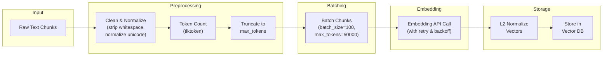
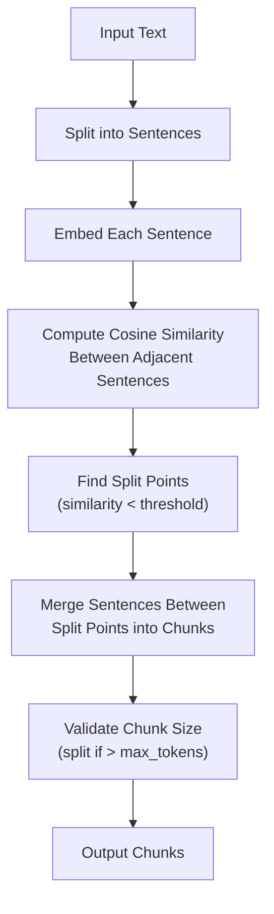
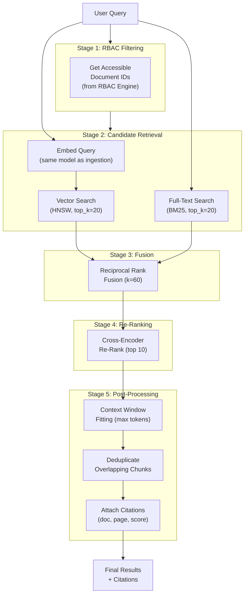

# Vector Store Design

**Product:** Enterprise AI Operations Center  
**Version:** 1.0  
**Date:** 2026-06-13  
**Classification:** Internal — Confidential  
**Status:** Draft — Awaiting Approval

---

## 1. Vector Store Strategy

### 1.1 Design Decision

| Option | Pros | Cons | Decision |
|---|---|---|---|
| **pgvector (default)** | Single DB to operate; transactional consistency; free; RLS works natively | Performance ceiling at ~50M vectors per table; less mature than dedicated DBs | ✅ **Default for v1.0** |
| **Qdrant** | Purpose-built; excellent performance at scale; rich filtering; snapshot support | Additional infrastructure; separate auth model; operational overhead | Supported via interface |
| **Pinecone** | Fully managed; auto-scaling; fastest setup | SaaS-only; vendor lock-in; no self-hosted option; expensive at scale | Supported via interface |
| **Weaviate** | Multi-modal native; GraphQL; hybrid search built-in | Complex to operate; higher resource requirements | Future v2.0 |

**Rationale:** pgvector reduces infrastructure complexity for most deployments (< 10M vectors). Enterprises needing > 10M vectors or sub-10ms latency at scale can swap to Qdrant via the `VectorStore` interface. The abstraction layer makes this a configuration change, not a code change.

### 1.2 Architecture

```
┌──────────────────────────────────────────────────────────┐
│                   RAG Service                             │
│                                                          │
│  ┌──────────────────────────────────────────────────┐   │
│  │              VectorStore Interface                │   │
│  │                                                    │   │
│  │  + upsert(chunks: List[Chunk]) → None             │   │
│  │  + search(embedding, filters, top_k) → Results    │   │
│  │  + delete(document_id) → None                     │   │
│  │  + count() → int                                  │   │
│  │  + health_check() → bool                          │   │
│  └─────────┬───────────────────┬─────────────────────┘   │
│            │                   │                          │
│  ┌─────────▼──────┐  ┌────────▼───────┐                 │
│  │  PgVectorStore  │  │  QdrantStore   │                 │
│  │                 │  │                │                 │
│  │  PostgreSQL     │  │  Qdrant        │                 │
│  │  + pgvector     │  │  Client        │                 │
│  └─────────────────┘  └────────────────┘                 │
└──────────────────────────────────────────────────────────┘
```

---

## 2. Embedding Strategy

### 2.1 Embedding Models

| Model | Provider | Dimensions | Max Tokens | Cost (per 1M tokens) | Performance | Use Case |
|---|---|---|---|---|---|---|
| `text-embedding-3-small` | OpenAI | 1536 | 8191 | $0.02 | Good | **Default** — best cost/quality ratio |
| `text-embedding-3-large` | OpenAI | 3072 | 8191 | $0.13 | Excellent | Premium tier for max accuracy |
| `text-embedding-ada-002` | OpenAI | 1536 | 8191 | $0.10 | Good | Legacy support |
| `embed-english-v3.0` | Cohere | 1024 | 512 | $0.10 | Excellent | Alternative provider |
| `all-MiniLM-L6-v2` | Local (sentence-transformers) | 384 | 256 | Free (compute) | Fair | Air-gapped / cost-sensitive |
| `nomic-embed-text` | Local (Ollama) | 768 | 8192 | Free (compute) | Good | Air-gapped with good quality |
| `CLIP ViT-B/32` | Local | 512 | N/A | Free (compute) | Good | Cross-modal (text + image) |

### 2.2 Embedding Provider Interface

```python
class EmbeddingProvider(Protocol):
    """Abstract interface for all embedding providers."""
    
    @property
    def dimensions(self) -> int:
        """Return the dimensionality of embeddings produced."""
        ...
    
    @property
    def max_tokens(self) -> int:
        """Maximum tokens per input text."""
        ...
    
    async def embed_texts(self, texts: list[str]) -> list[list[float]]:
        """Generate embeddings for a batch of texts."""
        ...
    
    async def embed_query(self, query: str) -> list[float]:
        """Generate embedding for a single search query."""
        ...
    
    def get_cost(self, token_count: int) -> float:
        """Calculate cost in USD for given token count."""
        ...
```

### 2.3 Embedding Pipeline



### 2.4 Embedding Normalization

All embeddings are L2-normalized before storage to enable cosine similarity via inner product (faster computation):

```
normalized_embedding = embedding / ||embedding||₂
```

This allows using `vector_ip_ops` (inner product) instead of `vector_cosine_ops` for search, which is computationally cheaper while producing identical rankings.

---

## 3. pgvector Configuration

### 3.1 Table Schema

```sql
-- Primary chunk table with embedding column
-- (Defined in 10_DATABASE_DESIGN.md, summarized here for vector-specific context)

CREATE TABLE rag.chunks (
    id                  UUID PRIMARY KEY DEFAULT gen_random_uuid(),
    document_id         UUID NOT NULL REFERENCES rag.documents(id) ON DELETE CASCADE,
    knowledge_base_id   UUID NOT NULL REFERENCES rag.knowledge_bases(id),
    tenant_id           UUID NOT NULL REFERENCES auth.tenants(id),
    content             TEXT NOT NULL,
    chunk_index         INTEGER NOT NULL,
    start_page          INTEGER,
    end_page            INTEGER,
    start_char          INTEGER NOT NULL,
    end_char            INTEGER NOT NULL,
    token_count         INTEGER NOT NULL,
    metadata            JSONB NOT NULL DEFAULT '{}',
    embedding           vector(1536),
    content_tsvector    tsvector GENERATED ALWAYS AS (to_tsvector('english', content)) STORED,
    created_at          TIMESTAMPTZ NOT NULL DEFAULT NOW()
);
```

### 3.2 Index Configuration

```sql
-- HNSW Index for Approximate Nearest Neighbor (ANN) search
-- HNSW is preferred over IVFFlat for:
--   1. Better recall at same speed
--   2. No need to retrain after inserts
--   3. Good performance at scale

CREATE INDEX idx_chunks_embedding ON rag.chunks
    USING hnsw (embedding vector_cosine_ops)
    WITH (
        m = 16,                -- Connections per layer (higher = better recall, more memory)
        ef_construction = 64   -- Build-time search width (higher = better recall, slower build)
    );

-- GIN Index for full-text search (BM25-style keyword matching)
CREATE INDEX idx_chunks_fts ON rag.chunks USING gin(content_tsvector);

-- GIN Index for JSONB metadata filtering
CREATE INDEX idx_chunks_metadata ON rag.chunks USING gin(metadata);

-- Composite index for tenant + KB filtered searches
CREATE INDEX idx_chunks_kb_tenant ON rag.chunks(knowledge_base_id, tenant_id);
```

### 3.3 HNSW Tuning Guide

| Parameter | Value | Effect | Tradeoff |
|---|---|---|---|
| **m** (build-time) | 16 | Connections per node per layer | Higher → better recall + more memory |
| **ef_construction** (build-time) | 64 | Search width during index build | Higher → better recall + slower build |
| **ef_search** (query-time) | 40 | Search width during query | Higher → better recall + slower query |

**Performance Benchmarks (target hardware: 4 vCPU, 16GB RAM):**

| Vector Count | ef_search=20 | ef_search=40 | ef_search=100 |
|---|---|---|---|
| 100K | 2ms / 95% recall | 4ms / 98% recall | 8ms / 99.5% recall |
| 1M | 5ms / 94% recall | 10ms / 97% recall | 20ms / 99% recall |
| 10M | 15ms / 92% recall | 30ms / 96% recall | 60ms / 98% recall |
| 50M | 40ms / 88% recall | 80ms / 93% recall | 150ms / 96% recall |

**Recommendation:** `ef_search=40` for production (balance of speed and recall). Tune per-query for high-precision needs.

```sql
-- Set ef_search at session level for query tuning
SET hnsw.ef_search = 40;
```

### 3.4 Vector Search Queries

```sql
-- Basic vector similarity search with tenant isolation (via RLS)
SELECT
    c.id,
    c.document_id,
    c.content,
    c.metadata,
    c.start_page,
    c.end_page,
    1 - (c.embedding <=> $1::vector) AS similarity_score
FROM rag.chunks c
WHERE c.knowledge_base_id = $2
  AND c.tenant_id = $3
  AND c.document_id = ANY($4::uuid[])   -- RBAC: only accessible documents
ORDER BY c.embedding <=> $1::vector      -- Cosine distance (uses HNSW index)
LIMIT $5;                                 -- top_k

-- Hybrid search: vector + full-text with Reciprocal Rank Fusion
WITH vector_results AS (
    SELECT
        c.id,
        c.content,
        c.document_id,
        c.metadata,
        c.start_page,
        ROW_NUMBER() OVER (ORDER BY c.embedding <=> $1::vector) AS vector_rank
    FROM rag.chunks c
    WHERE c.knowledge_base_id = $2
      AND c.tenant_id = $3
      AND c.document_id = ANY($4::uuid[])
    ORDER BY c.embedding <=> $1::vector
    LIMIT 20
),
text_results AS (
    SELECT
        c.id,
        c.content,
        c.document_id,
        c.metadata,
        c.start_page,
        ROW_NUMBER() OVER (ORDER BY ts_rank_cd(c.content_tsvector, plainto_tsquery('english', $5)) DESC) AS text_rank
    FROM rag.chunks c
    WHERE c.knowledge_base_id = $2
      AND c.tenant_id = $3
      AND c.document_id = ANY($4::uuid[])
      AND c.content_tsvector @@ plainto_tsquery('english', $5)
    ORDER BY ts_rank_cd(c.content_tsvector, plainto_tsquery('english', $5)) DESC
    LIMIT 20
),
fused AS (
    SELECT
        COALESCE(v.id, t.id) AS id,
        COALESCE(v.content, t.content) AS content,
        COALESCE(v.document_id, t.document_id) AS document_id,
        COALESCE(v.metadata, t.metadata) AS metadata,
        COALESCE(v.start_page, t.start_page) AS start_page,
        -- Reciprocal Rank Fusion: score = sum(1 / (k + rank))  where k = 60
        COALESCE(1.0 / (60 + v.vector_rank), 0) + COALESCE(1.0 / (60 + t.text_rank), 0) AS rrf_score
    FROM vector_results v
    FULL OUTER JOIN text_results t ON v.id = t.id
)
SELECT * FROM fused
ORDER BY rrf_score DESC
LIMIT $6;  -- top_k
```

### 3.5 Metadata Filtering

```sql
-- Filter by metadata tags
SELECT id, content, metadata
FROM rag.chunks
WHERE knowledge_base_id = $1
  AND tenant_id = $2
  AND metadata @> '{"department": "engineering"}'  -- JSONB containment
  AND metadata->>'author' = 'John Doe'              -- Exact match
ORDER BY embedding <=> $3::vector
LIMIT 10;

-- Filter by date range in metadata
SELECT id, content, metadata
FROM rag.chunks
WHERE knowledge_base_id = $1
  AND tenant_id = $2
  AND (metadata->>'created_date')::date BETWEEN '2026-01-01' AND '2026-06-30'
ORDER BY embedding <=> $3::vector
LIMIT 10;

-- Filter by tags array
SELECT id, content, metadata
FROM rag.chunks
WHERE knowledge_base_id = $1
  AND tenant_id = $2
  AND metadata->'tags' ?| array['compliance', 'regulation']  -- Any tag matches
ORDER BY embedding <=> $3::vector
LIMIT 10;
```

---

## 4. Chunking Strategies

### 4.1 Strategy Comparison

| Strategy | Chunk Quality | Speed | Best For |
|---|---|---|---|
| **Fixed-Size** | Low — breaks mid-sentence | Fastest | Homogeneous text (logs, CSV) |
| **Recursive Character** | Good — respects natural boundaries | Fast | **Default** — general purpose |
| **Semantic** | Excellent — semantically coherent | Slow | High-quality retrieval needs |
| **Document-Aware** | Excellent — respects headings/sections | Medium | Structured documents (manuals, specs) |

### 4.2 Recursive Character Chunking (Default)

```
Input Document:
"# Chapter 1\n\nThis is the first paragraph of chapter 1. It contains
important information about...\n\n## Section 1.1\n\nDetails about..."

Separators (tried in order):
1. "\n\n"  (paragraph breaks)
2. "\n"    (line breaks)
3. ". "    (sentence boundaries)
4. " "     (word boundaries)

Parameters:
- chunk_size: 512 tokens
- chunk_overlap: 50 tokens

Output:
┌─────────────────────────────────────────┐
│ Chunk 0 (480 tokens)                    │
│ "# Chapter 1\n\nThis is the first..."  │
├─────┤ 50-token overlap                  │
│ Chunk 1 (510 tokens)                    │
│ "...important information about...\n\n  │
│  ## Section 1.1\n\nDetails about..."    │
├─────┤ 50-token overlap                  │
│ Chunk 2 (495 tokens)                    │
│ "...Details about the specific..."      │
└─────────────────────────────────────────┘
```

### 4.3 Semantic Chunking



**Threshold Calibration:**

| Percentile | Typical Threshold | Effect |
|---|---|---|
| 10th | 0.3 | Very aggressive splitting → many small chunks |
| 25th | 0.5 | **Recommended** — balanced splitting |
| 50th | 0.7 | Conservative splitting → fewer, larger chunks |

---

## 5. Retrieval Pipeline Design

### 5.1 Full Retrieval Flow



### 5.2 Reciprocal Rank Fusion (RRF)

RRF combines results from multiple retrieval methods without requiring score normalization:

```
RRF_score(d) = Σ  1 / (k + rank_i(d))
               i∈{vector, bm25}

Where:
  k = 60 (constant, prevents division by near-zero ranks)
  rank_i(d) = rank of document d in result list i (1-indexed)
```

**Example:**

| Document | Vector Rank | BM25 Rank | RRF Score | Final Rank |
|---|---|---|---|---|
| doc_A | 1 | 5 | 1/61 + 1/65 = 0.0318 | 1 |
| doc_B | 3 | 1 | 1/63 + 1/61 = 0.0323 | 2 (wins on combined) |
| doc_C | 2 | 8 | 1/62 + 1/68 = 0.0308 | 3 |

### 5.3 Context Window Management

```python
def fit_to_context_window(
    chunks: list[SearchResult],
    max_tokens: int = 4096,
    strategy: str = "greedy_best"  # or "proportional", "truncate_last"
) -> list[SearchResult]:
    """
    Select chunks that fit within the LLM context window.
    
    Strategies:
    - greedy_best: Take highest-ranked chunks until budget exhausted
    - proportional: Allocate tokens proportionally by relevance score
    - truncate_last: Take all, truncate the last chunk to fit
    """
    ...
```

---

## 6. Evaluation Strategy (RAGAS)

### 6.1 Evaluation Metrics

| Metric | Formula | Target | Description |
|---|---|---|---|
| **Faithfulness** | claims_in_context / total_claims | > 0.85 | Are generated answers supported by retrieved context? |
| **Answer Relevancy** | cosine_sim(answer, question) | > 0.80 | Is the answer relevant to the question asked? |
| **Context Precision** | relevant_in_top_k / k | > 0.75 | Are the retrieved chunks actually relevant? |
| **Context Recall** | claims_covered / total_ground_truth | > 0.80 | Does the context cover all necessary information? |
| **Overall Score** | harmonic_mean(all_metrics) | > 0.80 | Balanced composite quality score |

### 6.2 Automated Evaluation Pipeline


### 6.3 Evaluation Data Schema

```sql
-- Evaluation test sets (ground truth)
CREATE TABLE rag.evaluation_sets (
    id                  UUID PRIMARY KEY DEFAULT gen_random_uuid(),
    knowledge_base_id   UUID NOT NULL REFERENCES rag.knowledge_bases(id),
    tenant_id           UUID NOT NULL REFERENCES auth.tenants(id),
    name                VARCHAR(255) NOT NULL,
    test_cases          JSONB NOT NULL,  -- [{question, ground_truth_answer, relevant_doc_ids}]
    created_by          UUID NOT NULL REFERENCES auth.users(id),
    created_at          TIMESTAMPTZ NOT NULL DEFAULT NOW()
);

-- Individual test case format:
-- {
--   "question": "What is the refund policy?",
--   "ground_truth_answer": "Refunds are available within 30 days...",
--   "relevant_doc_ids": ["uuid-1", "uuid-2"],
--   "metadata": {"category": "policy", "difficulty": "easy"}
-- }
```

---

## 7. Scaling Strategy

### 7.1 Scaling Thresholds

| Vector Count | Strategy | Infrastructure |
|---|---|---|
| < 1M | **pgvector** (single instance) | Standard PostgreSQL |
| 1M – 10M | **pgvector** (with optimized HNSW params) | PostgreSQL with 32GB+ RAM |
| 10M – 50M | **pgvector** (partitioned by KB) | PostgreSQL with 64GB+ RAM, read replicas |
| 50M – 100M | **Qdrant** (dedicated cluster) | 3-node Qdrant cluster |
| > 100M | **Qdrant** (sharded cluster) | N-node Qdrant with auto-sharding |

### 7.2 pgvector Partitioning (> 10M vectors)

```sql
-- Partition chunks by knowledge_base_id for large deployments
-- Each KB gets its own partition → smaller HNSW indexes → faster search

CREATE TABLE rag.chunks (
    -- same columns as above
) PARTITION BY HASH (knowledge_base_id);

-- Create 16 partitions
CREATE TABLE rag.chunks_p0 PARTITION OF rag.chunks FOR VALUES WITH (MODULUS 16, REMAINDER 0);
CREATE TABLE rag.chunks_p1 PARTITION OF rag.chunks FOR VALUES WITH (MODULUS 16, REMAINDER 1);
-- ... p2 through p15

-- Each partition gets its own HNSW index
CREATE INDEX idx_chunks_p0_embedding ON rag.chunks_p0
    USING hnsw (embedding vector_cosine_ops) WITH (m = 16, ef_construction = 64);
```

### 7.3 Qdrant Collection Configuration

```json
{
  "collection_name": "chunks_{tenant_id}_{kb_id}",
  "vectors": {
    "size": 1536,
    "distance": "Cosine",
    "on_disk": false
  },
  "optimizers_config": {
    "memmap_threshold": 20000,
    "indexing_threshold": 20000,
    "flush_interval_sec": 5
  },
  "hnsw_config": {
    "m": 16,
    "ef_construct": 100,
    "full_scan_threshold": 10000,
    "on_disk": false
  },
  "replication_factor": 2,
  "shard_number": 4
}
```

---

## 8. Design Decisions & Tradeoffs

| # | Decision | Choice | Tradeoff |
|---|---|---|---|
| V-01 | Default vector store | **pgvector** | Simpler ops vs. performance ceiling at 50M+ vectors |
| V-02 | Default embedding model | **text-embedding-3-small (1536d)** | Best cost/quality ratio vs. not the absolute best quality |
| V-03 | Index type | **HNSW** (not IVFFlat) | No retraining needed vs. higher memory usage |
| V-04 | Default chunking | **Recursive character (512 tokens)** | Good general purpose vs. not optimal for all document types |
| V-05 | Hybrid search | **Vector + BM25 with RRF** | Better recall vs. higher query complexity |
| V-06 | Embedding normalization | **L2-normalize before storage** | Enables inner product (faster) vs. extra pre-processing step |
| V-07 | Chunk overlap | **50 tokens** | Reduces information loss at boundaries vs. ~10% storage increase |
| V-08 | Multi-tenancy in vector store | **Tenant column + RLS** (not separate collections) | Simpler management vs. theoretical cross-tenant data risk |

---

*Document Owner: Data Architect / ML Engineer*  
*Next Review: Upon stakeholder approval of Phase 3*
