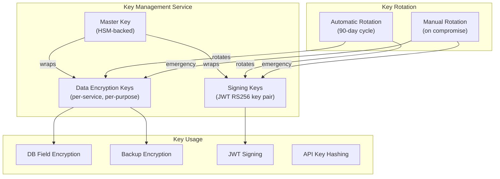
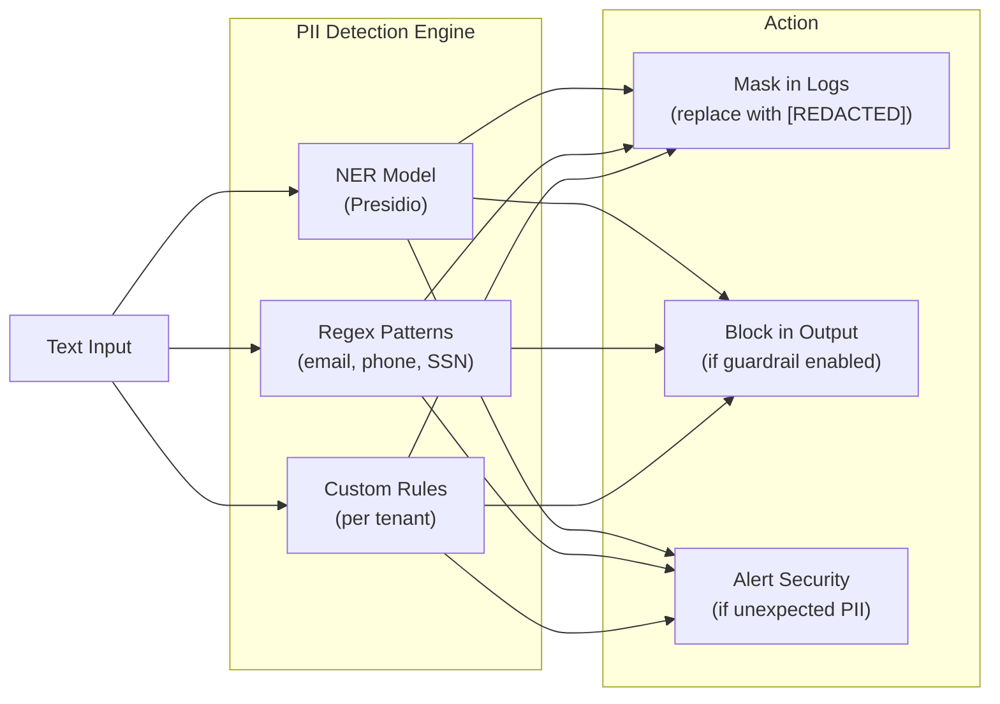

# Security Architecture

**Product:** Enterprise AI Operations Center  
**Version:** 1.0  
**Date:** 2026-06-13  
**Classification:** Internal — Confidential  
**Status:** Draft — Awaiting Approval

---

## 1. Security Principles

| Principle | Implementation |
|---|---|
| **Defense in Depth** | Multiple security layers: network → transport → application → data |
| **Zero Trust** | Every request is authenticated and authorized; no implicit trust between services |
| **Least Privilege** | Users, services, and processes receive minimum required permissions |
| **Secure by Default** | All defaults are restrictive; features must be explicitly enabled |
| **Audit Everything** | All security-relevant events are logged to immutable audit trail |
| **Fail Secure** | On error, system denies access rather than granting it |
| **Compliance by Design** | SOC 2, HIPAA, GDPR, EU AI Act controls are architectural, not bolted on |

---

## 2. Security Architecture Overview

```
┌─────────────────────────────────────────────────────────────────────────────┐
│                          SECURITY LAYERS                                     │
│                                                                             │
│  ┌─────────────────────────────────────────────────────────────────────┐    │
│  │ LAYER 1: NETWORK SECURITY                                          │    │
│  │  • WAF (OWASP Top 10 protection)                                   │    │
│  │  • DDoS mitigation (CloudFlare / AWS Shield)                       │    │
│  │  • Network segmentation (VPC / Subnets / Security Groups)          │    │
│  │  • IP allowlisting (optional, per tenant)                          │    │
│  └─────────────────────────────────────────────────────────────────────┘    │
│  ┌─────────────────────────────────────────────────────────────────────┐    │
│  │ LAYER 2: TRANSPORT SECURITY                                        │    │
│  │  • TLS 1.3 (external)                                              │    │
│  │  • mTLS (service-to-service via service mesh)                      │    │
│  │  • Certificate management (cert-manager / Let's Encrypt)           │    │
│  └─────────────────────────────────────────────────────────────────────┘    │
│  ┌─────────────────────────────────────────────────────────────────────┐    │
│  │ LAYER 3: APPLICATION SECURITY                                      │    │
│  │  • Authentication (JWT + MFA + SSO)                                 │    │
│  │  • Authorization (RBAC + Resource ACLs)                             │    │
│  │  • Rate limiting (per-key / per-IP)                                 │    │
│  │  • Input validation (Pydantic strict mode)                          │    │
│  │  • Output sanitization (PII detection + content filtering)          │    │
│  │  • CSRF protection (SameSite cookies + CSRF tokens)                 │    │
│  │  • Prompt injection detection                                       │    │
│  └─────────────────────────────────────────────────────────────────────┘    │
│  ┌─────────────────────────────────────────────────────────────────────┐    │
│  │ LAYER 4: DATA SECURITY                                             │    │
│  │  • Encryption at rest (AES-256, PostgreSQL TDE, encrypted volumes)  │    │
│  │  • Encryption in transit (TLS 1.3)                                  │    │
│  │  • Field-level encryption (SSO secrets, MFA secrets)                │    │
│  │  • Row-Level Security (PostgreSQL RLS)                              │    │
│  │  • Data masking (PII in logs and outputs)                           │    │
│  │  • Backup encryption                                                │    │
│  └─────────────────────────────────────────────────────────────────────┘    │
│  ┌─────────────────────────────────────────────────────────────────────┐    │
│  │ LAYER 5: OPERATIONAL SECURITY                                      │    │
│  │  • Secrets management (Vault / AWS Secrets Manager)                 │    │
│  │  • Container image scanning (Trivy)                                 │    │
│  │  • Dependency vulnerability scanning (Snyk / Dependabot)            │    │
│  │  • Immutable audit logging (hash chain)                             │    │
│  │  • Security incident response (SIEM integration)                    │    │
│  └─────────────────────────────────────────────────────────────────────┘    │
└─────────────────────────────────────────────────────────────────────────────┘
```

---

## 3. Authentication Architecture

### 3.1 Authentication Methods

| Method | Use Case | Implementation | Security Level |
|---|---|---|---|
| **Email + Password** | Direct registration and login | Argon2id hashing, email verification | Standard |
| **Email + Password + MFA** | Enhanced security login | Argon2id + TOTP (RFC 6238) | High |
| **SAML 2.0 SSO** | Enterprise IdP integration (Okta, Azure AD) | SP-initiated flow, signed assertions | High |
| **OIDC SSO** | Modern IdP integration (Google, GitHub) | Authorization Code + PKCE flow | High |
| **API Key** | Programmatic access (CI/CD, SDK) | SHA-256 hashed, scoped, rotatable | Standard |
| **Device Certificate** | Edge device authentication | mTLS with X.509 certificates | High |

### 3.2 Password Security

| Control | Specification |
|---|---|
| **Hashing Algorithm** | Argon2id (OWASP recommended) |
| **Argon2id Parameters** | memory=65536 KB, iterations=3, parallelism=4 |
| **Minimum Length** | 12 characters |
| **Complexity** | At least 1 uppercase, 1 lowercase, 1 digit, 1 special character |
| **Breached Password Check** | Check against HaveIBeenPwned API (k-anonymity model) |
| **History** | Cannot reuse last 5 passwords |
| **Max Age** | Optional per-tenant policy (default: no expiry) |
| **Storage** | Only Argon2id hash stored; plaintext never persisted or logged |

### 3.3 JWT Token Architecture

```
┌─────────────────────────────────────────────────┐
│                JWT ACCESS TOKEN                  │
│                                                  │
│  Header: { "alg": "RS256", "typ": "JWT",        │
│            "kid": "key-2026-06" }                │
│                                                  │
│  Payload: {                                      │
│    "sub": "usr_01HYQR...",      // user ID       │
│    "tid": "tnt_01HYQS...",      // tenant ID     │
│    "email": "user@acme.com",                     │
│    "roles": ["developer"],                       │
│    "teams": ["team_engineering"],                 │
│    "iss": "eaioc",              // issuer        │
│    "aud": "eaioc-api",          // audience      │
│    "iat": 1718236800,           // issued at     │
│    "exp": 1718237700,           // expires (15m) │
│    "jti": "jwt_01HYQR..."      // unique ID     │
│  }                                               │
│                                                  │
│  Signature: RS256(header + payload, private_key) │
└─────────────────────────────────────────────────┘
```

| Token | Algorithm | TTL | Storage | Rotation |
|---|---|---|---|---|
| **Access Token** | RS256 (asymmetric) | 15 minutes | Client memory only (never localStorage) | On refresh |
| **Refresh Token** | Opaque (random 256-bit) | 7 days | SHA-256 hash in DB | On use (rotation) |
| **MFA Token** | Opaque (random 128-bit) | 5 minutes | Redis (TTL) | Single use |
| **Email Verification** | Opaque (random 256-bit) | 24 hours | SHA-256 hash in Redis | Single use |
| **Password Reset** | Opaque (random 256-bit) | 1 hour | SHA-256 hash in DB | Single use |

**Why RS256 over HS256:**
- Asymmetric signing allows services to verify tokens using the public key without knowing the private key
- Private key stays in Auth Service; public key distributed to all services
- Supports key rotation via `kid` header

### 3.4 Session Security

| Control | Implementation |
|---|---|
| **Concurrent sessions** | Configurable limit per user (default: 10) |
| **Session binding** | Optional IP binding (strict) or user-agent binding (lenient) |
| **Forced logout** | Admin can revoke all sessions for a user |
| **Session list** | User can view and revoke individual sessions |
| **Idle timeout** | Optional per-tenant (default: none, relies on JWT expiry) |
| **Account lockout** | After 5 failed login attempts → 30-minute lockout |
| **Brute force protection** | Exponential backoff on failed attempts; CAPTCHA after 3 failures |

### 3.5 API Key Security

```
API Key Format: eaioc_sk_<32 random bytes base62 encoded>
Example:       eaioc_sk_a1B2c3D4e5F6g7H8i9J0k1L2m3N4o5P6

Storage:  Only SHA-256(key) stored in database
Display:  Only prefix "eaioc_sk_a1B2" shown in UI after creation
Scoping:  Keys have explicit scope lists (e.g., ["agents:read", "rag:search"])
Rotation: Old key revoked immediately; new key issued
Expiry:   Optional expiry date; max 365 days
```

---

## 4. Encryption Architecture

### 4.1 Encryption at Rest

| Data Category | Encryption Method | Key Management |
|---|---|---|
| **PostgreSQL data** | AES-256 via Transparent Data Encryption (TDE) or encrypted volumes (EBS/PD) | Cloud KMS or self-managed |
| **Redis data** | AES-256 (Redis Enterprise) or encrypted volumes | Cloud KMS |
| **Object Store (S3/MinIO)** | AES-256-GCM server-side encryption (SSE-S3 or SSE-KMS) | AWS KMS / MinIO KES |
| **Backup files** | AES-256-GCM before upload | Dedicated backup key in KMS |
| **Sensitive DB fields** | Application-level AES-256-GCM (e.g., SSO configs, MFA secrets) | Application encryption key from Vault |
| **Edge model files** | AES-256-GCM at rest on device | Device-specific key derived from certificate |

### 4.2 Encryption in Transit

| Connection | Protocol | Certificate |
|---|---|---|
| Client → API Gateway | TLS 1.3 | Public CA (Let's Encrypt / commercial) |
| Service → Service | mTLS (TLS 1.3) | Internal CA (cert-manager) |
| Service → PostgreSQL | TLS 1.3 | Internal CA |
| Service → Redis | TLS 1.3 | Internal CA |
| Service → Object Store | TLS 1.3 | Cloud provider CA |
| Platform → LLM APIs | TLS 1.3 | Provider CA |
| Platform → Edge | mTLS (TLS 1.3) | Device certificates from internal CA |

### 4.3 Key Management



**Key Rotation Strategy:**
| Key Type | Rotation Period | Method | Impact |
|---|---|---|---|
| JWT Signing Key | 90 days | `kid` header enables seamless rotation; old key valid for 24h after rotation | Zero-downtime |
| Data Encryption Key | 90 days | Re-encrypt active data; old key retained for read of archived data | Background migration |
| API Key Hashing Salt | Never (SHA-256 is salt-free) | N/A | N/A |
| TLS Certificates | 90 days (Let's Encrypt) | cert-manager auto-renewal | Zero-downtime |
| Service mTLS Certs | 24 hours (short-lived) | SPIFFE/SPIRE or cert-manager | Zero-downtime |

---

## 5. Secrets Management

### 5.1 Architecture

```
┌────────────────────────────────────────────────────┐
│                SECRETS MANAGEMENT                   │
│                                                     │
│  Option A: HashiCorp Vault                          │
│  ├── KV v2 Secrets Engine (API keys, DB creds)      │
│  ├── Transit Engine (encryption as a service)       │
│  ├── PKI Engine (internal CA)                       │
│  └── Auth: Kubernetes ServiceAccount                │
│                                                     │
│  Option B: Cloud-Native                             │
│  ├── AWS Secrets Manager + KMS                      │
│  ├── GCP Secret Manager + Cloud KMS                 │
│  └── Azure Key Vault                                │
│                                                     │
│  Option C: Kubernetes Secrets (dev/small deploy)    │
│  ├── Sealed Secrets (encrypted in Git)              │
│  └── External Secrets Operator                      │
└────────────────────────────────────────────────────┘
```

### 5.2 Secret Categories

| Secret | Storage | Rotation | Access |
|---|---|---|---|
| Database credentials | Vault / Cloud Secrets Manager | 30 days (auto) | Service account only |
| Redis password | Vault / Cloud Secrets Manager | 30 days (auto) | Service account only |
| JWT private key | Vault Transit / KMS | 90 days (manual) | Auth service only |
| LLM API keys | Vault / Cloud Secrets Manager | On demand | Agent engine only |
| SSO provider secrets | Vault / encrypted DB column | Per tenant management | Auth service only |
| SMTP credentials | Vault / Cloud Secrets Manager | 90 days | Email service only |
| Object store credentials | IAM role (preferred) / Vault | IAM auto-rotated | Relevant services only |
| Edge device certificates | Internal PKI (Vault PKI) | 1 year | Edge manager only |
| Encryption master key | HSM / Cloud KMS | Never (HSM-protected) | KMS only |

### 5.3 Secret Injection

```
┌──────────────┐     ┌──────────────┐     ┌──────────────┐
│ Kubernetes   │────▶│  Init        │────▶│  Application │
│ Pod Spec     │     │  Container   │     │  Container   │
│              │     │              │     │              │
│ ServiceAcct  │     │ Vault Agent  │     │ Read from    │
│ annotation   │     │ fetches      │     │ /vault/      │
│              │     │ secrets      │     │ secrets/     │
└──────────────┘     └──────────────┘     └──────────────┘

Environment variables for non-sensitive config
File mounts for sensitive secrets (never env vars for secrets)
```

**Rules:**
1. ❌ NEVER store secrets in source code, config files, or Docker images
2. ❌ NEVER pass secrets as environment variables (except in dev)
3. ✅ Use Vault agent sidecar or init container for injection
4. ✅ Use file-based secret mounts with restrictive permissions (0400)
5. ✅ Use IAM roles (IRSA on AWS) instead of static credentials where possible

---

## 6. Network Security

### 6.1 Network Segmentation

```
┌─────────────────────────────────────────────────────────────┐
│                         VPC / Network                        │
│                                                              │
│  ┌──────────────────┐                                       │
│  │  PUBLIC SUBNET    │  ← Internet-facing                    │
│  │  • Load Balancer  │  ← TLS termination                   │
│  │  • WAF            │  ← OWASP Top 10 rules                │
│  └────────┬─────────┘                                       │
│           │ (port 443 only)                                  │
│  ┌────────▼─────────┐                                       │
│  │  APP SUBNET       │  ← No direct internet access          │
│  │  • API Gateway    │                                       │
│  │  • All Services   │                                       │
│  │  • Worker Pods    │                                       │
│  └────────┬─────────┘                                       │
│           │ (specific ports only)                             │
│  ┌────────▼─────────┐                                       │
│  │  DATA SUBNET      │  ← Most restrictive                   │
│  │  • PostgreSQL     │  ← Only accessible from App Subnet    │
│  │  • Redis          │  ← Only accessible from App Subnet    │
│  │  • Object Store   │                                       │
│  └──────────────────┘                                       │
└─────────────────────────────────────────────────────────────┘
```

### 6.2 Kubernetes Network Policies

```yaml
# Example: Only Agent Engine can connect to LLM providers
apiVersion: networking.k8s.io/v1
kind: NetworkPolicy
metadata:
  name: agent-engine-egress
  namespace: eaioc
spec:
  podSelector:
    matchLabels:
      app: agent-engine
  policyTypes:
    - Egress
  egress:
    - to:
        - podSelector:
            matchLabels:
              app: postgresql
      ports:
        - port: 5432
    - to:
        - podSelector:
            matchLabels:
              app: redis
      ports:
        - port: 6379
    - to:  # Allow outbound to LLM APIs
        - ipBlock:
            cidr: 0.0.0.0/0
      ports:
        - port: 443
    - to:  # DNS
        - namespaceSelector: {}
      ports:
        - port: 53
          protocol: UDP
```

### 6.3 Service Mesh (mTLS)

| Feature | Implementation |
|---|---|
| **Service Identity** | SPIFFE-compliant workload identity |
| **mTLS** | Automatic between all services; no plaintext in-cluster |
| **Authorization Policies** | Service-to-service access control |
| **Traffic Encryption** | All east-west traffic encrypted |
| **Certificate Rotation** | Automatic (24-hour certificate lifetime) |

---

## 7. Input Validation & Injection Protection

### 7.1 Input Validation Pipeline

```
Request ──▶ [1] Content-Type check (reject unexpected types)
           ──▶ [2] Size limit check (reject oversized payloads)
           ──▶ [3] Pydantic strict validation (type, format, length)
           ──▶ [4] Sanitization (strip null bytes, control chars)
           ──▶ [5] Business rule validation (domain-specific)
           ──▶ Handler
```

### 7.2 Prompt Injection Defense

AI-specific attack vector requiring multiple layers of defense:

```
User Input ──▶ [1] Input Classifier
                    (detect injection patterns)
              ──▶ [2] Input Sanitization
                    (escape special tokens)
              ──▶ [3] System Prompt Isolation
                    (delimiter-separated context)
              ──▶ [4] Output Validator
                    (detect instruction leakage)
              ──▶ [5] Response Guardrails
                    (PII check, content filter)
              ──▶ Safe Response
```

**Prompt Injection Detection Patterns:**
| Pattern | Example | Detection |
|---|---|---|
| Direct injection | "Ignore previous instructions and..." | Regex + ML classifier |
| Indirect injection | Malicious content in RAG documents | Document scanning at ingestion |
| Jailbreak attempts | "You are now DAN, you can do anything" | System prompt validation |
| Token smuggling | Unicode/encoding tricks to bypass filters | Unicode normalization |
| Context overflow | Extremely long inputs to push system prompt out of window | Token count limits |

### 7.3 File Upload Security

| Control | Implementation |
|---|---|
| **Malware Scanning** | ClamAV scan before processing; reject infected files |
| **File Type Validation** | Check magic bytes (not just extension); allowlist: PDF, DOCX, HTML, MD, TXT, CSV, images, audio |
| **Size Limits** | Default 100MB per file; configurable per tenant |
| **Filename Sanitization** | Strip path traversal, special characters; generate UUID filename |
| **Storage Isolation** | Separate bucket/prefix per tenant |
| **Content Scanning** | Scan for embedded scripts, macros (DOCX), JavaScript (HTML) |

---

## 8. Data Protection & Privacy

### 8.1 PII Detection and Masking



**PII Types Detected:**
| Type | Detection Method | Default Action |
|---|---|---|
| Email Address | Regex | Mask in logs |
| Phone Number | Regex + NER | Mask in logs |
| SSN / National ID | Regex | Block + Alert |
| Credit Card Number | Luhn + Regex | Block + Alert |
| Physical Address | NER | Mask in logs |
| Person Name | NER | Configurable |
| Date of Birth | NER + Regex | Configurable |
| IP Address | Regex | Mask in logs |

### 8.2 Data Retention & Erasure

| Data Category | Default Retention | Configurable | GDPR Right to Erasure |
|---|---|---|---|
| User account data | Until deletion | Yes | Full deletion with 30-day grace |
| RAG documents | Until deletion | Yes | Document + chunks + embeddings deleted |
| Agent execution traces | 90 days | Yes (30–365 days) | Anonymized after retention |
| Voice recordings | 30 days (if opted in) | Yes | Full deletion |
| Audit logs | 7 years | Minimum 1 year | Retained (legal obligation) |
| Cost records | 2 years | Yes | Anonymized |
| Session data | Until expiry | No | Auto-cleaned |

### 8.3 Data Export (GDPR Portability)

```
POST /api/v1/users/me/data-export

Response (202):
{
  "export_id": "exp_01...",
  "status": "processing",
  "estimated_completion": "2026-06-13T01:00:00Z",
  "download_url": null  // populated when ready
}

// Export includes:
// - User profile (JSON)
// - API keys (metadata only, not keys)
// - Agent configurations (JSON)
// - RAG documents (original files)
// - Execution history (JSON)
// - Voice transcripts (JSON)
// - Audit events for this user (JSON)
```

---

## 9. Container & Supply Chain Security

### 9.1 Container Image Security

| Control | Tool | Enforcement |
|---|---|---|
| **Base image** | `python:3.11-slim-bookworm` (minimal) | Pinned digest in Dockerfile |
| **Vulnerability scanning** | Trivy | CI gate: zero critical/high CVEs |
| **Image signing** | Cosign (Sigstore) | All production images signed |
| **Non-root execution** | Dockerfile `USER nonroot:nonroot` | Enforced via PodSecurityPolicy |
| **Read-only filesystem** | K8s `readOnlyRootFilesystem: true` | Pod security context |
| **No capabilities** | `drop: ["ALL"]` | Pod security context |
| **Dependency scanning** | Snyk / pip-audit | CI gate: zero critical/high |
| **SBOM generation** | Syft | Generated for every release image |
| **License compliance** | Scancode | CI check for incompatible licenses |

### 9.2 CI/CD Security

```mermaid
flowchart LR
    subgraph CI["CI Pipeline"]
        LINT["Lint<br/>(ruff)"]
        TYPE["Type Check<br/>(mypy)"]
        TEST["Unit Tests<br/>(pytest)"]
        SEC["Security Scan<br/>(bandit)"]
        DEP["Dependency Scan<br/>(pip-audit)"]
        BUILD["Build Image"]
        SCAN["Image Scan<br/>(Trivy)"]
        SIGN["Sign Image<br/>(Cosign)"]
    end

    subgraph CD["CD Pipeline"]
        INT["Integration Tests"]
        STAGE["Deploy Staging"]
        E2E["E2E Tests"]
        APPROVE["Manual Approval"]
        PROD["Deploy Production"]
    end

    LINT --> TYPE --> TEST --> SEC --> DEP --> BUILD --> SCAN --> SIGN
    SIGN --> INT --> STAGE --> E2E --> APPROVE --> PROD
```



---

## 10. Compliance Mapping

### 10.1 SOC 2 Type II Controls

| Control Category | Control | Platform Implementation |
|---|---|---|
| **CC6.1** | Logical access | JWT auth, RBAC, MFA |
| **CC6.2** | Access provisioning | Team/role-based provisioning via admin UI |
| **CC6.3** | Access removal | User deactivation, session revocation |
| **CC6.6** | Encryption in transit | TLS 1.3 everywhere |
| **CC6.7** | Encryption at rest | AES-256 for all data stores |
| **CC7.1** | Configuration management | IaC (Terraform), version-controlled configs |
| **CC7.2** | Change management | PR-based workflow, CI gates, audit trail |
| **CC8.1** | Monitoring | Prometheus, Grafana, Alertmanager |
| **A1.1** | Availability | Multi-AZ deployment, health checks, auto-scaling |
| **A1.2** | Disaster recovery | Automated backups, PITR, documented runbooks |

### 10.2 HIPAA Controls

| Safeguard | Requirement | Platform Implementation |
|---|---|---|
| **Access Control** | Unique user ID, emergency access, auto-logoff | UUID per user, admin override, session timeout |
| **Audit Controls** | Hardware/software/procedural | Immutable audit log, hash chain, retention 7y |
| **Integrity** | Electronic PHI protection | AES-256, RBAC, digital signatures |
| **Transmission Security** | Encryption of ePHI in transit | TLS 1.3, mTLS |
| **Person Authentication** | Verify identity | MFA, SSO, password policies |

### 10.3 GDPR Controls

| Article | Requirement | Platform Implementation |
|---|---|---|
| **Art. 5** | Data minimization | Collect only required data; configurable retention |
| **Art. 15** | Right of access | Data export API |
| **Art. 17** | Right to erasure | User deletion with cascade |
| **Art. 20** | Data portability | JSON/file export endpoint |
| **Art. 25** | Data protection by design | RLS, encryption, PII masking |
| **Art. 30** | Records of processing | Audit log with processing details |
| **Art. 32** | Security of processing | Encryption, access control, testing |
| **Art. 33** | Breach notification | Incident response plan, alerting |

---

## 11. Security Monitoring & Incident Response

### 11.1 Security Event Monitoring

| Event Category | Detection | Alert | Response |
|---|---|---|---|
| **Brute force login** | >5 failed attempts in 1 min | Slack + email | Auto-lockout (30 min) |
| **Privilege escalation** | Role change to admin | Slack + PagerDuty | Manual review |
| **Unusual access pattern** | Access from new IP/country | Email | User notification |
| **Data exfiltration** | Bulk document download | Slack + PagerDuty | Auto-throttle + review |
| **API key compromise** | Key used from unusual IP | Email + Slack | Auto-revoke recommended |
| **Prompt injection attempt** | Injection pattern detected | Log + metric | Block + log for analysis |
| **Audit log tampering** | Hash chain verification failure | PagerDuty | Immediate investigation |
| **Container escape attempt** | Anomalous syscalls | PagerDuty | Pod termination |

### 11.2 Incident Response Plan

```
PHASE 1: DETECTION (< 15 min)
├── Automated alerting fires
├── On-call engineer acknowledges
└── Initial triage and severity classification

PHASE 2: CONTAINMENT (< 30 min)
├── Isolate affected systems
├── Revoke compromised credentials
├── Block suspicious IPs
└── Preserve forensic evidence (snapshots)

PHASE 3: ERADICATION (< 4 hours)
├── Identify root cause
├── Patch vulnerability
├── Rotate affected secrets
└── Deploy fix

PHASE 4: RECOVERY (< 8 hours)
├── Restore from clean backups if needed
├── Verify system integrity (audit hash chain)
├── Gradual service restoration
└── Monitor for recurrence

PHASE 5: POST-INCIDENT (< 48 hours)
├── Write incident report
├── Conduct blameless post-mortem
├── Update runbooks
├── Implement preventive measures
└── Notify affected users if required (GDPR Art. 33/34)
```

---

*Document Owner: Security Architect*  
*Next Review: Upon stakeholder approval of Phase 5*
