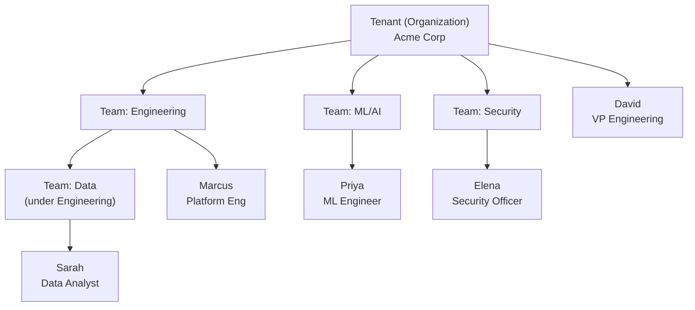
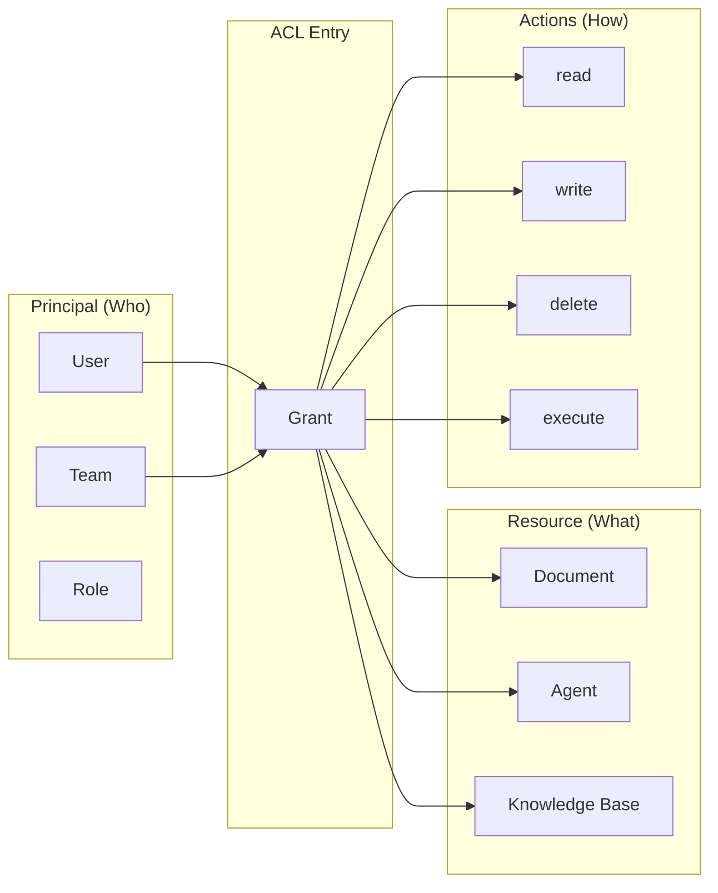
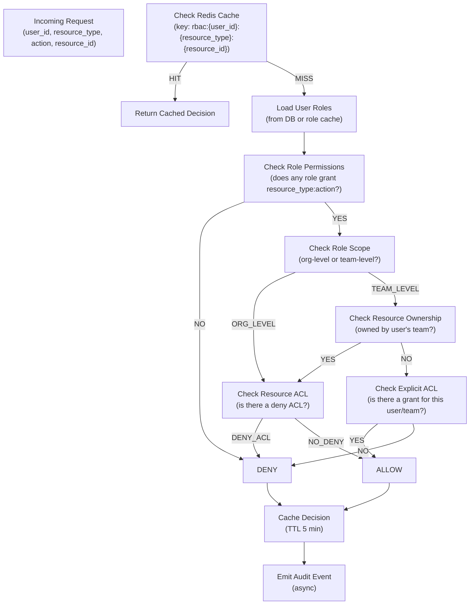
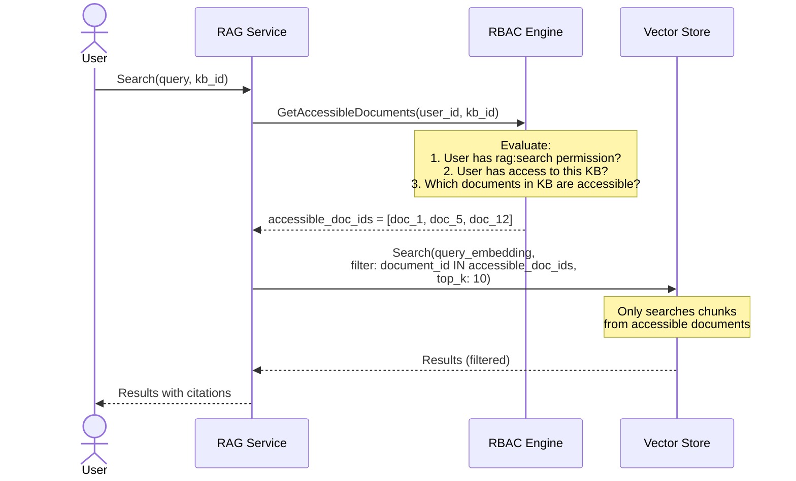

# RBAC Design

**Product:** Enterprise AI Operations Center  
**Version:** 1.0  
**Date:** 2026-06-13  
**Classification:** Internal — Confidential  
**Status:** Draft — Awaiting Approval

---

## 1. RBAC Model Overview

The platform implements a **Hierarchical RBAC** (RBAC2) model with the following layers:

```
┌─────────────────────────────────────────────────────────────────┐
│                      RBAC MODEL                                  │
│                                                                  │
│  ┌──────────────────────────────────────────────────────────┐   │
│  │ LAYER 1: ORGANIZATIONAL HIERARCHY                         │   │
│  │  Tenant → Teams (hierarchical) → Users                    │   │
│  └──────────────────────────────────────────────────────────┘   │
│  ┌──────────────────────────────────────────────────────────┐   │
│  │ LAYER 2: ROLE-BASED ACCESS (RBAC)                         │   │
│  │  System Roles + Custom Roles → Permission Sets            │   │
│  └──────────────────────────────────────────────────────────┘   │
│  ┌──────────────────────────────────────────────────────────┐   │
│  │ LAYER 3: RESOURCE-LEVEL ACCESS (ACL)                      │   │
│  │  Fine-grained per-resource permissions                    │   │
│  └──────────────────────────────────────────────────────────┘   │
│  ┌──────────────────────────────────────────────────────────┐   │
│  │ LAYER 4: ATTRIBUTE-BASED POLICIES (ABAC) — v2.0          │   │
│  │  Dynamic policies based on user/resource/context attrs    │   │
│  └──────────────────────────────────────────────────────────┘   │
└─────────────────────────────────────────────────────────────────┘
```

### 1.1 Organizational Hierarchy



**Hierarchy Rules:**
- Users belong to one or more teams
- Teams can be nested (max 5 levels)
- Roles are assigned at org level or team level
- Team-level role assignment scopes the role to that team's resources
- Org-level role assignment applies across all teams

---

## 2. Permission Model

### 2.1 Permission Structure

```
Permission = resource:action

Examples:
  agents:create       — Create new agents
  agents:read         — View agent configurations
  agents:update       — Modify agent configurations
  agents:delete       — Delete agents
  agents:execute      — Execute agent workflows
  rag:search          — Search knowledge bases
  rbac:manage         — Manage roles and permissions
  audit:read          — View audit logs
```

### 2.2 Complete Permission Matrix

| Permission | Super Admin | Org Admin | Team Lead | Developer | Analyst | Viewer |
|---|---|---|---|---|---|---|
| `agents:create` | ✅ | ✅ | ✅ | ✅ | ❌ | ❌ |
| `agents:read` | ✅ | ✅ | ✅ | ✅ | ✅ | ✅ |
| `agents:update` | ✅ | ✅ | ✅ | ✅ | ❌ | ❌ |
| `agents:delete` | ✅ | ✅ | ✅ | ✅ | ❌ | ❌ |
| `agents:execute` | ✅ | ✅ | ✅ | ✅ | ✅ | ❌ |
| `rag:create` | ✅ | ✅ | ✅ | ✅ | ❌ | ❌ |
| `rag:read` | ✅ | ✅ | ✅ | ✅ | ✅ | ✅ |
| `rag:update` | ✅ | ✅ | ✅ | ✅ | ❌ | ❌ |
| `rag:delete` | ✅ | ✅ | ✅ | ✅ | ❌ | ❌ |
| `rag:search` | ✅ | ✅ | ✅ | ✅ | ✅ | ❌ |
| `voice:use` | ✅ | ✅ | ✅ | ✅ | ✅ | ❌ |
| `voice:manage` | ✅ | ✅ | ✅ | ❌ | ❌ | ❌ |
| `multimodal:use` | ✅ | ✅ | ✅ | ✅ | ✅ | ✅ |
| `multimodal:manage` | ✅ | ✅ | ✅ | ❌ | ❌ | ❌ |
| `edge:read` | ✅ | ✅ | ✅ | ✅ | ❌ | ❌ |
| `edge:manage` | ✅ | ✅ | ❌ | ❌ | ❌ | ❌ |
| `rbac:manage` | ✅ | ✅ | ❌ | ❌ | ❌ | ❌ |
| `users:read` | ✅ | ✅ | ✅ | ❌ | ❌ | ❌ |
| `users:manage` | ✅ | ✅ | ❌ | ❌ | ❌ | ❌ |
| `users:team_manage` | ✅ | ✅ | ✅ | ❌ | ❌ | ❌ |
| `audit:read` | ✅ | ✅ | ❌ | ❌ | ❌ | ❌ |
| `billing:read` | ✅ | ✅ | ❌ | ❌ | ❌ | ❌ |
| `billing:manage` | ✅ | ❌ | ❌ | ❌ | ❌ | ❌ |

### 2.3 Role Constraints

| Role | Is System | Can Delete | Minimum Count | Scope |
|---|---|---|---|---|
| **Super Admin** | Yes | No | 1 per tenant | Org-level only |
| **Org Admin** | Yes | No | 0+ | Org-level only |
| **Team Lead** | Yes | No | 0+ | Team-level |
| **Developer** | Yes | No | 0+ | Team-level |
| **Analyst** | Yes | No | 0+ | Team-level |
| **Viewer** | Yes | No | 0+ | Team-level |
| **Custom Roles** | No | Yes | 0+ | Team or Org level |

**Constraint Rules:**
- A tenant must always have at least 1 Super Admin
- System roles cannot be deleted or have their permissions modified
- Custom roles can have any subset of the available permissions
- Users can have multiple roles (union of permissions applies)
- Team-level roles only apply to resources owned by that team

---

## 3. Resource-Level Access Control (ACL)

### 3.1 ACL Model

Resource ACLs provide fine-grained control beyond role-based permissions. They answer: "Can user X perform action Y on specific resource Z?"



### 3.2 ACL Use Cases

| Scenario | ACL Configuration |
|---|---|
| Share a document with a specific user | `{resource: doc_123, principal: user_456, actions: ["read"]}` |
| Give a team access to a knowledge base | `{resource: kb_789, principal: team_eng, actions: ["read", "search"]}` |
| Restrict an agent to certain teams | Default deny; explicit ACLs for allowed teams |
| Time-limited document access | `{resource: doc_123, ..., expires_at: "2026-07-01"}` |

### 3.3 ACL + RBAC Evaluation

```
EVALUATION ORDER:

1. Does user have the required ROLE permission?
   (e.g., "agents:read" to view any agent they have access to)
   
   └── NO → DENY immediately

2. Is there a resource-level ACL for this specific resource?
   
   └── YES → Check if ACL grants the required action
       └── GRANT → ALLOW
       └── No matching action → Continue
   
   └── NO ACL exists for this resource:
       └── If role permission implies org-wide access → ALLOW
       └── If role permission is team-scoped:
           └── Is resource owned by user's team? → ALLOW
           └── Otherwise → DENY

RESULT: ALLOW or DENY (always logged to audit)
```

---

## 4. Authorization Engine Implementation

### 4.1 Authorization Decision Flow



### 4.2 Performance Design

| Metric | Target | Implementation |
|---|---|---|
| **P99 evaluation latency** | < 5ms | Redis cache with 5-min TTL |
| **Cache hit rate** | > 90% | Pre-warm on login; invalidate on change |
| **Throughput** | 50,000 evaluations/sec | In-memory role cache + Redis |
| **Consistency** | Eventual (5-min max staleness) | Cache invalidation on role/ACL change |

### 4.3 Cache Invalidation Rules

| Event | Cache Keys Invalidated |
|---|---|
| Role assigned/removed for user | `rbac:{user_id}:*` |
| Permission added/removed from role | `rbac:*:*:*` for all users with that role |
| Resource ACL created/updated/deleted | `rbac:*:{resource_type}:{resource_id}` |
| User added/removed from team | `rbac:{user_id}:*` |
| Team deleted | `rbac:*:*` for all team members |

---

## 5. RAG Document-Level RBAC

### 5.1 Document Access Control

RAG documents are the most security-sensitive resources because they contain potentially confidential enterprise data. The retrieval pipeline MUST enforce RBAC before returning any chunks.



### 5.2 Document Access Levels

| Access Level | Who Can Search | Who Can View Full Doc | Who Can Delete |
|---|---|---|---|
| **Public** (within tenant) | All tenant users with `rag:search` | All tenant users with `rag:read` | KB owner, admins |
| **Team-Restricted** | Team members with `rag:search` | Team members with `rag:read` | Team lead, admins |
| **User-Restricted** | Explicitly ACL'd users only | ACL'd users only | Doc owner, admins |
| **Confidential** | Explicit ACL + audit alert on access | ACL'd users + access logged | Admin only |

### 5.3 Knowledge Base Inheritance

```
Knowledge Base Access:
├── Public KB → all documents searchable by all tenant users
├── Team KB → documents searchable by team members
│   ├── Document can override to be more restrictive
│   └── Document CANNOT be less restrictive than KB level
└── Private KB → documents searchable only by explicit ACL
```

---

## 6. Multi-Tenant Isolation

### 6.1 Isolation Mechanisms

| Layer | Mechanism | Guarantee |
|---|---|---|
| **Database** | PostgreSQL RLS with `tenant_id` | Every query filtered by tenant; no cross-tenant data access |
| **Application** | Tenant context set from JWT `tid` claim | All service operations scoped to tenant |
| **Cache** | Redis key namespace includes `tenant_id` | No cache cross-contamination |
| **Object Store** | Separate bucket prefix per tenant | Physical data separation |
| **Vector Search** | Filter by `tenant_id` column | Embeddings never mixed across tenants |
| **Audit Log** | `tenant_id` on every event | Per-tenant audit trail |

### 6.2 RLS Implementation Detail

```sql
-- Set tenant context at the start of every database transaction
-- This is done in middleware, before any query executes

SET app.current_tenant_id = 'tnt_01HYQS...';

-- RLS policy on users table (example)
-- This policy is evaluated for EVERY row access
CREATE POLICY tenant_isolation ON auth.users
    USING (tenant_id = current_setting('app.current_tenant_id')::uuid);

-- With RLS enabled, this query:
SELECT * FROM auth.users;
-- Is equivalent to:
SELECT * FROM auth.users WHERE tenant_id = 'tnt_01HYQS...';

-- Cross-tenant access is IMPOSSIBLE even with SQL injection
-- because RLS is enforced at the database engine level
```

### 6.3 Tenant Context Propagation

```
JWT → API Gateway → Set tenant_id in request context
                  → Auth Middleware validates tenant_id matches JWT.tid
                  → Every DB session sets: SET app.current_tenant_id = ?
                  → Every Redis key includes tenant_id
                  → Every Object Store path includes tenant_id
                  → Every audit event includes tenant_id
```

---

## 7. API Key Scoping

### 7.1 Scope Hierarchy

API keys have configurable scopes that restrict what operations they can perform:

```
Scope Format: resource:action

Available Scopes:
├── agents:create, agents:read, agents:update, agents:delete, agents:execute
├── rag:create, rag:read, rag:update, rag:delete, rag:search
├── voice:use
├── multimodal:use
├── edge:read, edge:manage
├── mlops:read
├── audit:read
└── users:read

Wildcard: resource:* (all actions on resource)
Full access: * (all resources, all actions — use with extreme caution)
```

### 7.2 API Key Evaluation

```
function evaluateApiKey(key, resource, action):
    1. Validate key hash exists and is active
    2. Check key.scopes contains "resource:action" OR "resource:*" OR "*"
    3. Check key has not expired
    4. Load user associated with key
    5. Evaluate RBAC for user (same as JWT flow)
    6. Return ALLOW only if BOTH key scope AND user RBAC permit
```

**Key principle:** An API key NEVER grants more access than the user's role permissions. Scopes are always an additional restriction on top of RBAC.

---

## 8. Admin Operations & Delegation

### 8.1 Super Admin Capabilities

| Capability | Description | Audit Level |
|---|---|---|
| Manage all users | Create, update, deactivate any user | Full |
| Manage all roles | Create, modify, delete custom roles | Full |
| Manage SSO | Configure SAML/OIDC connections | Full |
| View all audit logs | Unrestricted audit access | Meta-logged |
| Manage billing | Subscription, usage, invoices | Full |
| Force password reset | Require any user to reset password | Full |
| Revoke all sessions | Logout all users in tenant | Full + notification |
| Tenant settings | Configure tenant-level policies | Full |
| Delete tenant | Full tenant data deletion (irreversible) | Full + confirmation |

### 8.2 Delegated Administration

| Delegation | From | To | Scope |
|---|---|---|---|
| Team management | Org Admin | Team Lead | Manage members of their team |
| Agent management | Org Admin | Developer | CRUD agents within their team |
| KB management | Org Admin | Developer | CRUD knowledge bases within team |
| User invite | Org Admin | Team Lead | Invite new users to their team |

---

## 9. Design Decisions & Tradeoffs

| # | Decision | Options | Choice | Tradeoff |
|---|---|---|---|---|
| R-01 | RBAC model | RBAC0 (flat) vs. RBAC2 (hierarchical) vs. full ABAC | **RBAC2 + Resource ACLs** | Covers 95% of use cases without ABAC complexity; ABAC deferred to v2.0 |
| R-02 | Permission granularity | Coarse (per-service) vs. fine (per-action) | **Per-action** | More flexible but more permissions to manage |
| R-03 | Default deny vs. allow | Default deny vs. default allow | **Default deny** | Safer but requires explicit grants for everything |
| R-04 | Cache consistency | Strong vs. eventual | **Eventual (5-min TTL)** | Better performance vs. role changes take up to 5 min to propagate |
| R-05 | Cross-team sharing | Via ACLs only vs. via shared resources | **ACLs** | More explicit/auditable but requires admin to set up |
| R-06 | API key model | Separate from user vs. tied to user | **Tied to user** | Key never exceeds user's permissions vs. can't create "service accounts" easily |

---

*Document Owner: Security Architect*  
*Next Review: Upon stakeholder approval of Phase 5*
